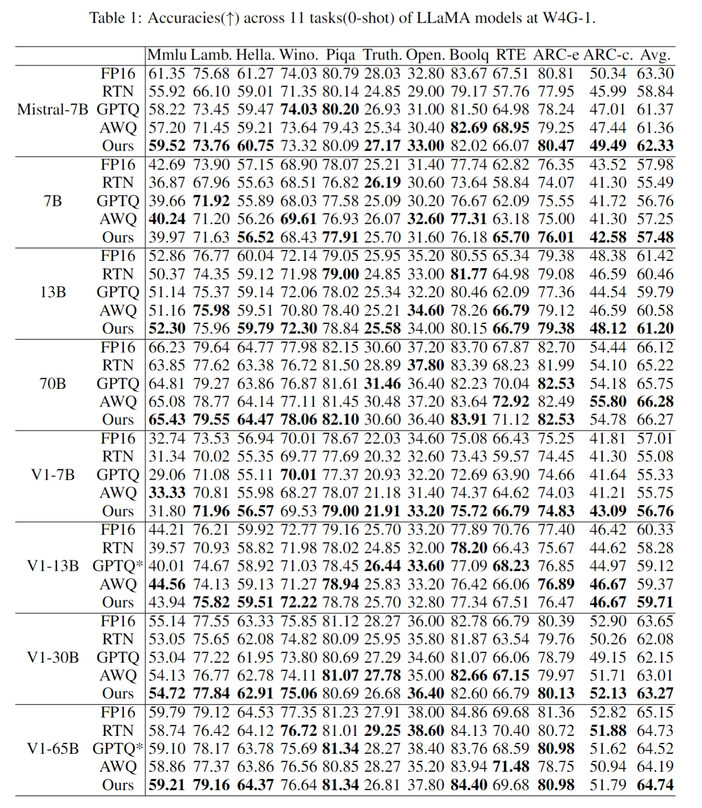
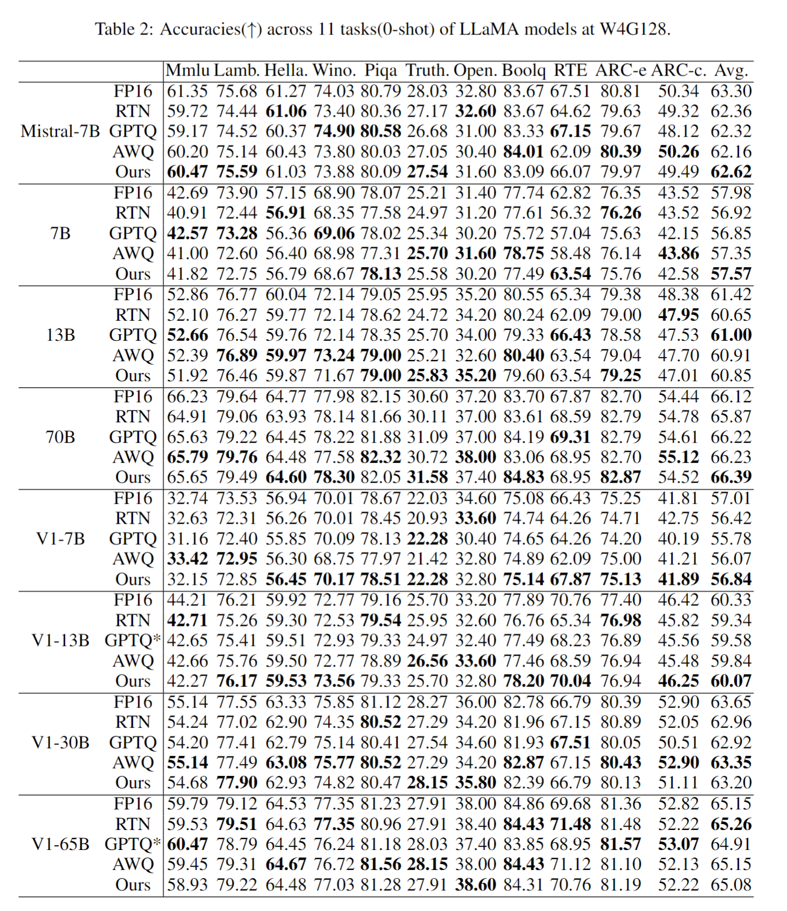
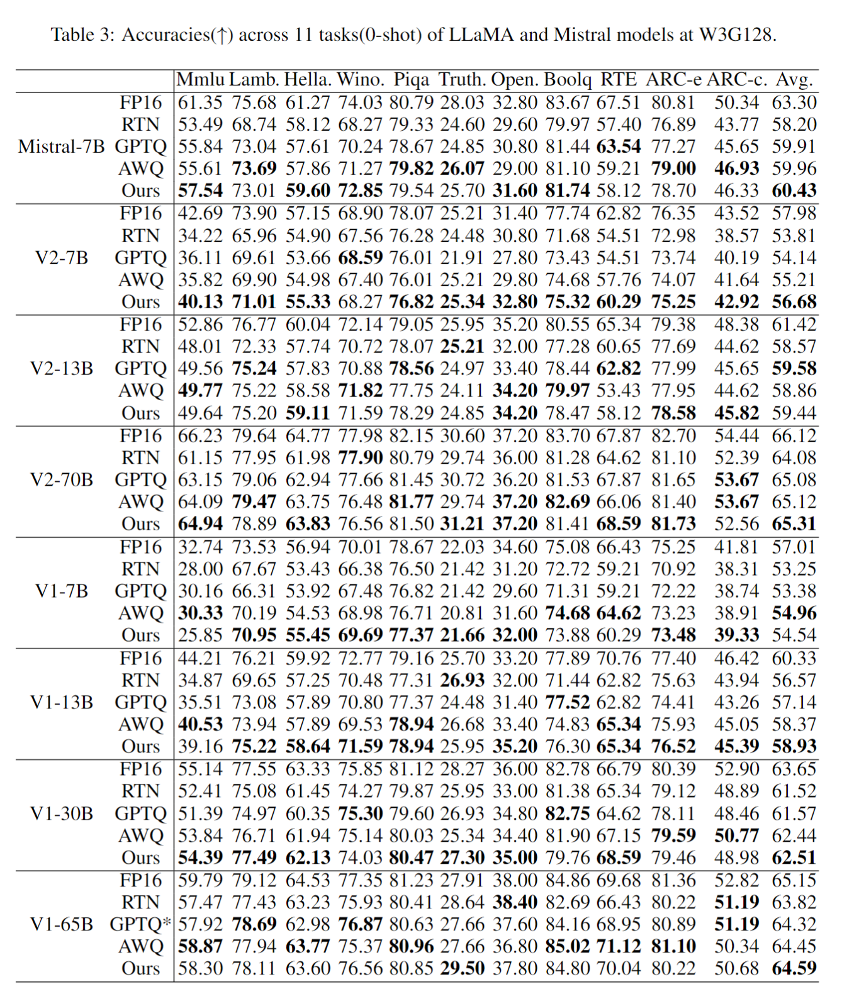
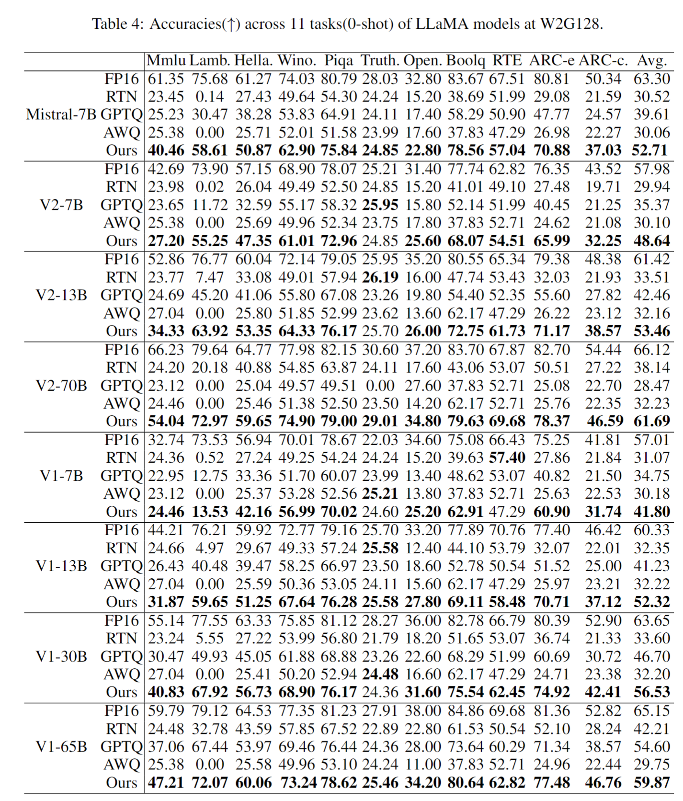

For a fair comparison, we utilized 512 samples from Pile-10k for all methods during calibration. Due to memory constraints, we maintained the original sequence length of 512 for AWQ, while for GPTQ and our approach,  a sequence length of 2048 is used. We have enabled act-order and true-seqential in GPTQ, and the notation GPTQ* indicates that we adjusted the random seed or data preprocessing to address issues related to the non-positive definite Hessian matrix or other issues.

