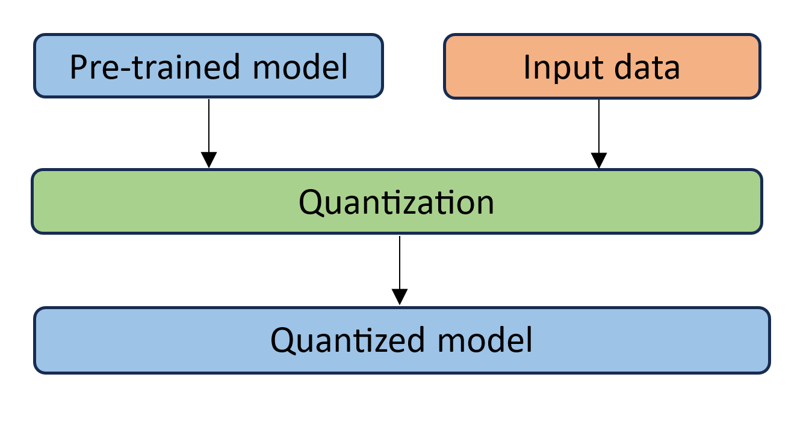

Quantization
============
1. [Introduction](#introduction)
2. [Quantization Fundamentals](#quantization-fundamentals)
3. [Accuracy Aware Tuning](#accuracy-aware-tuning)
4. [Supported Feature Matrix](#supported-feature-matrix)
5. [Get Started](#get-started)

## Introduction
Quantization is a widely-used model compression technique that can reduce model size while also improving inference latency. The full precision data converts to low-precision, there is little degradation in model accuracy, but the inference performance of quantized model can gain higher performance by saving the memory bandwidth and accelerating computations with low precision instructions. Intel provided several lower precision instructions (ex: 8-bit or 16-bit multipliers), inference can get benefits from them. Refer to the Intel article on [Lower Numerical Precision Deep Learning Inference and Training](https://www.intel.com/content/www/us/en/developer/articles/technical/lower-numerical-precision-deep-learning-inference-and-training.html).

## Quantization Fundamentals

`Affine quantization` and `Scale quantization` are two common range mapping techniques used in tensor conversion between different data types.

The math equation is like: $X_{int8} = round(Scale \times X_{fp32} + ZeroPoint)$.

**Affine Quantization**

This is so-called `asymmetric quantization`, in which we map the min/max range in the float tensor to the integer range. Here int8 range is [-128, 127], uint8 range is [0, 255]. 

here:

If INT8 is specified, $Scale = (|X_{f_{max}} - X_{f_{min}}|) / 127$ and $ZeroPoint = -128 - X_{f_{min}} / Scale$.

or

If UINT8 is specified, $Scale = (|X_{f_{max}} - X_{f_{min}}|) / 255$ and $ZeroPoint = - X_{f_{min}} / Scale$.

**Scale Quantization**

This is so-called `Symmetric quantization`, in which we use the maximum absolute value in the float tensor as float range and map to the corresponding integer range. 

The math equation is like:

here:

If INT8 is specified, $Scale = max(abs(X_{f_{max}}), abs(X_{f_{min}})) / 127$ and $ZeroPoint = 0$. 

or

If UINT8 is specified, $Scale = max(abs(X_{f_{max}}), abs(X_{f_{min}})) / 255$ and $ZeroPoint = 128$.

*NOTE*

Sometimes the reduce_range feature, that's using 7 bit width (1 sign bit + 6 data bits) to represent int8 range, may be needed on some early Xeon platforms, it's because those platforms may have overflow issues due to fp16 intermediate calculation result when executing int8 dot product operation. After AVX512_VNNI instruction is introduced, this issue gets solved by supporting fp32 intermediate data.

### Quantization Approach
Quantization has three different approaches:
1) post training dynamic quantization
2) post training static quantization
3) quantization aware training.

The first two approaches belong to optimization on inference. The last belongs to optimization during training.

#### Post Training Dynamic Quantization

The weights of the neural network get quantized into int8 format from float32 format offline. The activations of the neural network is quantized as well with the min/max range collected during inference runtime.

This approach is widely used in dynamic length neural networks, like NLP model.


<br>

#### Post Training Static Quantization

Compared with `post training dynamic quantization`, the min/max range in weights and activations are collected offline on a so-called `calibration` dataset. This dataset should be able to represent the data distribution of those unseen inference dataset. The `calibration` process runs on the original fp32 model and dumps out all the tensor distributions for `Scale` and `ZeroPoint` calculations. Usually preparing 100 samples are enough for calibration.

This approach is major quantization approach people should try because it could provide the better performance comparing with `post training dynamic quantization`.


<br>

#### Quantization Aware Training

Quantization aware training emulates inference-time quantization in the forward pass of the training process by inserting `fake quant` ops before those quantizable ops. With `quantization aware training`, all weights and activations are `fake quantized` during both the forward and backward passes of training: that is, float values are rounded to mimic int8 values, but all computations are still done with floating point numbers. Thus, all the weight adjustments during training are made while aware of the fact that the model will ultimately be quantized; after quantizing, therefore, this method will usually yield higher accuracy than either dynamic quantization or post-training static quantization.


## Accuracy Aware Tuning

This feature can be used to solve accuracy loss pain points brought by applying low precision quantization and other lossy optimization methods. 

This tuning algorithm is provided by [Intel(R) Neural Compressor](https://github.com/intel/neural-compressor/blob/master/docs/source/quantization.md).

## Supported Feature Matrix

Quantization methods include the following three types:
<table class="center">
    <thead>
        <tr>
            <th>Types</th>
            <th>Quantization</th>
            <th>Dataset Requirements</th>
            <th>Framework</th>
            <th>Backend</th>
        </tr>
    </thead>
    <tbody>
        <tr>
            <td rowspan="2" align="center">Post-Training Static Quantization</td>
            <td rowspan="2" align="center">weights and activations</td>
            <td rowspan="2" align="center">calibration</td>
            <td align="center">PyTorch</td>
            <td align="center"><a href="https://pytorch.org/docs/stable/quantization.html#prototype-fx-graph-mode-quantization">PyTorch FX</a>/<a href="https://github.com/intel/intel-extension-for-pytorch">IPEX</a></td>
        </tr>
        <tr>
            <td align="center">TensorFlow</td>
            <td align="center"><a href="https://github.com/tensorflow/tensorflow">TensorFlow</a>/<a href="https://github.com/Intel-tensorflow/tensorflow">Intel TensorFlow</a></td>
        </tr>
        <tr>
            <td rowspan="1" align="center">Post-Training Dynamic Quantization</td>
            <td rowspan="1" align="center">weights</td>
            <td rowspan="1" align="center">none</td>
            <td align="center">PyTorch</td>
            <td align="center"><a href="https://pytorch.org/docs/stable/quantization.html#eager-mode-quantization">PyTorch eager mode</a></td>
        </tr>
        <tr>
            <td rowspan="2" align="center">Quantization-aware Training (QAT)</td>
            <td rowspan="2" align="center">weights and activations</td>
            <td rowspan="2" align="center">fine-tuning</td>
            <td align="center">PyTorch</td>
            <td align="center"><a href="https://pytorch.org/docs/stable/quantization.html#prototype-fx-graph-mode-quantization">PyTorch fx mode</a></td>
        </tr>
        <tr>
            <td align="center">TensorFlow</td>
            <td align="center"><a href="https://github.com/tensorflow/tensorflow">TensorFlow</a>/<a href="https://github.com/Intel-tensorflow/tensorflow">Intel TensorFlow</a></td>
        </tr>
    </tbody>
</table>
<br>
<br>

## Get Started
### Script:
```python
from intel_extension_for_transformers.optimization import metric, objectives, QuantizationConfig
from intel_extension_for_transformers.optimization.trainer import NLPTrainer
# Replace transformers.Trainer with NLPTrainer
# trainer = transformers.Trainer(......)
trainer = NLPTrainer(......)
metric = metrics.Metric(
    name="eval_f1", is_relative=True, criterion=0.01
)
objective = objectives.performance
q_config = QuantizationConfig(
    approach="PostTrainingStatic",
    metrics=[metric],
    objectives=[objective]
)
model = trainer.quantize(quant_config=q_config)
```
Please refer to [quantization example](../examples/huggingface/pytorch/text-classification/quantization/run_glue.py) for the details.

### Create an Instance of Metric
The Metric defines which metric will be used to measure the performance of tuned models.
- example:
    ```python
    metric = metrics.Metric(name="eval_f1", greater_is_better=True, is_relative=True, criterion=0.01, weight_ratio=None)
    ```

    Please refer to [metrics document](metrics.md) for the details.

### Create an Instance of Objective(Optional)
In terms of evaluating the status of a specific model during tuning, we should have general objectives to measure the status of different models.

- example:
    ```python
    objective = objectives.Objective(name="performance", greater_is_better=True, weight_ratio=None)
    ```

    Please refer to [objective document](objectives.md) for the details.

### Create an Instance of QuantizationConfig
The QuantizationConfig contains all the information related to the model quantization behavior. If you have created Metric and Objective instance(default Objective is "performance"), then you can create an instance of QuantizationConfig.

- arguments:

|Argument   |Type       |Description                                        |Default value    |
|:----------|:----------|:-----------------------------------------------|:----------------|
|framework  |string     |Which framework you used                        |"pytorch"        |
|approach   |string     |Which quantization approach you used            |"PostTrainingStatic"|
|timeout    |integer    |Tuning timeout(seconds), 0 means early stop; combine with max_trials field to decide when to exit|0    |
|max_trials |integer    |Max tune times                                  |100              |
|metrics    |list of Metric|Used to evaluate accuracy of tuning model, no need for NoTrainerOptimizer|None |
|objectives |list of Objective|Objective with accuracy constraint guaranteed|performance|

- example:
    ```python
    q_config = QuantizationConfig(
        approach="PostTrainingDynamic",
        metrics=[metric],
        objectives=[objective]
    )
    ```

### Quantization with Trainer
- Quantization with Trainer
    NLPTrainer inherits from transformers.Trainer, so you can create trainer like you do in transformers examples. Then you can quantize model with trainer.quantize function.
    ```python
    model = trainer.quantize(quant_config=q_config)
    ```
