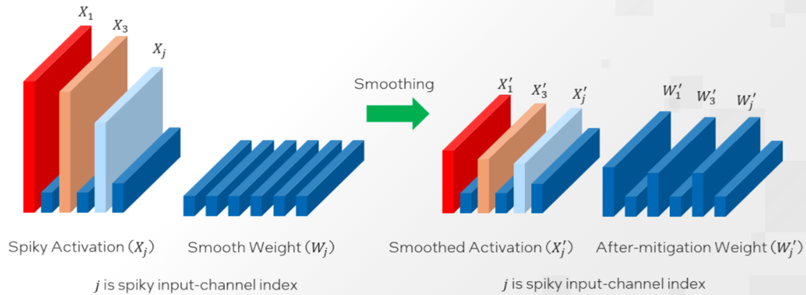

# Smooth Quant

1. [Introduction](#Introduction)
2. [Example](#Example)
3. [Validated Models](#Validated-Models)
4. [Supported Framework Matrix](#Supported-Framework-Matrix)

## Introduction
[Quantization](https://github.com/intel/intel-extension-for-transformers/blob/main/docs/quantization.md) is a common compression operation to reduce memory and accelerate inference by converting the floating point matrix to an integer matrix. For large language models (LLMs) with gigantic parameters, the systematic outliers make quantification of activations difficult.  [SmoothQuant](https://arxiv.org/abs/2211.10438), a training free post-training quantization (PTQ) solution, offline migrates this difficulty from activations to weights with a mathematically equivalent transformation. 


Smoothquant introduces a hyperparameter $\alpha$ as a smooth factor to calculate the conversion per-channel scale and balance the quantization difficulty of activation and weight. A larger $\alpha$ value could be used on models with more significant activation outliers to migrate more quantization difficulty to weights.
<div align="center">
    
</div>

SmoothQuant method aims to split the quantization difficulty of weight and activation by using a fixed-value $\alpha$ for an entire model. However, as the distributions of activation outliers vary not only across different models but also across different layers within a model, [Intel® Compressor](https://github.com/intel/neural-compressor) propose a method to obtain [layer-wise optimal](https://github.com/intel/neural-compressor/blob/master/docs/source/smooth_quant.md#our-enhancement) $\alpha$ values with the ability to tune automatically.


## Example
We have extended the `from_pretrained` function so that `quantization_config` can accept [`SmoothQuantConfig`](https://github.com/intel/intel-extension-for-transformers/blob/main/intel_extension_for_transformers/transformers/utils/quantization_config.py#L251), We provide built-in calibration function with calibration dataset `NeelNanda/pile-10k` and calib_iters `100`, if you would like to use built-in calibration function, tokenizer is necessary, if you would like to use customer calibration function, please provide calibration function to parameter `calib_func` directly.

Let us set the sq_config with `SmoothQuantConfig` first, SmoothQuantConfig provides many parameters, please see definition.
```bash
from intel_extension_for_transformers.transformers import SmoothQuantConfig, AutoTokenizer
model_name_or_path = "Intel/neural-chat-7b-v1-1"
output_dir = "saved_results"
# use built-in calibration function
tokenizer = AutoTokenizer.from_pretrained(model_name_or_path)
sq_config = SmoothQuantConfig(tokenizer=tokenizer, alpha=0.5)
# customer calibration function format
def calib_func(model):
    for index, input in enumerate(calib_dataloader):
        if index > 100:
            break
        model(**input)  # if the input is dictionary
sq_config = SmoothQuantConfig(calib_func=calib_func, alpha=0.5)
```
After setting the sq_config, we can do quantization, save, load and inference it.
```bash
from intel_extension_for_transformers.transformers import AutoConfig, AutoModelForCausalLM
sq_model = AutoModelForCausalLM.from_pretrained(
                                                model_name_or_path,
                                                quantization_config=sq_config,
                                                )
# save
config = AutoConfig.from_pretrained(model_name_or_path)
config.save_pretrained(output_dir)
sq_model.save(output_dir)
# load
sq_model = TSModelForCausalLM.from_pretrained(output_dir, file_name="best_model.pt")
# int8 model generation
generate_kwargs = dict(do_sample=False, temperature=0.9, num_beams=4)
prompt = "Once upon a time, a little girl"
input_ids = tokenizer(prompt, return_tensors="pt").input_ids
gen_ids = sq_model.generate(input_ids, max_new_tokens=32, **generate_kwargs)
gen_text = tokenizer.batch_decode(gen_ids, skip_special_tokens=True)
print(gen_text)
```

## Validated Models
Intel extension for transformers: 1.2

Neural Compressor: 2.1

IPEX (Intel Extension for PyTorch): 2.0/2.1

Dataset: lambada_openai

Task: text-generation

alpha [0.4, 0.6] is sweet spot region in SmoothQuant paper.

A list of models that achieved a <1% accuracy drop is shown below.

| Model/Last token accuracy |  FP32 Accuracy   | INT8 (w/ SmoothQuant) | Notes |
|:----------:|:------:|:------:|-----------------------------------|
| bigscience/bloom-560m | 0.354 | 0.3542 | alpha=0.5, Ipex 2.1 |
| bigscience/bloom-1b7  | 0.4634 | 0.4936 | alpha=0.5, Ipex 2.0 |
| bigscience/bloom-3b   | 0.518 | 0.5185 | alpha=0.8, Ipex 2.1 | 
| bigscience/bloom-7b1  | 0.5764 | 0.5977 | alpha=0.5, Ipex 2.0 |
| bigscience/bloomz-560m  | 0.3947 | 0.3930 | alpha=0.8, Ipex 2.1 |
| bigscience/bloomz-1b7  | 0.4828 | 0.4906 | alpha=0.5, Ipex 2.1 |
| bigscience/bloomz-3b   | 0.5018 | 0.4980 | alpha=0.5, Ipex 2.1 | 
| bigscience/bloomz-7b1  | 0.5593 | 0.5552 | alpha=0.5, Ipex 2.1 |
| facebook/opt-125m   | 0.379 | 0.3757 | alpha=0.5, Ipex 2.1 |
| facebook/opt-350m   | 0.4516 | 0.4533 | alpha=0.8, Ipex 2.1 |
| facebook/opt-1.3b   | 0.5789 | 0.5742 | alpha=0.8, Ipex 2.0 |
| facebook/opt-2.7b   | 0.6365 | 0.6404 | alpha=0.5, Ipex 2.0 |
| facebook/opt-6.7b   | 0.6769 | 0.6804 | alpha=0.5, Ipex 2.0 |
| facebook/opt-13b   | 0.6872 | 0.6814 | alpha=0.5, Ipex 2.1 |
| facebook/opt-30b   | 0.7149 | 0.7128 | alpha=0.5, Ipex 2.1 |
| facebook/opt-66b   | 0.7398 | 0.7326 | alpha=0.5, Ipex 2.1 |       
| LLaMa-7b | 0.7361 | 0.7357 | alpha=0.8, Ipex 2.1 |
| LLaMa-13b | 0.7627 | 0.7590 | alpha=0.7, Ipex 2.1 |
| LLaMa-30b | 0.7759 | 0.7840 | alpha=0.7, Ipex 2.1 |
| LLaMa-65b | 0.7908 | 0.7957 | alpha=0.9, Ipex 2.1 |
| LLaMa-2-7b | 0.7369/0.7262 | 0.7330 | alpha=Auto, Ipex 2.1/Pytorch |
| EleutherAI/gpt-j-6B | 0.6831 | 0.6821 | alpha=1.0, Ipex 2.1 |
| MBZUAI/LaMini-GPT-124m | 0.3804 | 0.3887 | alpha=0.5, Ipex 2.1 |
| MBZUAI/LaMini-GPT-774m | 0.5048 | 0.5057 | alpha=0.5, Ipex 2.1 |
| MBZUAI/LaMini-GPT-1.5b | 0.5443 | 0.5436 | alpha=0.5, Ipex 2.1 |
| mosaicml/mpt-7b-chat | 0.655 | 0.6499 | alpha=0.7, Ipex 2.1 |
| stabilityai/stablelm-base-alpha-3b | 0.4172 | 0.4149 | alpha=0.6, Ipex 2.1 |
| togethercomputer/RedPajama-INCITE-Base-3B-v1 | 0.6542 | 0.6735 | alpha=0.5, Ipex 2.1 |
| togethercomputer/RedPajama-INCITE-Chat-3B-v1 | 0.6718 | 0.6740 | alpha=0.5, Ipex 2.0 |
| togethercomputer/RedPajama-INCITE-Instruct-3B-v1 | 0.6569 | 0.6621 | alpha=0.5, Ipex 2.0 |
| togethercomputer/RedPajama-INCITE-Base-7B-v0.1 | 0.7143 | 0.7221 | alpha=0.5, Ipex 2.0 |
| togethercomputer/RedPajama-INCITE-Instruct-7B-v0.1 | 0.6895 | 0.6953 | alpha=0.5, Ipex 2.0 |
| databricks/dolly-v1-6b | 0.6866 | 0.6895 | alpha=0.8, Ipex 2.1 |
| databricks/dolly-v2-3b | 0.6297 | 0.6247 | alpha=0.5, Ipex 2.1 |
| tiiuae/falcon-7b-instruct | 0.6437 | 0.6392 | alpha=0.7, Pytorch |

## Supported Framework Matrix

| Framework | Alpha        | Folding    |
|:---------:|--------------|------------|
| PyTorch   | [0-1] / 'auto' | False      |
| IPEX      | [0-1] / 'auto' | True / False(Version>2.1) |
