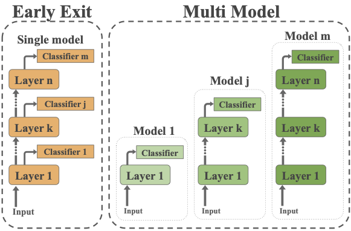
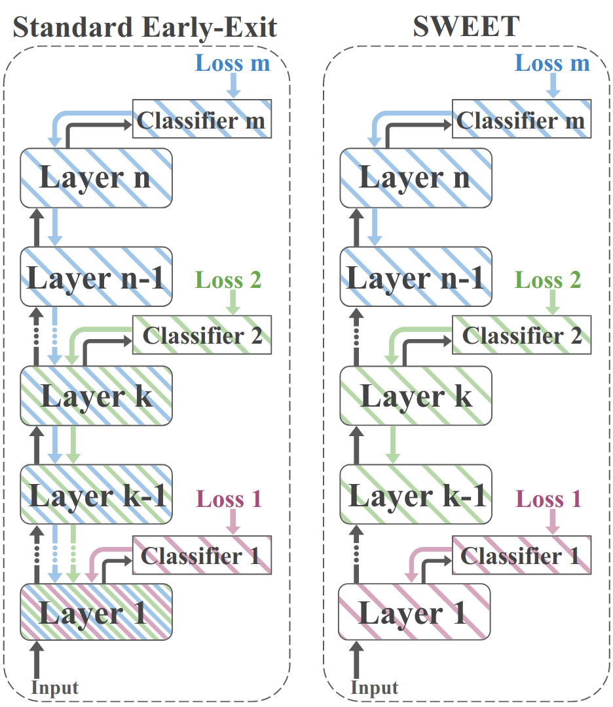

# Separating Weights for Early-Exit Transformers (SWEET) for Text Classification with BERT or DeBERTa

This code implements SWEET Early-Exit fine-tuning method described in the paper [**Finding the SWEET spot:** Improvement and Anlysis of Adaptive Inference in Low Resource Settings](https://arxiv.org/abs/2306.02307) and is based on [SWEET repo](https://github.com/schwartz-lab-NLP/SWEET).


Below is an illustration of Early-Exit and Multi-Model adaptive inference approaches. In both methods, multiple classifiers of increasing sizes are run serially, until a confident prediction is made. In Early-Exit (left), a single model with multiple classifiers is used, such that early computations are reused by later classifiers. In Multi-Model (right), a sequence of independent models is used, allowing each classifier to decouple its parameters from other classifiers.
<p align="center">
    
</p>

Below is an illustration of the standard Early-Exit fine-tuning method (left), where lower layers get gradient updates from multiple classifiers, with the SWEET method (right), in which each layer parameters are updated only by the next classifier.

<p align="center">
    
</p>

## Installation

```bash
pip install -r requirements.txt
```

## Running Text Classification on GLUE tasks with SWEET
We provide instructions for training and evaluating BERT or DeBERTa models on GLUE tasks with Early-Exit or Multi-Model model. Note that we currently support single GPU.

run_glue_EE.py and run_glue_MM.py use similar parameters as [run_glue.py](https://github.com/huggingface/transformers/blob/main/examples/pytorch/text-classification/run_glue.py) from HuggingFace example, with the following modifications: 
* `model_name_or_path`: path to pretrained model or model identifier from **BERT** or **DeBERTa** huggingface.co/models.
* `exit_layers`: '_'-separated list indices of layers to add classifiers to (each between [0-(num_layers-1)]).
* `exit_thresholds`: number of exit thresholds for inference early-exit (ranged from 1/num_labels to 1).
* `exit_strategy`: function implementing a decision rule for early-exit among confidence_threshold anf lte (for learning the exit approach). By default, it is set to confidence_threshold.
* `exit_kwargs`: arguments for the exit strategy if needed.
* `SWEET`: flag indicating whether to use the SWEET fine-tuning method. disable the SWEET flag for running standard early-exit.
* `per_device_eval_batch_size`: The batch size per GPU/TPU core/CPU for evaluation has to be set to 1 since early-exit inference works only with batch size 1.
* `deberta`: flag indicating whether the pretrained model is DeBERTa (by default, the pretrained model is BERT).

For example, following is the command for running SWEET fine-tuning and evaluation of bert-base-uncased on MNLI task
```bash 
python3 run_glue_EE.py --model_name_or_path bert-base-uncased --task_name mnli --per_device_train_batch_size 16 --per_device_eval_batch_size 1 --do_train --do_calibration --do_eval --max_seq_length 256 --max_train_samples 6000 --output_dir ${OUTPUT_DIR} --cache_dir ${CACHE_DIR} --learning_rate 5e-5 --exit_layers 0_3_5_11  --exit_thresholds 11 --num_train_epochs 2 --SWEET
```
Following is the command for running multi-model fine-tuning and evaluation of bert-base-uncased on MNLI task
```bash 
python3 run_glue_MM.py --model_name_or_path bert-base-uncased --task_name mnli --per_device_train_batch_size 16 --per_device_eval_batch_size 1 --do_train --do_calibration --do_eval --max_seq_length 256 --max_train_samples 6000 --output_dir ${OUTPUT_DIR} --cache_dir ${CACHE_DIR} --learning_rate 5e-5 --exit_layers 0_3_5_11  --exit_threshold 11 --num_train_epochs 2
```

## Citation

```
@misc{rotem2023finding,
      title={Finding the SWEET Spot: Analysis and Improvement of Adaptive Inference in Low Resource Settings}, 
      author={Daniel Rotem and Michael Hassid and Jonathan Mamou and Roy Schwartz},
      year={2023},
      eprint={2306.02307},
      archivePrefix={arXiv},
      primaryClass={cs.CL}
}
```