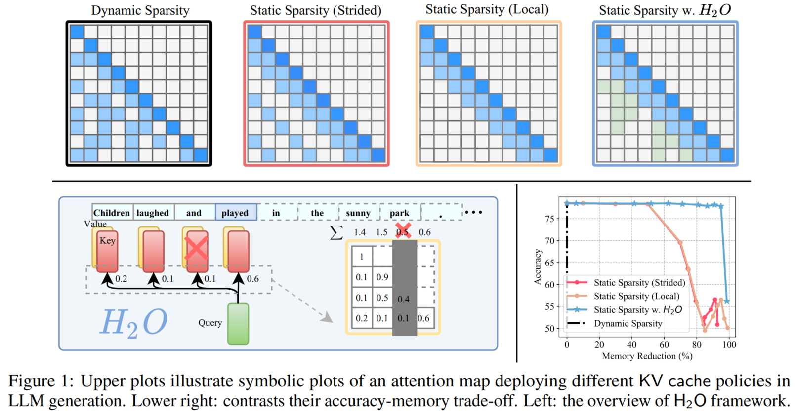

# H2O: Heavy-Hitter Oracle for Efficient Generative Inference of Large Language Models

**Heavy-Hitter Oracal (H2O)** is a novel approach for implementing the KV cache which significantly reduces memory footprint. 

This methods base on the fact that the accumulated attention scores of all tokens in attention blocks adhere to a power-law distribution. It suggests that there exists a small set of influential tokens that are critical during generation, named heavy-hitters (H2). H2 provides an opportunity to step away from the combinatorial search problem and identify an eviction policy that maintains accuracy.

H2O can dynamically retains the balance of recent and H2 tokens. Significantly increase model throughput while ensuring accuracy.


For more info, please refer to the paper [H2O: Heavy-Hitter Oracle for Efficient Generative Inference of Large Language Models](https://arxiv.org/pdf/2306.14048).





## Usage and Examples
### Evaluation on tasks from [lm-eval-harness](https://github.com/EleutherAI/lm-evaluation-harness) framework
Using simulation mode
```bash
python run_generation.py \
    --model meta-llama/Meta-Llama-3-8B \
    --accuracy \
    --batch_size 16 \
    --h2o \
    --heavy_ratio 0.1 \
    --recent_ratio 0.1 \
    --device 0
```
To run the real_drop mode
```bash
python run_generation.py \
    --model meta-llama/Meta-Llama-3-8B \
    --accuracy \
    --batch_size 16 \
    --h2o \
    --heavy_ratio 0.1 \
    --recent_ratio 0.1 \
    --device 0
    --real_drop
```
Get the accuracy of dense model
```bash
python run_generation.py \
    --model meta-llama/Meta-Llama-3-8B \
    --accuracy \
    --batch_size 16
```