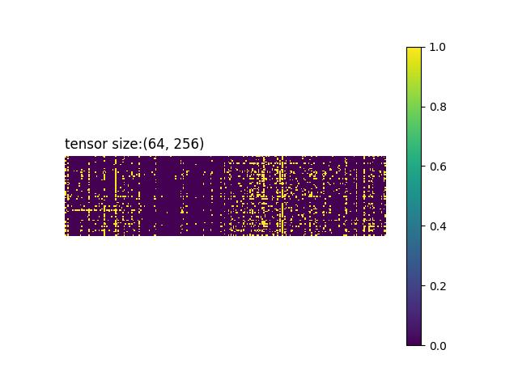

# How to visualize weights distribution of sparse model
## Introduction 
Sparse model is one type of compressed model, which contains un-structure information more than pre-trained model in the same weights tensor. visualization these sparse models could help us design a better kernel level computation pattern in specific hardware platform. this script currently supports both neural engine model and pytorch model.
## Setups
### 1. Prepare the sparse model 
You have to prepare a model.bin file and its conf.yaml file for neural engine model in the same IR directory, but just one model.bin for pytorch model.
### 2. Run below commands
`pip install -r requirements.txt`
1. Neural Engine model: `python sparsity_all.py --mt 1 --path /path to IR directory`
2. Pytorch model: `python sparsity_all.py --mt 0 --path /path to pytorch model directory`

### 3. Analysis results
You could see visualization one of results as below hotmap figure after running above command in the same directory, and it could generate JPG format pictures for each weight tensor, the name of pictures corresponding with tensor name.

