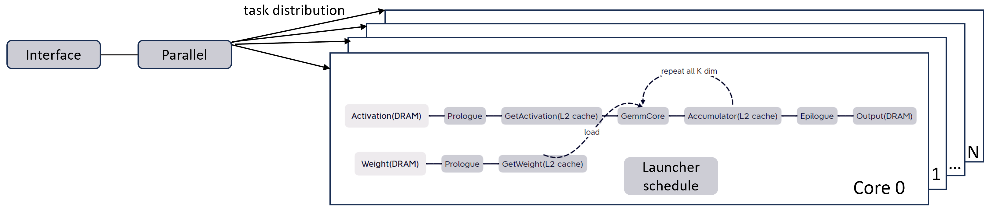

# Jblas
Jblas is a lightweight, header-only acceleration library for high-performance GEMM and related computations on Intel platform. Inspired by Cutlass, it provides high-level template class abstractions for various elements required for computation, and allows flexible kernel construction through template combinations to meet specific needs, maximizing the reuse of existing template classes. Users can also develop custom template classes to expand Jblas’s computational capabilities. Jblas includes several different types of template classes, specifically:

- `Interface`: Exposes gemm computation interface to users, while allowing users to specify their own Launcher template classes and Parallel template classes.
- `Launcher`: Schedules computation-related template classes, allowing users to specify their own computation-related template classes, including GemmCore, Prologue, and Epilogue.
- `Parallel`: Specifies data splitting strategy for task distribution among different cores. Jblas’s default Parallel template class adopts an L2-cache-fusion concept, i.e., each core tries to temporarily store the data it processes in its L2-cache during each round of gemm-tile computation.
- `GemmCore`: A computation-related template class that provides a micro-kernel for performing a tile gemm computation with a specific ISA. It is the most important template class in Jblas. Currently, GemmCore supports the following ISAs:
   - AVX2
   - AVX_VNNI
   - AVX512F
   - AVX512_VNNI
   - AMX_BF16
   - AMX_INT8
   - AVX512_FP16
- `Prologue`: A computation-related template class that preprocesses (such as data type conversion/padding) input data to meet GemmCore’s input data requirements.
- `Epilogue`: A computation-related template class that post-processes (such as eltwiseop-fusion) the results of gemm-core computations to expand Jblas’s application scenarios.

The interaction logic between different template classes and the calculation process of gemm are shown in the following figure.
  
# Highlights 
## Weight-only 
Jblas provides weight-only linear computational capabilities for LLM inference. We provide a series of Prologues for quantize/compress/serialize/deserialize fp32 weights in different ways. Specifically, we support compressed weights of the following data types:

- S8
- S4_CLIP
- S4_FULLRANGE
- FP4
- NF4
## Postop-fusion 
Jblas provides assembly-level postop-fusion through epilogue to minimize the overhead caused by data movement. Specifically, we support the following postop-fusions:

- GELU
- SWISH
- RELU
- EXP
- TANH
## Compilation Requirements and Usage
Compile: 

- GCC version >=8.5.0 
- CMake version >=3.5

Usage:
```cmake
add_subdirectory(jblas)
target_link_libraries("${YOUR_PROJECT}" jblas::jblas)
```
