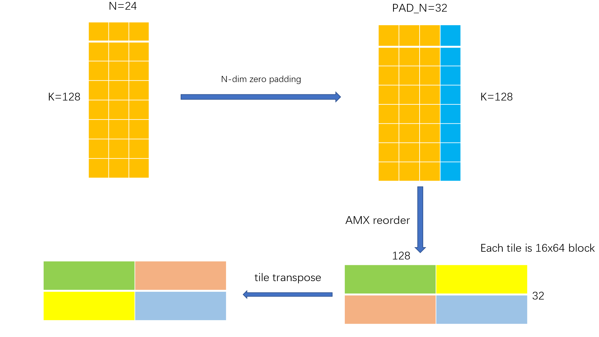
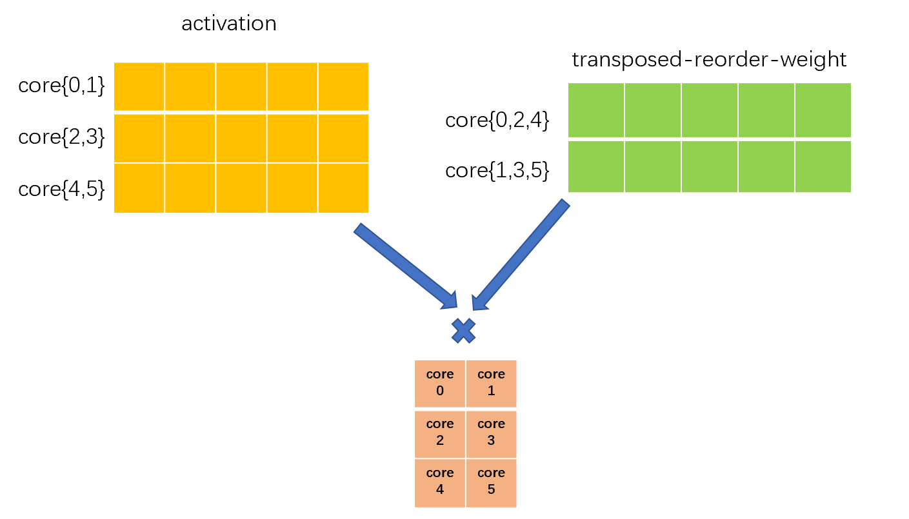
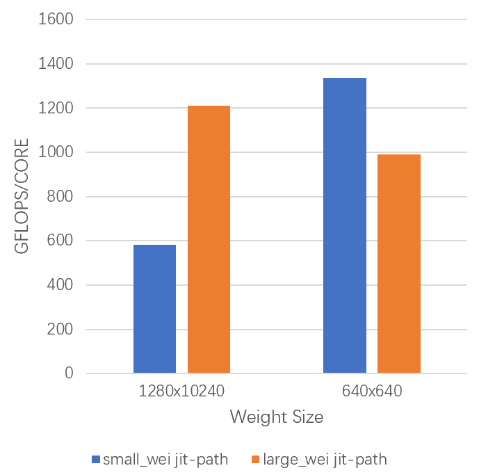

# Dynamic Quant Matmul

## problem description
Quantization technology, as an important method of model compression and acceleration, has been applied to more and more scenarios.  Among them, static quantization shows high enough accuracy in some models (such as bert), but its accuracy is not satisfactory in some other models (such as stable-diffusion).  Dynamic quantization can improve the accuracy performance, but it requires the inference engine to use multiple small operators to complete the quantization process, which will inevitably affect the throughput performance of the entire model.  To solve the above problems, we introduce a dynamic quantization matmul kernel based on AMX instructions, which can complete dynamic quantization while ensuring high performance of matrix computation.

## Kernel details
### Prerequisites for using dynamic quant matmul
1. In order to facilitate the dequantization of the matmul results of activation and weight, we require that the activation matrix and weight matrix use symmetric quantization with zero point as 0. At the same time, in order to cooperate with the subsequent dynamic quantization kernels, we will also use symmetric quantization for the result matrix, that is, only output the quantized dst matrix and the corresponding scale, and not output zero point.
2. The current dynamic_quant_matmul supports flexible `batch`, `M`, `N`, but requires that `K` can be divisible by 4  


### Preprocessing of weight matrix
Our dynamic_quant_matmul is applied in the scenario of multiplying activation matrix and weight matrix. Since the weight matrix is static during inference, it can be preprocessed before inference to facilitate our ISA to accelerate the calculation of matrix multiplication, mainly divided into two steps:

1. Padding + AMX reorder the weight matrix to facilitate the calculation of `tdpbssd` instruction, please refer to AMX document to understand the reorder method. Each `tdpbssd` instruction calculates block shape generally as `16 × tile_k` * `tile_k x 16`, where `tile_k` value satisfies the following formula `max_tile_k(tile_k<=k&&k%tile_k==0&&tile_k%4==0)`. The build of each block is always 16 on `N dimension`, so when weight matrix cannot be divisible by 16 on `N-dim`, we will pad 0 on `N-dim` to make it divisible by 16, and use mask register to avoid writing back extra values when writing back `N-dim` on the last result tile.
2. Transpose the reordered matrix with tile of `(tile_k/4)*64` as the basic unit, its purpose is to `row-major` access weight matrix when we reduce on the `K-dim`, such access behavior is more friendly to cache. 

The whole weight matrix preprocessing process can be represented by the following figure
  

### different jit-paths for different weight size
 In our internal implementation of dynamic_quant_matmul, the weight matrix has a very high spatial locality, and we hope that the L2 cache can cache the entire weight matrix that the core is responsible for processing, so we will generate different jit kernels to meet the above requirements for different weight size. When the reuse-data-size is less than `L2-cache-size`×`large_wei_threshold` (can be specified by the user, default is 1) and each core will process enough row (M assigned for each core >= 16, avoid to waste AMX), we will enable one-stage path, otherwise enable two-stage path.  

#### one-stage jit-path
In this jit-path, we will have a `16xpad_n` tmp_buffer, which is used for data write-back of `tilestored` instruction, dequantize of dst tile, and the calculation of scale and quantize of dst tile are all done on this tmp buffer, so this buffer also has a very high spatial locality. When `(16xpad_n+weight)`x`large_wei_threshold`<`L2-cache-size`, this path has better performance for matmul. Specifically, this jit-path will parallelize on the `M-dim`, each core caches the entire weight matrix, and the pseudo code description of the kernel calculation process is as follows
```cpp
for (int m = 0; m < M; m += TILE_M) {
    // build 16xN dst block
    for (int n = 0; n < N; n += DP_TILE_N) {
        k_dim_dp();
        write_tile_to_tmp_buf();
        dequantize_tile_on_tmp_buf();
    }
    calculate_scale_on_tmp_buf();
    write_back_scale();
    // quant write back
    for (int n = 0; n < N; n += QUANT_TILE_N) {
        quantize_on_tmp_buf();
        write_tile_to_dst();
    }
}
```
#### two-stage jit-path
In this jit-path, the calculation of dynamic_quant_matmul will be done by two kernels

1. s8(activation)s8(weight)bf16(dst) matmul
2. scale_reduce_quantization

The `scale_reduce_quantization` kernel can reduce the scales then apply dynamic-quantization. All of the cores will do reduce calculation and store the scales to their private buffer but only one core will write to the real-scale-dst address so we needn't reduce-scale-sync. `scale_reduce_quantization` also promise the data processed by each core in 2nd stage is same as the previous (s8s8bf16 gemm) stage, which make the most cache-friendliness. 

In the first step of s8s8_dynamic_dequant matmul, the kernel will parallelize on both `M-dim` and `N-dim` as the weight is too large or the M assign to each core is too small in one-stage jit-path. It desides the `M` and `N` that each core is responsible for processing duing initialization. We split N-dim until the size of the weight processed by each core is less than L2-cache meanwhile the M processed by each core is large enough.

The activation, weight and dst that each core is responsible for processing are roughly as follows



Finally, we can intuitively feel the performance benefits of kernel executing on a suitable jit path through the following chart.  

<div align=center>  


</div>