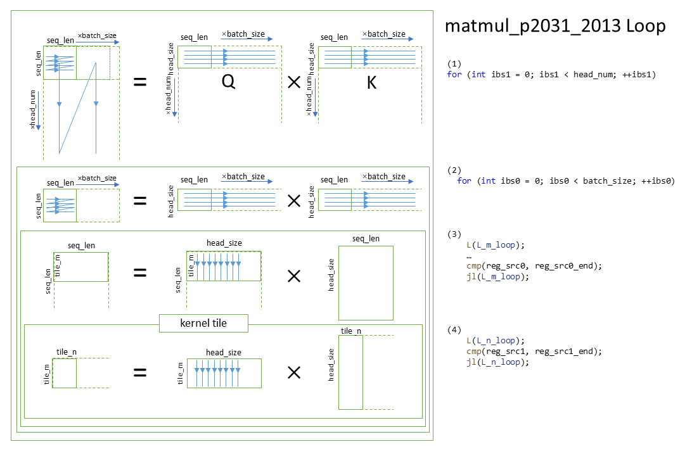
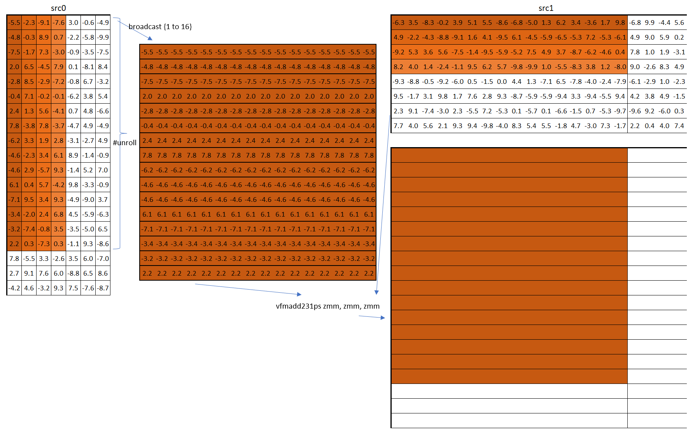
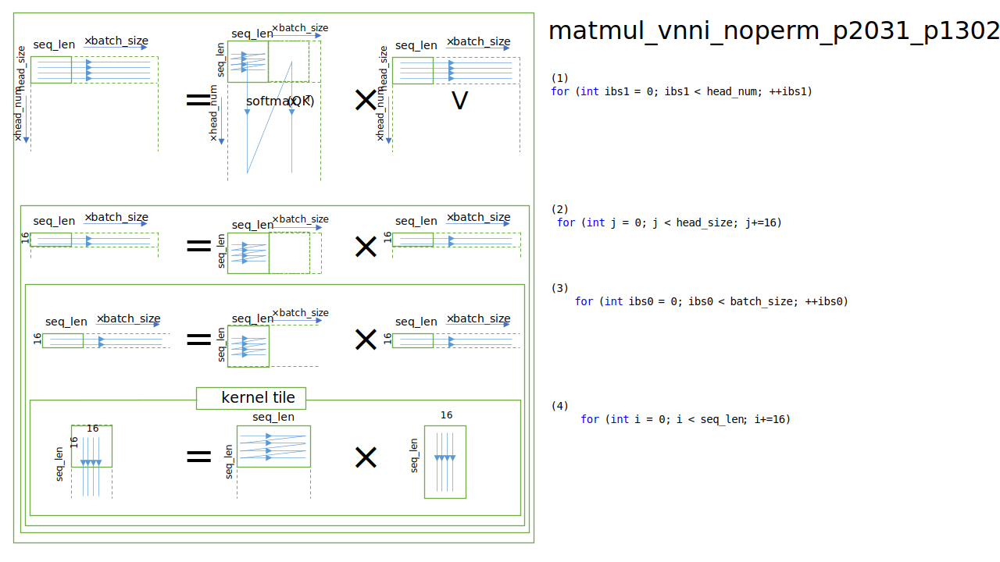
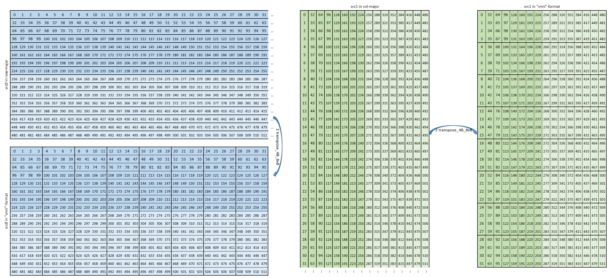
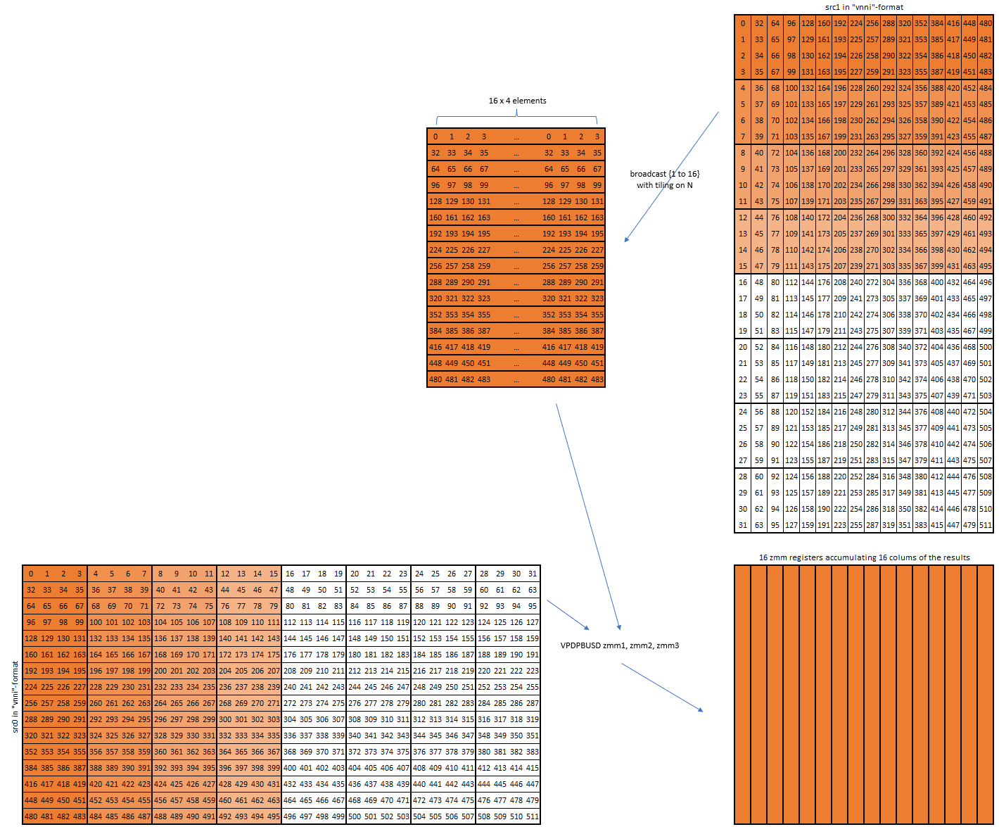

# Transposed MatMul

- [Introduction](#introduction)
  - [Problem Statements](#problem-statements)
- [Matmul_p2031_2013](#matmul_p2031_2013)
  - [Matmul_avx512f_p2031_2013](#matmul_avx512f_p2031_p2013)
- [Matmul_noperm_p2031_p1302](#matmul_noperm_p2031_p1302)
  - [Matmul_vnni_noperm_p2013_p1302](#matmul_vnni_noperm_p2013_p1302)
    - [Reorder beforehand](#reorder-beforehand)

## Introduction

This document introduces our specialized matmul kernels for the special permutations used in transformer models.

### Problem Statements

We focus our transpose matmul kernel on accelerating the "attention" of the transformer. Given the equation of dot-product attention,

$$
{\rm Attention}(Q, K, V) = {\rm softmax}(\frac{QK^T}{\sqrt{d_k}})V
$$

where $Q, K, V \in Q^{\rm seq{\textunderscore}len \times head{\textunderscore}size}$ for a single attention.
In real computation, we evaluate this equation over multiple heads and over multiple samples in a batch, making $Q,K,V$ three matrices of `batch_size x head_num x seq_len x head_size`. As these three matrices are the results of linear layers, they are natively stored in the memory format of `batch_size x seq_len x head_num x head_size`.

> Note: For BERT base, head_num is 12 and head_size is 64.

As the SpMM kernels of SpareLib [prefer transposed operation](./kernel_vnni.md), the $Q, K, V$ matrices are in `head_num x head_size x batch_size x seq_len` in terms of physical memory format. Therefore, to get the correct matrix shape for multiplication, the axises of the source and destination matrices of matmul kernels are conceptually permuted in the following way:

```
Q:                  head_nun   head_size batch_size seq_len ====perm2031===> batch_size head_nun seq_len   head_size
K:                  head_nun   head_size batch_size seq_len ====perm2013===> batch_size head_nun head_size seq_len
QK^T:               batch_size head_nun  seq_len    seq_len ===============> batch_size head_nun seq_len   seq_len
V:                  head_nun   head_size batch_size seq_len ====perm2031===> batch_size head_nun seq_len   head_size
Attention(Q, K, V): head_nun   head_size batch_size seq_len <===perm1302==== batch_size head_nun seq_len   head_size
```

> Notes
>
> - The concept of "perm" is derived from that of the [transpose operator of ONNX](https://github.com/onnx/onnx/blob/rel-1.11.0/docs/Operators.md#transpose). It is used to describe the permutation of tensor axes.
> - The physical memory format is LHS, and the conceptual layout is RHS (where the last two dimensions perform matrix multiplication, leaving the rest for batching).

## Matmul_p2031_2013

> i.e. The kernel for the first matmul operation

Currently, we have only implemented a kernel of these permutations with float32 input and output.

### Matmul_avx512f_p2031_p2013

The following figure illustrates loops iterated by this kernel:



The inner-most loop body performs computation for each tile, where the results of multiplication continuously accumulate on a group of vector registers. The following figure shows a 16x1 tile (or 16x16 tile in terms of elements).
> Note: The $Q$ matrix in the first and second loops is drawn transposed in the figure for a better demonstration of the memory layout.



where lighter cells indicate values used in following steps along the k-axis.

## Matmul_noperm_p2031_p1302

> i.e. The kernel for the second matmul operation

Currently, we have only implemented a kernel of these permutations with uint8, int8, and uint8 as left matrix, right matrix, and output matrix respectfully.

### Matmul_vnni_noperm_p2013_p1302

The following figure illustrates loops iterated by the `vnni_noperm_p2013_p1302` kernel:



As the memory format does not match what VNNI needs, the kernel tile continuously performs two `transpose_4B_8x8` on both the left and right matrix for each step of 32 elements along the reduction axis:



| Legend                        | Explanation                   |
|-------------------------------|-------------------------------|
| Cell values                   | Original memory offset (may not be contiguous for those next to ellipsis) |
| Thinner border                | Memory contiguous elements    |
| Bolder border                 | Cache line                    |
| Fill color | The first and second `transpose_4B_8x8` tasks    |

Following the reordering, the kernel tile computes over 16x32x16 as the graph below demonstrated (similar legends applied):



#### Reorder beforehand

Notice that sub-matrices from both the left and right matrices need to be reordered multiple times in the above workflow, leading to suboptimal performance. To avoid this overhead, we perform reordering on a temporary piece of memory beforehand. It turned out to be able to boost performance by more than twofold on large matrices. The following figure shows the loops iterated by this kernel:


Users can specify `op_attrs["unified"] = "true"` to roll back to the non-copied implementation on small workloads where the transpose-copy introduces higher overhead than it saves.
