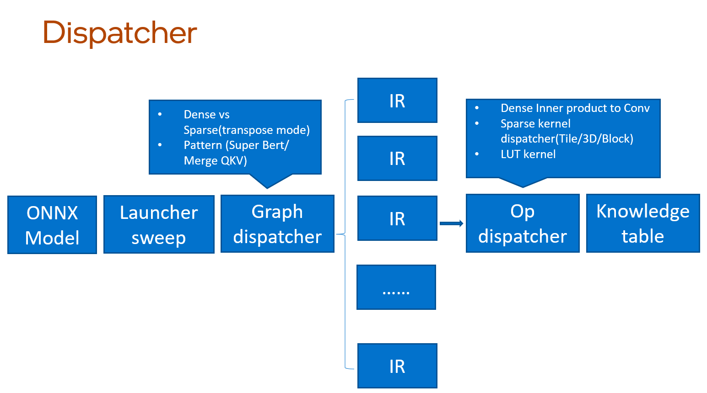

# Engine Tuning
- [Introduction](#introduction)
- [Pattern Tuning for Dispatching Best Pattern](#pattern-tuning-for-dispatching-best-pattern)
- [Graph Tuning for Dispatching Best Graph](#graph-tuning-for-dispatching-best-graph)
- [OP Tuning for Dispatching Best Kernel and Related Runtime Config](#op-tuning-for-dispatching-best-kernel-and-related-runtime-config)
  - [How to Turn on Op Tuning Mechanism](#how-to-turn-on-op-tuning-mechanism)
  - [More Tuning Options](#more-tuning-options)

## Introduction
`Neural Engine` supports tuning mechanisms which will try to find the best pattern, best graph and best kernel implementation and related runtime configurations. It includes graph tuning and op tuning. The whole workflow is as follows:

Just like the picture shown. ONNX model will be compiled to Neural Engine IR first. And then you can use graph dispatcher to tune IR on graph level. For graph level tuning, it includes graph tuning and pattern tuning. And for further performance, op tuning will bring the best recipe of op config.

## Pattern Tuning for Dispatching Best Pattern
For pattern tuning, it is mainly for two big patterns (Super Bert/ Merge QKV). The algorithm will automatically determine the pattern should be off or on according to the performance. You just set tune = True in subgraph_match():
```python
from intel_extension_for_transformers.backends.neural_engine.compile.loaders.loader import Loader
from intel_extension_for_transformers.backends.neural_engine.compile.extractors.extractor import Extractor
from intel_extension_for_transformers.backends.neural_engine.compile.sub_graph.subgraph_matcher import SubGraphMatcher
load = Loader()
extract = Extractor()
subgraph_match = SubGraphMatcher()
graph = load(model_path)
graph = extract(graph)
# pattern tuning
graph = subgraph_match(graph, tune = True)
output = graph.inference([data])
```
## Graph Tuning for Dispatching Best Graph
For graph tuning, it is mainly for the sparse graphs or dense graphs. In some cases such as small shapes or devices with ISA, the performance of dense ops maybe perform better than sparse ops. And sparse op will bring other transpose ops. We have an easy-to-use API to tune sparse graphs, dense graphs or mix graphs automatically. You just need add graph_dispatch after `compile`:
```python
from intel_extension_for_transformers.backends.neural_engine.compile import compile
model = compile(int8_model_path)
# set shape for graph tuning
model.graph_dispatch(inputs_shape = [shape_0, shape_1, shape_2])
output = model.inference([input_0, input_1, input_2])
```
>**Note** Sparse and dense graph tuning only can be used on int8 models.

## OP Tuning for Dispatching Best Kernel and Related Runtime Config
`Neural Engine` supports op tuning mechanism for trying to get the best kernel implementation and related runtime configurations. Below are the tuning ways for now (We will consider enlarging the tuning space in subsequent versions). So, before you turn on the tuning mechanism, you need to check if the model can be tuned.

| op type | dtype | default kernel | tuning kernel | kernel config | remark |
| :-------: | :-----: | :--------------: | :-------------: | :-------------: | :------: |
| InnerProduct | fp32 | DNNL InnerProduct | DNNL Convolution | input shape | dense fp32 weight |
| InnerProduct | int8 | SparseLib InnerProduct | SparseLib InnerProduct | input shape, micro oc, sub func level | sparse int8 structured weight |

>**Note**
> 1. DNNL InnerProduct (MK x KN) - DNNL Convolution (NHWC, conv kernel size is 1x1), split M into NxHxW, K=C. Tune best N, H, W combinations.
> 2. SparseLib InnerProduct (NK x KM) - SparseLib InnerProduct (NK x MmKMb), split M into MmxMb. micro oc is a positive integer fulfilling micro oc <= OC && micro oc % 4 == 0 determined the size along the output dimension is processed in each OMP iteration. Tune best MmxMb, micro oc and sub func level (higher sub_func value means more operations are done in sub-function, i.e. less unrolling) combinations.
> 3. see op_tuning.hpp if you want to know more details.

### How to Turn on Op Tuning Mechanism

```python
# load model from disk
from intel_extension_for_transformers.backends.neural_engine.compile.graph import Graph
model = Graph()
model.graph_init(conf.yaml, model.bin)
# or get model from compile
from intel_extension_for_transformers.backends.neural_engine.compile import compile
model = compile(model.onnx)
options = {'enable_op_tuning': True}
model.execution_options = options
# inference with fixed shape data
model.inference([data])
```

You can see a txt file called `engine_dispatch_table.txt` in your workspace folder which records tuning results after executing the above code.

This table file contains the lines number (first row) and the rest of the lines contain best tuning results which are like: `op_type (string) - hash key (size_t) - kernel_config(kernel_name (string) - input_shape- ... <if has specific dispatch kernel config except kernel name>)`.

Examples:

DNNL InnerProduct -DNNL Convolution
```text
1
InnerProduct 3025159985633461085 Convolution 4,1,40,1024
```
SparseLib InnerProduct - SparseLib  InnerProduct
```text
1
InnerProduct 14124194128933833351 SparseLib 4,1024,384 0 2
```
>**Note** Do not do other things when tuning your model! Otherwise, the final results may be affected.

### More Tuning Options
You can set the table file path and tuning warmup iterations if you want to simulate real deployment conditions.

```python
options = {'enable_op_tuning': True,
           # set tuning warmup iterations
           'warmup_iter': num_iterations,
           # set table file path
           'dispatch_table_file_root': file_root,
}
model.execution_options = options
# inference with multi-iterations
for i in range(iterations):
    # data can have different shapes
    model.inference([data])
```

If you want to get model performance after tuning in one python script, you can use the following code:

```python
# load model here
...

# 1. before tuning
for i in range(iterations):
    model.inference([data])
# get performance here

# 2. tuning
options = {'enable_op_tuning': True,
           # set tuning warmup iterations
           'warmup_iter': num_iterations,
           # set table file path
           'dispatch_table_file_root': file_root,
}
model.execution_options = options
for i in range(iterations):
    model.inference([data])
# get performance here

# 3. after tuning
options = {'enable_op_tuning': False}
model.execution_options = options
for i in range(iterations):
    model.inference([data])
# get performance here
```

However, we recommend you benchmark model performance one by one to prevent imprecise results.
