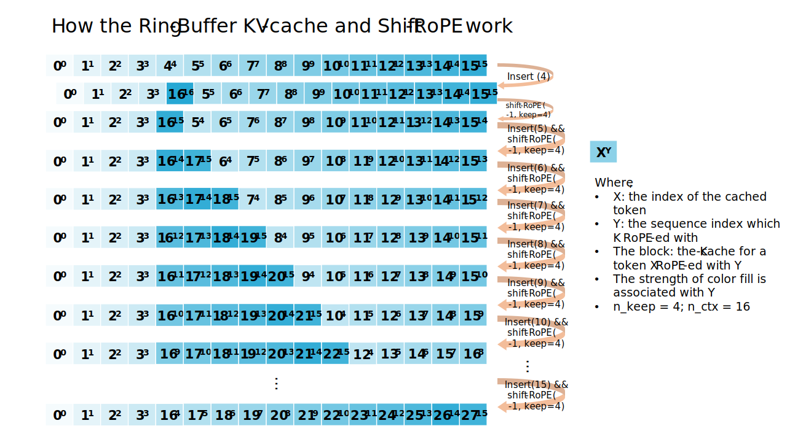
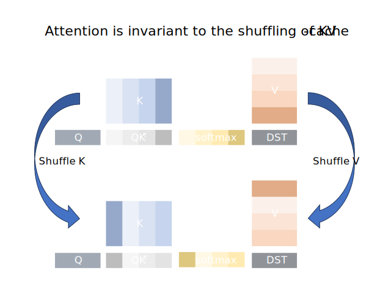

Infinite Inference
==================

As a key feature to many LLM applications like ChatBot, the [StreamingLLM paper](https://arxiv.org/abs/2309.17453) discussed infinite inference and proposed their solution which preserves first `n_keep` tokens as "attention sink". Based on their work, LLM Runtime supports infinite inference with two optimized implementations: re-evaluate and shift-RoPE-K. The discard and re-evaluate is available to all models, while the more efficient shift-RoPE-K method required certain models design and needs graph-level support to enable (but it only adds less than 10% overhead comparing to our optimized fix-length generation).

## Discard and Re-evaluate
By default, the LLM Runtime discards half of the recent tokens and re-evaluates the left sequence to rebuild the KV-cache if no space left in the KV-cache. Obviously, no extra cost is introduced before the KV-cache context is full. The overhead of re-evaluation can be amortized until the context is full again which results in competitive average latency. This method avoids the copying (e.g. `torch.cat`) of the entire KV-cache in the original implement of StreamingLLM. However, the re-evaluation is triggered constantly if only one token is dropped at a time according to the StreamingLLM paper.

## Shift-RoPE-K and Ring-Buffer
If the model implements its positional embedding with [the Rotary Positional Encoding (RoPE)](https://arxiv.org/abs/2104.09864), a "shift operation" can be applied to existing K-Cache, avoiding re-computation for all previous tokens that are not discarded. This method makes use of the full context size in the generation of long text and it introduces no overhead before the KV-cache context is fully filled.

The "shift operation" relies on the commutativity and associativity of rotation, or complex number multiplication. For example, if the K-tensor for a token is initially placed in a position $m$ and thus rotated $m\times\theta_i \text{ for } i \in \left[0, d/2\right)$, it can rotate back $(-1)\times\theta_i \text{ for } i \in \left[0, d/2\right)$ if it needs to be moved to the position $m-1$. This is just what happens every time the cache of `n_discard` tokens are dropped, when every token left needs to be "moved" `n_discard` closer. This process is illustrated in the following graph with `n_keep = 4, n_ctx = 16, n_discard = 1`.

Notice that the [fused-attention](./fused_attention.md) layer does not need to be informed of the process above. As long as the K-cache and V-cache are shuffled identically, the attention will output the same results (with minor differences due to the floating point errors). The invariance of attention is shown in the following diagram.

### Acceleration with AVX512-FP16
The shifting-RoPE operation can be viewed as a vector-matrix element-wise complex multiplication, where the complex vector is consist of the cosine/sine value of $-N \times \theta_i \text{ for } i \in \left[0, d/2\right)$ (where $N$ is the length of current tokens / number of discarded cached tokens), and the complex matrix is of shape `d/2 x n_ctx`. The complex vector is precomputed and is been broadcasted in the dimension of `n_ctx` to multiply to the matrix. Therefore, it is straightforward to accelerate this operation with the `VFMULCPH` instruction which performs 16 complex multiplications to 16 pairs of fp16 values (and `VPBROADCASTD` for broadcasting).

### Supported Models
The following models supports shift-RoPE-K method by the LLM Runtime:
| Model name                                                                                                                                                                                                           |                    Status (Challenges)                    |
| -------------------------------------------------------------------------------------------------------------------------------------------------------------------------------------------------------------------- | :-------------------------------------------------------: |
| [LLaMA2-7B](https://huggingface.co/meta-llama/Llama-2-7b-chat-hf), [LLaMA2-13B](https://huggingface.co/meta-llama/Llama-2-13b-chat-hf), [LLaMA2-70B](https://huggingface.co/meta-llama/Llama-2-70b-chat-hf)          |                             ✅                             |
| [LLaMA-7B](https://huggingface.co/decapoda-research/llama-7b-hf), [LLaMA-13B](https://huggingface.co/decapoda-research/llama-13b-hf)                                                                                 |                             ✅                             |
| [GPT-J-6B](https://huggingface.co/EleutherAI/gpt-j-6b)                                                                                                                                                               |                             ✅                             |
| [GPT-NeoX-20B](https://huggingface.co/EleutherAI/gpt-neox-20b)                                                                                                                                                       | 🚧 (the "neox-style" RoPE needs to be shifted differently) |
| [Dolly-v2-3B](https://huggingface.co/databricks/dolly-v2-3b)                                                                                                                                                         | 🚧 (the "neox-style" RoPE needs to be shifted differently) |
| [MPT-7B](https://huggingface.co/mosaicml/mpt-7b), [MPT-30B](https://huggingface.co/mosaicml/mpt-30b)                                                                                                                 |        🚧 (ALiBi in ring-buffer to be implemented)         |
| [Falcon-7B](https://huggingface.co/tiiuae/falcon-7b), [Falcon-40B](https://huggingface.co/tiiuae/falcon-40b)                                                                                                         | 🚧 (the "neox-style" RoPE needs to be shifted differently) |
| [BLOOM-7B](https://huggingface.co/bigscience/bloomz-7b1)                                                                                                                                                             |        🚧 (ALiBi in ring-buffer to be implemented)         |
| [OPT-125m](https://huggingface.co/facebook/opt-125m), [OPT-350m](https://huggingface.co/facebook/opt-350m), [OPT-1.3B](https://huggingface.co/facebook/opt-1.3b), [OPT-13B](https://huggingface.co/facebook/opt-13b) |    ❌ (learned-positional-embedding cannot be shifted)     |
| [ChatGLM-6B](https://huggingface.co/THUDM/chatglm-6b), [ChatGLM2-6B](https://huggingface.co/THUDM/chatglm2-6b)                                                                                                       |                           🚧, ✅                            |
| [Baichuan-13B-Chat](https://huggingface.co/baichuan-inc/Baichuan-13B-Chat), [Baichuan2-13B-Chat](https://huggingface.co/baichuan-inc/Baichuan2-13B-Chat)                                                             |        🚧 (ALiBi in ring-buffer to be implemented)         |
| [Mistral-7B](https://huggingface.co/mistralai/Mistral-7B-v0.1)                                                                                                                                                       |                             ✅                             |

> ✅: Supported; 🚧: WIP
