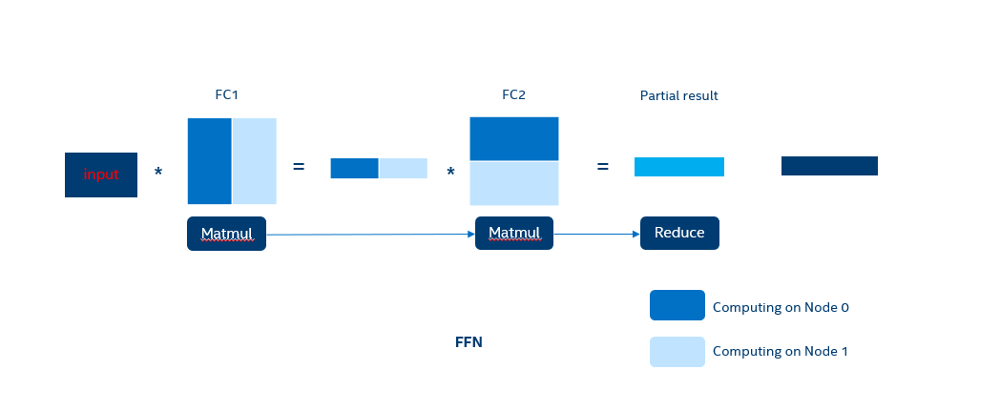
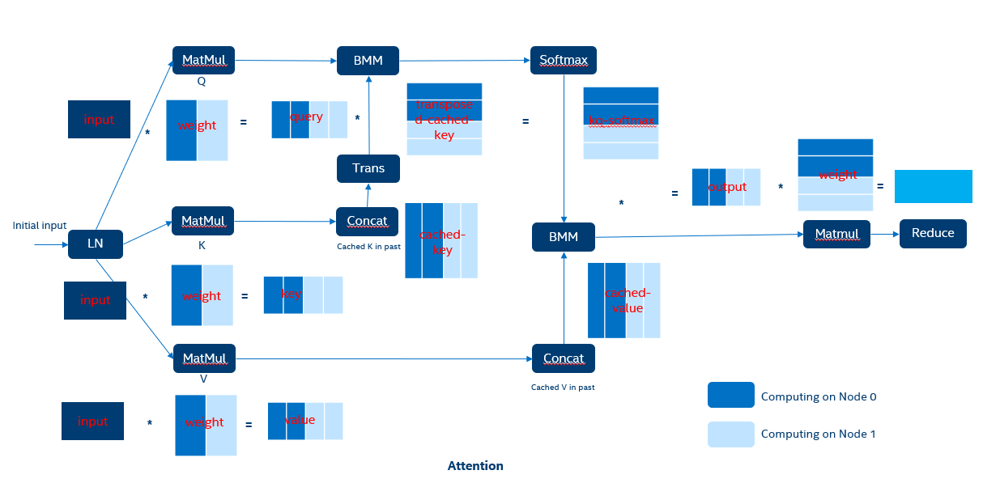

Tensor Parallelism
=======


- [Introduction](#introduction)
- [Prerequisites](#prerequisites)
- [Enable Customized Model](#enable-customized-model)
- [Examples](#examples)

## Introduction
Tensor parallelism is a strategy employed to train and inference from very large language models by splitting the actual computations/tensors across multiple compute devices. It is a critical technique for the continued growth and application of massive deep learning models and offers a path to unlocking unprecedented model capacities.

When we use tensor parallelism to partition and compute large language models, there are various ways in which we can perform the partitioning algorithm. In 1D algorithms, we can split by rows or columns. For a row-major order matrix, if you split by column, data rearrangement is required, which is a factor affecting performance. However, splitting a row-major order matrix by rows does not consume time. In our TP implementation, we adopt the method of pre-splitting the corresponding weights, so the time consumed for this part is one-time and does not affect inference performance. Meanwhile, another major factor impacting performance is 'all reduce'. Since each node computes partial and incomplete results, it is necessary to perform 'all reduce' on the output data. But all reduce is relatively time-consuming, interestingly, by using a reasonable splitting and combining method, primitives can be operated independently across nodes, which is very helpful for performance optimization. Thus, a rational splitting method becomes extremely important. 

Taking the FFN module as an example, if the first 'matmul' splits by column and computes the 'matmul' with input, it will result in two unrelated sub-matrices on each node. These two sub-matrices, when performing the second 'matmul' operation, can proceed directly without having to perform 'all reduce' if splitting by rows. Thus, the entire FFN module only requires one 'all reduce', meaning that with properly tailored split implementation, even with multiple 'matmul' operations, only one 'all reduce' operation may be needed. 


<br>

The scenario for the attention module is more complex. As shown in the following figure, a rational split can make it so that the entire attention module only requires one 'all reduce' operation, thus greatly saving synchronization time.


<br>

## Prerequisites
Multi-node and Multi-socket communications are needed in tensor parallelism, we use oneCCL for the distributed communications. 

## Enable Customized Model
Taking "llama" as an example, we need three modifications:

- First, we need to split the weight used in the 'matmul' calculation.
- Second, determine the size of 'n_head' after splitting, based on the number of nodes in parallel computation(world_size).
- Finally, insert the 'all_reduce' operator where necessary.

For instance, when splitting the FFN (feed-forward network) module, it is visible in the FFN flowchart that both 'feedforward.w1.weight' and 'feedforward.w3.weight' are part of the first 'matmul' computation. This portion of the 'matmul' should be split by column, considering the weight in ITREX is already transposed. Here, we only need to set the 'split_type' of these two weights to 'TP_1D_ROW' within the 'calc_split_type()' function in 'models/modelutils/model_files.h'. 
The 'feedforward.w1.weight' belongs to the second part of the 'matmul' calculation in the FFN process diagram, the 'split_type' should be set to 'TP_1D_COLUMN'. This ensures that the partial results from the first 'matmul' calculation can be independently used for the second 'matmul' calculation. There are also some primitives between the two 'matmul' calculations, and since these primitives are element-wise, they are also calculated independently on their respective nodes.
For the attention module, there are four weights: 'attention.wq.weight', 'attention.wk.weight', 'attention.wv.weight', and 'attention.wo.weight'. The 'split_type' for 'attention.wq.weight', 'attention.wk.weight', and 'attention.wv.weight' should be set to 'TP_1D_ROW'. In contrast, 'attention.wo.weight' should be set to 'TP_1D_COLUMN'. The calculations for the primitives in between are all independent.
When the weight splitting is complete, the actual 'n_head' computed by each node when running the model is correspondingly reduced, so it is necessary to reset the size of 'n_head'. Code is simple like:

```C++
n_head /= world_size;
n_head_kv /= world_size;
```

Finally, after the last 'matmul' calculation, insert the 'all_reduce' operator to sum up the partial computation results, thereby obtaining the complete computational outcome.
```C++
cur = ne_all_reduce(ctx0, cur);
```

### Build the oneCCL and setup the env


```shell
git clone https://github.com/oneapi-src/oneCCL.git
cd oneCCL
sed -i 's/cpu_gpu_dpcpp/./g' cmake/templates/oneCCLConfig.cmake.in
mkdir build
cd build
cmake ..
make -j install
source <path_to_build_dir>/_install/env/setvars.sh
```
To confirm that the oneCCL installation is successful, use command:

```shell
mpirun --version

```
If the command line prints log like below, means the oneCCL env is ready.
```
Intel(R) MPI Library for Linux* OS, Version 2021.9 Build 20230306 (id: d82b3071db)
Copyright 2003-2023, Intel Corporation.

```
### Enable the CMake option and build executable file
Compile an executable file that supports tensor parallelism by enabling the CMake option `NE_TP`. You can build the executable file like below.

```shell
mkdir build
cd build
cmake -DNE_TP=ON .. 
make -j

```

### Download the model weights and quantize to q4_0 format.
First you should download and convert the model to f32 format. You can also quantize the model to q4_0 format, but it is optional.

```shell
python scripts/convert.py --outtype f32 --outfile EleutherAI/gpt-j-6b
```
Then quantize the model to q4_0 format(optional).

```shell
python scripts/quantize.py --model_name gptj --model_file /path/to/your/ne-f32.bin --out_file ne-q4_0.bin --weight_dtype int4
```

## Examples

We can config the `mpirun` to start parallel programs. Here is an example about running tensor pallelsim on 2 sockets in CPU.
```shell
mpirun -np 2 -bind-to=socket ./build/bin/main_gptj -m ne-q4_0.bin --seed 1234 -t 56 -c 68 -n 32 -p "Once upon a time, there existed a little girl, who liked to have adventures. She wanted to go to places and meet new people, and have fun." --no_mmap
```
We only add `mpirun -np 2 -bind-to=socket` to the original command to enable 2 processes to run parallel. If you want to bind specific core to each process. You can write the original command to a shell script and use command like below.

```shell
mpirun -n 1 taskset -c 0-47 sh run.sh : -n 1 taskset -c 48-95 sh run.sh

```
**NOTICE**: tensor parallelsim strategy will split the model to specific node/socket, each device already use part of the original weights differently. So we should not use shared-memory of weights to avoid cross numa weight movement. Use option `--no-mmap` to disable shared weights between processes.

