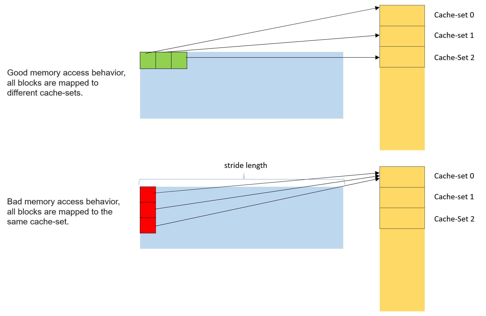
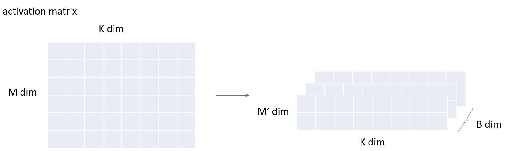
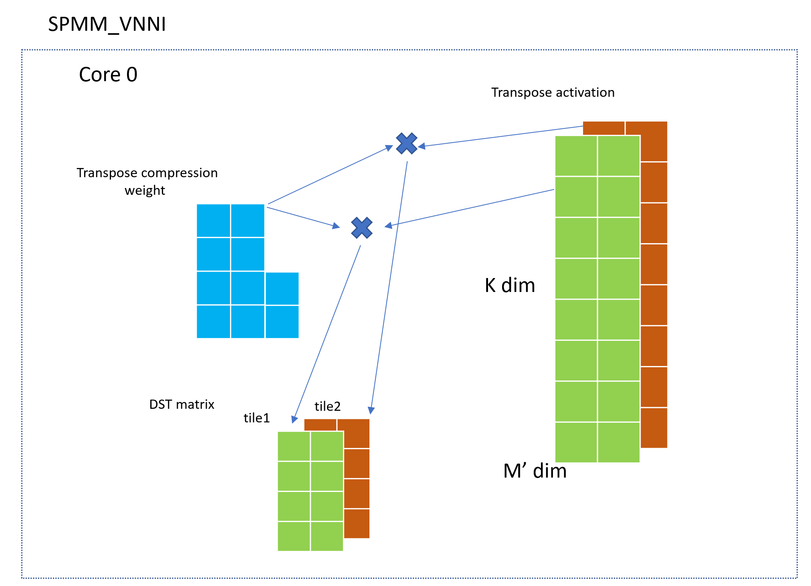

# 3D Inference

## Memory Layout in SPMM_VNNI
In DeepLearning, GEMM is usually represented an as activation matrix multiplied by a weight matrix.
$$A\times W= D$$
However in `spmm_vnni` `4x1`sparse pattern, in order to more easily implement micro_kernel and better storing performance, we adopted the transposed compressed sparse weight matrix multiplied by the transposed activation matrix.
$$W^{T}\times A^{T}= D^{T}$$

## Cache Issues
In modern computer architecture, in order to make better use of the spatial locality of the program, the CPU will fetch the data blocks near the fetched data into the cache-line. In the Intel Xeon CPU, the size of a cache-line is 64Byte. A cache organization form is called `N-way set associative cache`. The entire cache is divided into several cache-sets, and each cache-set has cache-lines with the number of the `way`.  

Consider that we want to access several 64Byte-aligned memory blocks `B1`, `B2`..., each memory block size is 64Byte (AVX512 SIMD register bit-width, and also the cache-line size), if these memory blocks are accessed continuously at this time , they can be evenly mapped to different cache-sets. But if the access behavior is discontinuous, the cache set cannot be fully utilized. In the worst case of access stride(`cache-line` size * `cache-set` num), even every memory access will be mapped to the same cache-set. Therefore cache utilization is very low and cache misses will occur very frequently.   

In `spmm_vnni`algorithm, when we load the activation matrix in column-major, it must introduce the accessing memory behavior with stride and the stride is equal to the last dim of the activation matrix. A specific CPU core will build a specific tile in the destination matrix and the L1/L2 cache is private to the core. When the size of the activation matrix is too large, perhaps the L2 cache can't fully cache the activation matrix that the core needs to compute the tile. Therefore, we should reduce the size of the tile calculated by each core to reduce the size of the activation matrix in the cache and make the access stride  configurable to avoid frequent L2 cache miss due to the large size of the cached data.

## SPMM_VNNI 3D Inference
We propose a `3D inference` feature in the `spmm_vnni` kernel for reducing the size of the activation matrix accessed by each core when building tiles meanwhile make the access stride configurable.  
Considering the shape of the activation matrix is `MxK`, we can split the `M-dim` and give the activation matrix 3D view which means `BxM'xK` where $B\times M^{'}=M$. Please see the below picture.  

  

After enabling `3D inference` feature, the shape of transposed activation matrix processed by each core changes to `BxKxM'` and each core will build B `NxM'` tiles. Compared with 2D inference, the cache space required for the activation matrix that each core is responsible for caching when build `NxM'` block is reduced to $\frac{1}{B}$, meanwhile, the access stride is change to M' which is configurable. 

