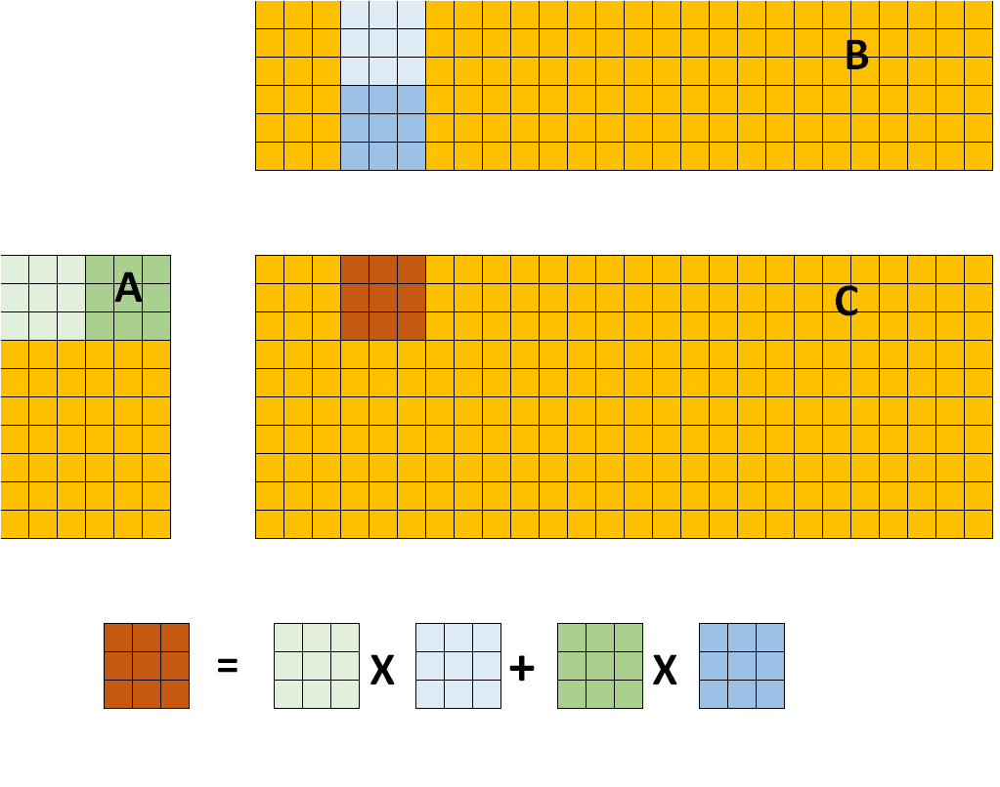
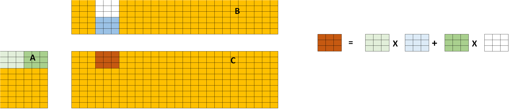

# Introduction
This article describes how to achieve the acceleration of sparse matrices multiplication in the GPU with OpenCL code snippets instead of unintelligible assembly.

# Dense and Sparse
Before introducing the sparse matrix, let's first understand how the dense matrix is accelerated on the GPU.
## Naive
Let's first look at one of the most naive GPU implementations
```
__kernel void naive_gemm(const int M, const int N, const int K, const __global float* A, const __global float* B,
                         __global float* C) {
  // Thread identifiers
  const int globalRow = get_global_id(0);  // Row ID of C (0..M)
  const int globalCol = get_global_id(1);  // Col ID of C (0..N)

  // Compute a single element (loop over K)
  float acc = 0.0f;
  for (int k = 0; k < K; k++) {
    acc += A[k * M + globalRow] * B[globalCol * K + k];
  }

  // Store the result
  C[globalCol * M + globalRow] = acc;
}
```
A total of MxN threads are used. Each thread requires K multiplication and addition operations and 2xK load. Obviously not a good kernel.
## Tile
Next, I use the tiling strategy and local memory to reduce redundant load operations.

In the same working group, Asub and Bsub are shared by threads, which can reduce repeated data load.
```
__kernel void tile_gemm(const int M, const int N, const int K, const __global float* A, const __global float* B,
                        __global float* C) {
  // Thread identifiers
  const int row = get_local_id(0);                   // Local row ID (max: TS)
  const int col = get_local_id(1);                   // Local col ID (max: TS)
  const int globalRow = TS * get_group_id(0) + row;  // Row ID of C (0..M)
  const int globalCol = TS * get_group_id(1) + col;  // Col ID of C (0..N)

  // Local memory to fit a tile of TS*TS elements of A and B
  __local float Asub[TS][TS];
  __local float Bsub[TS][TS];

  // Initialise the accumulation register
  float acc = 0.0f;

  // Loop over all tiles
  const int numTiles = K / TS;
  for (int t = 0; t < numTiles; t++) {
    // Load one tile of A and B into local memory
    const int tiledRow = TS * t + row;
    const int tiledCol = TS * t + col;
    Asub[col][row] = A[tiledCol * M + globalRow];
    Bsub[col][row] = B[globalCol * K + tiledRow];

    // Synchronise to make sure the tile is loaded
    barrier(CLK_LOCAL_MEM_FENCE);

    // Perform the computation for a single tile
    for (int k = 0; k < TS; k++) {
      acc += Asub[k][row] * Bsub[col][k];
    }

    // Synchronise before loading the next tile
    barrier(CLK_LOCAL_MEM_FENCE);
  }

  // Store the final result in C
  C[globalCol * M + globalRow] = acc;
}
```
When the weight is a sparse matrix, there must be a large number of all zero blocks. These blocks do not need to participate in computing.

We assume that there are as many full zero blocks per col as.

White in the figure represents zero. Compared with dense, the amount of calculation will be reduced by half.
Of course, the above dense is not very efficient, there are redundant load operations, and the correspondingly improved sparse is not used as our kernel.
# Efficient kernel
We continue to optimize the dense kernel. Increase the workload of each thread, reduce redundant data loading, use registers instead of local memory, and use prefetch to improve computing efficiency.
## More work per thread
In the example above, localmemory is used, but each thread still only computes one element of C. When the size of C is large, thread resources may be tight, so we need to increase the calculation amount of each thread. When the size of C is large, thread resources may be tight, so we need to increase the calculation amount of each thread.
```
for (int w=0; w<8; w++) {
    const int tiledRow = TS*t + row;
    const int tiledCol = TS*t + col;
    Asub[col + w*TS/8][row] = A[(tiledCol + w*TS/8)*M + globalRow];
    Bsub[col + w*TS/8][row] = B[(globalCol + w*TS/8)*K + tiledRow];
}
```
```
for (int k=0; k<TS; k++) {
  for (int w=0; w<8; w++) {
    acc[w] += Asub[k][row] * Bsub[col + w*TS/8][k];
  }
}
```
```
for (int w=0; w<8; w++) {
  C[(globalCol + w*TS/8)*M + globalRow] = acc[w];
}
```
Each thread does more load and computing. Only need 1/8 of the number of threads before.
Of course, the same approach can also be extended to continuous row elements of C.
## Prefetch
Pre-fetching. In the case of matrix-multiplication, that means that we are going to load the next tile while we are computing the current tile, such that the latency of the loads can be hidden by computations.
To implement this, we'll need twice as much local memory. Use ping-pong to complete data calculation and load at the same time
```
// Ping-pong
__local float Asub[2][TS*TS];
__local float Bsub[2][TS*TS];
```
```
__kernel void gemm(const int M, const int N, const int K,
                      const __global float* A,
                      const __global float* B,
                      __global float* C) {

    // Thread identifiers
    const int tidm = get_local_id(0); // Local row ID
    const int tidn = get_local_id(1); // Local col ID
    const int offsetM = TS*get_group_id(0); // Work-group offset
    const int offsetN = TS*get_group_id(1); // Work-group offset

    // Ping-pong local memory
    __local float Asub[2][TS*TS];
    __local float Bsub[2][TS*TS];

    // Allocate register space
    float Areg;
    float Breg[8];
    float acc[8][8];

    for (int wm=0; wm<8; wm++) {
        for (int wn=0; wn<8; wn++) {
            acc[wm][wn] = 0.0f;
        }
    }

    for (int la=0; la<LPTA/; la++) {
        int tid = tidn*TS/8 + tidm;
        int id = la*TS/8*TS/8 + tid;
        int row = MOD2(id,TS);
        int col = DIV2(id,TS);

        // Load the values (wide vector load)
        int tiledIndex = TS*0 + col;
        int indexA = tiledIndex*(M) + offsetM + row;
        int indexB = tiledIndex*(N) + offsetN + row;
        float vecA = A[indexA];
        float vecB = B[indexB];

        // Store the loaded vectors into local memory
        Asub[0][col*TS + row] = vecA;
        Bsub[0][col*TS + row] = vecB;
    }

    // Synchronise
    barrier(CLK_LOCAL_MEM_FENCE);
    
    // Loop over all tiles
    const int numTiles = K/TS;
    int t=0;
    do {
        // Load the next tile of A and B into local memory
        int tt = t + 1;
        if (tt < numTiles) {
            for (int la=0; la<LPTA; la++) {
                int tid = tidn*TS/8 + tidm;
                int id = la*TS/8*TS/8 + tid;
                int row = MOD2(id,TS);
                int col = DIV2(id,TS);

                // Load the values (wide vector load)
                int tiledIndex = TS*tt + col;
                int indexA = tiledIndex*(M) + offsetM + row;
                int indexB = tiledIndex*(N) + offsetN + row;
                float vecA = A[indexA];
                float vecB = B[indexB];

                // Store the loaded vectors into local memory
                Asub[tt%2][col*TS + row] = vecA;
            }
        }

        // Loop over the values of a single tile
        for (int k=0; k<TS; k++) {

            // Cache the values of Bsub in registers
            for (int wn=0; wn<8; wn++) {
                int col = tidn + wn*TS/8;
                Breg[wn] = Bsub[t%2][k*TS + col];
            }

            // Perform the computation
            for (int wm=0; wm<8; wm++) {
                int row = tidm + wm*TS/8;
                Areg = Asub[t%2][k*TS + row];
                for (int wn=0; wn<8; wn++) {
                    acc[wm][wn] += Areg * Breg[wn];
                }
            }
        }

        // Synchronise
        barrier(CLK_LOCAL_MEM_FENCE);

        // Next tile
        t++;
    } while (t<numTiles);

    // Store the final results in C
    for (int wm=0; wm<8; wm++) {
        int globalRow = offsetM + tidm + wm*TS/8;
        for (int wn=0; wn<8; wn++) {
            int globalCol = offsetN + tidn + wn*TS/8;
            C[globalCol*M + globalRow] = acc[wm][wn];
        }
    }
}
```
## Sparse acceleration
Same as above. We only need the calculation process based on dense, skip the block of all zero.
```
__kernel void gemm(const int M, const int N, const int K,
                      const __global float* pattern,
                      const __global float* A,
                      const __global float* B,
                      __global float* C) {

    // Thread identifiers
    const int tidm = get_local_id(0); // Local row ID
    const int tidn = get_local_id(1); // Local col ID
    const int offsetM = TS*get_group_id(0); // Work-group offset
    const int offsetN = TS*get_group_id(1); // Work-group offset

    // Ping-pong local memory
    __local float Asub[2][TS*TS];
    __local float Bsub[2][TS*TS];

    // Allocate register space
    float Areg;
    float Breg[8];
    float acc[8][8];

    for (int wm=0; wm<8; wm++) {
        #pragma unroll
        for (int wn=0; wn<8; wn++) {
            acc[wm][wn] = 0.0f;
        }
    }

    for (int la=0; la<LPTA/; la++) {
        int tid = tidn*TS/8 + tidm;
        int id = la*TS/8*TS/8 + tid;
        int row = MOD2(id,TS);
        int col = DIV2(id,TS);

        // Load the values (wide vector load)
        int tiledIndex = col;
        int indexA = tiledIndex*(M) + offsetM + row;
        int indexB = tiledIndex*(N) + offsetN + row;
        if (pattern[indexA] != 0) {
          float vecA = A[indexA];
          float vecB = B[indexB];

          // Store the loaded vectors into local memory
          Asub[0][col*TS + row] = vecA;
          Bsub[0][col*TS + row] = vecB;
        }
    }

    // Synchronise
    barrier(CLK_LOCAL_MEM_FENCE);
    
    // Loop over all tiles
    const int numTiles = K/TS;
    int t=0;
    do {
        // Load the next tile of A and B into local memory
        int tt = t + 1;
        if (tt < numTiles) {
            for (int la=0; la<LPTA; la++) {
                int tid = tidn*TS/8 + tidm;
                int id = la*TS/8*TS/8 + tid;
                int row = MOD2(id,TS);
                int col = DIV2(id,TS);

                // Load the values (wide vector load)
                int tiledIndex = TS*tt + col;
                int indexA = tiledIndex*(M) + offsetM + row;
                int indexB = tiledIndex*(N) + offsetN + row;
                if (pattern[indexA] != 0) {
                  float vecA = A[indexA];
                  float vecB = B[indexB];

                  // Store the loaded vectors into local memory
                  Asub[tt%2][col*TS + row] = vecA;
                }
            }
        }

        // Loop over the values of a single tile
        for (int k=0; k<TS; k++) {
            // Cache the values of Bsub in registers
            for (int wn=0; wn<8; wn++) {
                int col = tidn + wn*TS/8;
                Breg[wn] = Bsub[t%2][k*TS + col];
            }

            // Perform the computation
            int globalRow = offsetM + tidm + wm*TS/8;
            for (int wm=0; wm<8; wm++) {
                int globalCol = offsetN + tidn + wn*TS/8;
                int row = tidm + wm*TS/8;
                if (pattern[globalRow][globalCol]) != 0) {
                Areg = Asub[t%2][k*TS + row];
                  for (int wn=0; wn<8; wn++) {
                      acc[wm][wn] += Areg * Breg[wn];
                  }
                }
            }
        }

        // Synchronise
        barrier(CLK_LOCAL_MEM_FENCE);

        // Next tile
        t++;
    } while (t<numTiles);

    // Store the final results in C
    for (int wm=0; wm<8; wm++) {
        int globalRow = offsetM + tidm + wm*TS/8;
        for (int wn=0; wn<8; wn++) {
            int globalCol = offsetN + tidn + wn*TS/8;
            C[globalCol*M + globalRow] = acc[wm][wn];
        }
    }
}
```