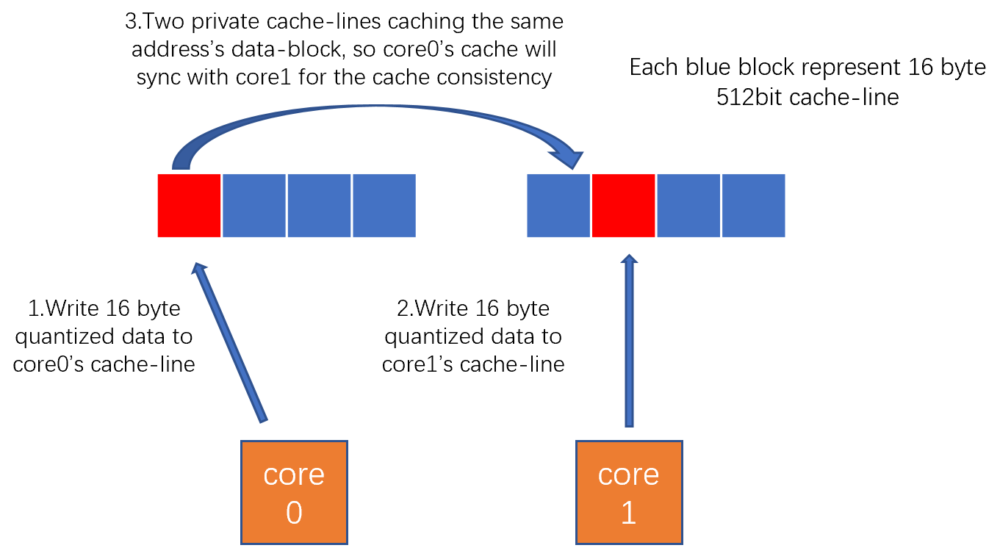

# Sparse GEMM with Layer-Normalize

## Problem Description 
In the transformer architecture of the sparse Bert model, we need to apply a layernorm operation on the output matrix after executing sparse-matmul (spmm). Since the output of spmm is the [transposed memory layout](https://github.com/intel/intel-extension-for-transformers/blob/main/intel_extension_for_transformers/backends/neural_engine/kernels/docs/kernel_desc/kernel_vnni.md), when performing layernorm, we should apply a reorder on the output matrix first, and then execute layernorm calculations, finally a transpose again, obviously, which makes layernorm layers real bottleneck of the whole model.

An naive solution is to implement a kernel that can execute layernorm under the transposed-memory-layout. Specifically, this kernel is col-major when calculating the mean, variance, and normalization. However, the kernel's performance high probability have a large gap with the normal layernrom performance. The main reasons are as follows:

1. When calculating the mean, variance in col-major, the data blocks processed by each core are not continuous, so the utilization rate of the cache is not high. This problem is similar to the cache issue in [3D inference](https://github.com/intel/intel-extension-for-transformers/blob/main/intel_extension_for_transformers/backends/neural_engine/kernels/docs/kernel_desc/3D_inference.md). When the problem size is large, the kernel's performance will drop significantly.
2. The parallel capability is poor. Since the bit width of each ZMM register is 512 bits, when the input data type is FP32, each core is responsible for processing at least 16 columns. If we have fewer columns but more cores (e.g. 32 columns with 4 cores), then many cores will be wasted.
3. There is a potential cache inconsistency problem. This kind of problem mainly occurs in the scene of layernorm+quantize fusion. Since the bit width of INT8 is a quarter of FP32, when the quantization operation is performed and writing the result back,  two cores may write to the same cache-line. The figure below depicts this situation. At this time, the time to execute the cache coherence protocol between different cores will offset the bandwidth gain brought by low-bit-width data write-back.
## layernormalized sparse matmul
In order to solve the above problem, we provide the layernormalized_spmm kernel. Based on the original sparse-matmul, this kernel supports:

1. output spmm's result after col-majotr layternormalized.
2. stores the quantized INT8 results and FP32 results at the same time. 

The kernel actually encapsulates two kernels - pre-compute spmm and direct layernorm_ba.
### Pre-compute SPMM
pre-compute spmm can mainly support col-major to calculate the mean and variance of the matrix. This feature is based on [parallel welford's online algorithm](https://en.wikipedia.org/wiki/Algorithms_for_calculating_variance) which can dynamically update the mean and M of the discrete random distribution with O(1) overhead (the variance can be derived from M). Since the spmm building block process is col-major, it is naturally can calculate the mean and M of each block based on Welford's online algorithm friendly. When multiple cores are building blocks in parallel, each core will write the calculated mean and M into its own private buffer. After spmm is executed, there is a reduce kernel to calculate the real mean and variance of the entire matrix. Finally, spmm will output the col-major mean and variance of the output matrix for the next operator to calculate.
### Direct Layernorm_ba
The kernel can use the input mean, variance, and alpha and beta to directly apply normalization without calculating the mean and variance inside the kernel. In addition, if the "split_output" feature is enabled, the kernel will output the FP32 result before quantization (for the append_sum of the next spmm) and the INT8 result after quantization at the same time. When writing the result of FP32 back, we recommend using the in-place mode, that is, the input of FP32 and the output address of FP32 are the same, which is more friendly to the cache and the overall performance of the kernel will be better.
