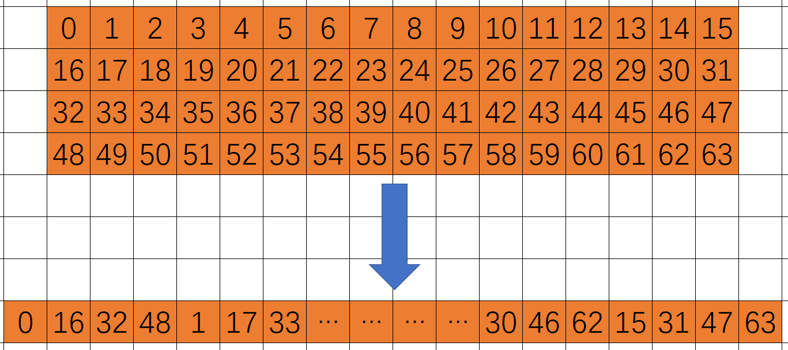
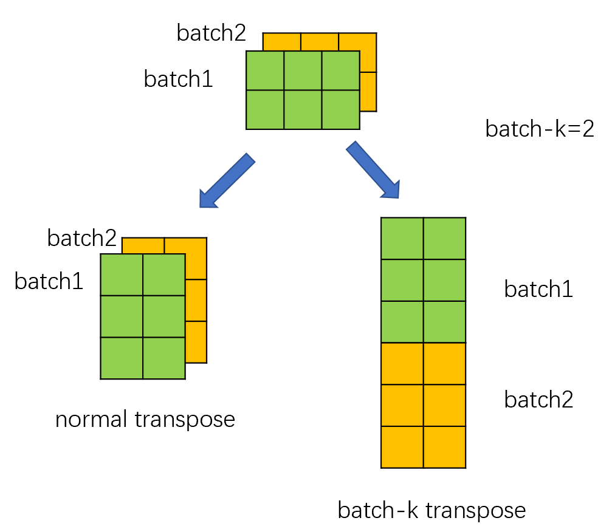

# Transposed MHA
## Problem description 
In our sparse GEMM, the weight, activation and result matrices are all transposed. See this [documentation](https://github.com/intel/intel-extension-for-transformers/blob/main/intel_extension_for_transformers/backends/neural_engine/kernels/docs/kernel_desc/kernel_vnni.md) for details.
In transformer architecture, MHA's computing logic is $softmax(Q\times K^T)\times V$, while $Q^T,K^T,V^T$ matrices are generated after calling sparse-matmul. The inference engine may need to transpose the $Q^T$ and $V^T$ matrices twice before performing the MHA operation. It is worth noting that since many models are stacked transformer structures, after calculating the MHA, the result also needs to be transposed for the next sparse-matmul calculation. It is clear that we have introduced multiple reorder operations, which will significantly affect performance. In fact, we can completely execute MHA with transposed-memory-layout. That is $dst^T=V^T\times softmax(K\times Q^T,axis =1)$. With the fully transposed mode, we greatly reduce the transpose times, and only need to transpose $K$ once. Note that we will execute softmax with col-major at this point.
## Details 
At present, we provide two implementations of transpose_MHA, one is based on AMX ISA introduced by SPR and the other based on VNNI ISA(VNNI_W and VNNI_B, the latter will bring better performance) introduced by 2nd Xeon CLX. Please notice that because the problem-size is limited in bert model, so the MHA's implementation is not a general method. The whole kernel is composed of preprocessing and three computing steps among them.
> We only support HEAD_SIZE = 32 /64 now.
 
### Reordering
1. Reorder matrix Q/K to VNNI format for AMX/VNNI instruction. Refer to the [AMX](https://www.intel.com/content/www/us/en/docs/intrinsics-guide/index.html#ig_expand=159,653,1854,5965,5461,1742,2782,2782,2774,4964,4916,4925,4944,1745,1589,4114,4089,4120,4114,4111,4108,5390,5389,5388,1595,2782,4541,6243,6255,4541,1510,2244,6836,7263,2250,5360,5388,5389,5390,5352,5353,5324,5381,4626,7264,607,6172,649,6159,6897,7264,7267,2808,2795,2782,2913,1431,1385,5381,574,572,5381,5380,5379,5378,5377,5376,5375,5374,5373,5390,5389,5388,5360,5359,6897,6937,6905,6830,6897,6903,6857,7265,6501,6519,6582,488,4506,5240,5459,5478,5489,5488,5487,5480,5463,640,6206,640,2808,4469,4470,4471,4463,4472,4469,2801,2759,2782,2787,640,2949,2949,2890,2913,2912,2585,2585,2585,2585,7041,7043,572,2579,640,4369,6903,6903,2756,1827,6529,572,7264,2749,5645,2808,2795,2782,7260,4469,7267,7266,2139,1998,2756,2750,2753,7439,7259,7259,2769,7439,4376,6172,6255,6252,7498,7400,7343,6410,6951,5289,4087,4123,4111,4107,2250,6951,6947,6944,6955,4374,4107,707,7544,184,4503,119,7539,7540&techs=AMX)/[VNNI](https://www.intel.com/content/www/us/en/docs/intrinsics-guide/index.html#ig_expand=159,653,1854,5965,5461,1742,2782,2782,2774,4964,4916,4925,4944,1745,1589,4114,4089,4120,4114,4111,4108,5390,5389,5388,1595,2782,4541,6243,6255,4541,1510,2244,6836,7263,2250,5360,5388,5389,5390,5352,5353,5324,5381,4626,7264,607,6172,649,6159,6897,7264,7267,2808,2795,2782,2913,1431,1385,5381,574,572,5381,5380,5379,5378,5377,5376,5375,5374,5373,5390,5389,5388,5360,5359,6897,6937,6905,6830,6897,6903,6857,7265,6501,6519,6582,488,4506,5240,5459,5478,5489,5488,5487,5480,5463,640,6206,640,2808,4469,4470,4471,4463,4472,4469,2801,2759,2782,2787,640,2949,2949,2890,2913,2912,2585,2585,2585,2585,7041,7043,572,2579,640,4369,6903,6903,2756,1827,6529,572,7264,2749,5645,2808,2795,2782,7260,4469,7267,7266,2139,1998,2756,2750,2753,7439,7259,7259,2769,7439,4376,6172,6255,6252,7498,7400,7343,6410,6951,5289,4087,4123,4111,4107,2250,6951,6947,6944,6955,4374,4107,707,7544,184,4503,119,7539,7540,2899&avx512techs=AVX512_VNNI) documentation for details of VNNI format. In general, we reorder 4x16 tiles in the form shown below. In order to reduce the number of kernel launchings, kernel will calculate the appropriate ```batchK``` value before execution. The kernel responsible for preprocessing will transpose and reorder ```batchK``` sub-matrix at one time, so as to avoid the related overhead. 

### Calculation
In calculating step1, jit kernel takes a sub-matrix of MxN in each iteration. The values of M and N are from prior experience. In each iteraion, the kernels perform the following computational logic:
1. Calculate the block and execute binary_add(add mask). 
2. For each value `x` in the block, use a low-order polynomial approximation to calculate `exp(x)` and col-major to calculate `sum(exp(x))`. 
3. Convert the value of `exp(x)` from `fp32` to `bf16` to write back to tmp-buffer to reduce the bandwidth overhead when writing back, and take the inverse of `sum(exp(x))` divide by `scale`(1/255) to write back to tmp-buffer. These are essentially the first half of computing softmax. 

In the calculation step2, the following part of softmax is completed, and `sum(exp(x))` is used as the normalization of `exp(x)`, and the result is quantized into `u8` with the incoming scale, that is, the final result of $softmax(K\times Q^T,axis=1)$ is obtained. Then, to facilitate the subsequent multiplication with $V^T$, we also reorder this result.   

Calculation step3 is a simple matmul, that is $V^T\times softmax(K\times Q^T,axis =1)$

So far, we have completed the calculation of transpose_MHA.
