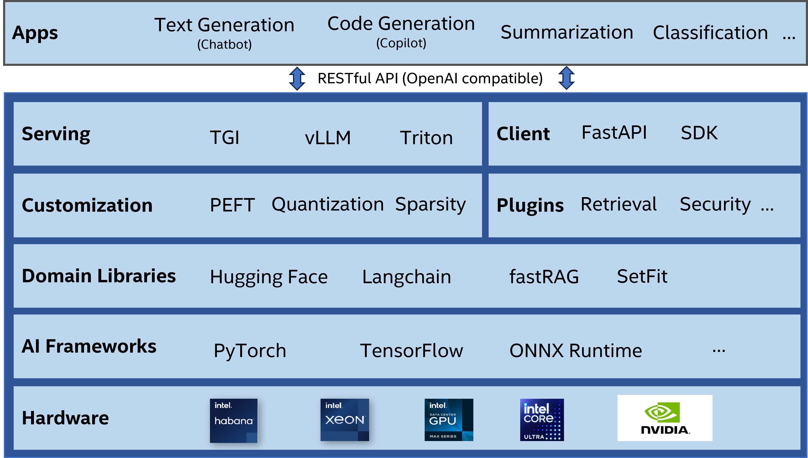

<div align="center">

NeuralChat
===========================
<h3> A customizable framework to create your own LLM-driven AI apps within minutes</h3>

🌟[RESTful API](./docs/neuralchat_api.md)&nbsp;&nbsp;&nbsp;|&nbsp;&nbsp;&nbsp;🔥[Features](./docs/advanced_features.md)&nbsp;&nbsp;&nbsp;|&nbsp;&nbsp;&nbsp;💻[Examples](./examples)&nbsp;&nbsp;&nbsp;|&nbsp;&nbsp;&nbsp;📖[Notebooks](./docs/full_notebooks.md)
</div>

# Introduction

NeuralChat is a powerful and flexible open framework that empowers you to effortlessly create LLM-centric AI applications, including chatbots and copilots.
* Support a range of hardware like [Intel Xeon Scalable processors](https://www.intel.com/content/www/us/en/products/details/processors/xeon/scalable.html), [Intel Gaudi AI processors](https://habana.ai/products), [Intel® Data Center GPU Max Series](https://www.intel.com/content/www/us/en/products/details/discrete-gpus/data-center-gpu/max-series.html) and NVidia GPUs
* Leverage the leading AI frameworks (e.g., [PyTorch](https://pytorch.org/) and popular domain libraries (e.g., [Hugging Face](https://github.com/huggingface), [Langchain](https://www.langchain.com/)) with their extensions
* Support the model customizations through parameter-efficient fine-tuning, quantization, and sparsity. Released [Intel NeuralChat-7B LLM](https://huggingface.co/Intel/neural-chat-7b-v3-1), ranking #1 in Hugging Face open LLM leaderboard in Nov'23
* Provide a rich set of plugins that can augment the AI applications through retrieval-augmented generation (RAG) (e.g., [fastRAG](https://github.com/IntelLabs/fastRAG/tree/main)), content moderation, query caching, more
* Integrate with popular serving frameworks (e.g., [vLLM](https://github.com/vllm-project/vllm), [TGI](https://github.com/huggingface/text-generation-inference), [Triton](https://developer.nvidia.com/triton-inference-server)). Support [OpenAI](https://platform.openai.com/docs/introduction)-compatible API to simplify the creation or migration of AI applications

<a target="_blank" href="./docs/images/neuralchat_arch.png">
<p align="center">
  
</p>
</a>

> NeuralChat is under active development. APIs are subject to change.

# System Requirements

Please make sure below basic system libraries are installed. If you want to try more features, please refer to [system requirements](../../docs/installation.md#system-requirements)


```shell
apt-get update
apt-get install -y python3-pip
apt-get install -y libgl1-mesa-glx
```
 >**Note**: If your system only have python3 or you meet error `python: command not found`, please run `ln -sf $(which python3) /usr/bin/python`.


# Installation

NeuralChat is under Intel Extension for Transformers, so ensure the installation of Intel Extension for Transformers first by following the [installation](../../docs/installation.md). After that, install additional dependency for NeuralChat per your device:

```shell
pip install intel-extension-for-transformers
pip install fastapi==0.103.2

# For CPU device
pip install -r requirements_cpu.txt

# For HPU device
pip install -r requirements_hpu.txt

# For XPU device
pip install -r requirements_xpu.txt

# For CUDA device
pip install -r requirements.txt

```
>**Note**: Suggest using fastapi==0.103.2


# Getting Started

## OpenAI-Compatible RESTful APIs

NeuralChat provides OpenAI-compatible RESTful APIs for LLM inference, so you can use NeuralChat as a drop-in replacement for OpenAI APIs. NeuralChat service can also be accessible through [OpenAI client library](https://github.com/openai/openai-python), `curl` commands, and `requests` library. See [neuralchat_api.md](./docs/neuralchat_api.md).

### Launch OpenAI-compatible Service

NeuralChat launches a chatbot service using [Intel/neural-chat-7b-v3-1](https://huggingface.co/Intel/neural-chat-7b-v3-1) by default. You can customize the chatbot service by configuring the YAML file.


You can start the NeuralChat server either using the shell command or Python code.

Using Shell Command:

```shell
neuralchat_server start --config_file ./server/config/neuralchat.yaml
```

Using Python Code:

```python
from intel_extension_for_transformers.neural_chat import NeuralChatServerExecutor
server_executor = NeuralChatServerExecutor()
server_executor(config_file="./server/config/neuralchat.yaml", log_file="./neuralchat.log")
```

### Access the Service

Once the service is running, you can observe an OpenAI-compatible endpoint `/v1/chat/completions`. You can use any of below ways to access the endpoint.

#### Using OpenAI Client Library

First, install openai-python:

```bash
pip install --upgrade openai
```

Then, interact with the model:

```python
import openai
openai.api_key = "EMPTY"
openai.base_url = 'http://127.0.0.1:8000/v1/'
response = openai.chat.completions.create(
      model="Intel/neural-chat-7b-v3-1",
      messages=[
          {"role": "system", "content": "You are a helpful assistant."},
          {"role": "user", "content": "Tell me about Intel Xeon Scalable Processors."},
      ]
)
print(response.choices[0].message.content)
```
>**Note**: When intel-extension-for-transformers <= 1.3.1, please try [command](#using-curl) below


#### Using Curl
```shell
curl http://127.0.0.1:8000/v1/chat/completions \
    -H "Content-Type: application/json" \
    -d '{
    "model": "Intel/neural-chat-7b-v3-1",
    "messages": [
    {"role": "system", "content": "You are a helpful assistant."},
    {"role": "user", "content": "Tell me about Intel Xeon Scalable Processors."}
    ]
    }'
```

>**Note**: When intel-extension-for-transformers <= 1.3.1, please use old command like:
> ```shell
> curl -X POST -H "Content-Type: application/json" -d '{"prompt": "Tell me about Intel Xeon Scalable Processors."}' http://127.0.0.1:8000/v1/chat/completions
> ```


#### Using Python Requests Library

```python
import requests
url = 'http://127.0.0.1:8000/v1/chat/completions'
headers = {'Content-Type': 'application/json'}
data = '{"model": "Intel/neural-chat-7b-v3-1", "messages": [ \
          {"role": "system", "content": "You are a helpful assistant."}, \
          {"role": "user", "content": "Tell me about Intel Xeon Scalable Processors."}] \
       }'
response = requests.post(url, headers=headers, data=data)
print(response.json())
```

>**Note**: When intel-extension-for-transformers <= 1.3.1, please try [command](#using-curl) above


## Langchain Extension APIs

Intel Extension for Transformers provides a comprehensive suite of Langchain-based extension APIs, including advanced retrievers, embedding models, and vector stores. These enhancements are carefully crafted to expand the capabilities of the original langchain API, ultimately boosting overall performance. This extension is specifically tailored to enhance the functionality and performance of RAG.

### Vector Stores

We introduce enhanced vector store operations, enabling users to adjust and fine-tune their settings even after the chatbot has been initialized, offering a more adaptable and user-friendly experience. For langchain users, integrating and utilizing optimized Vector Stores is straightforward by replacing the original Chroma API in langchain.

```python
from langchain_community.llms.huggingface_pipeline import HuggingFacePipeline
from langchain.chains import RetrievalQA
from langchain_core.vectorstores import VectorStoreRetriever
from intel_extension_for_transformers.langchain_community.vectorstores import Chroma
retriever = VectorStoreRetriever(vectorstore=Chroma(...))
retrievalQA = RetrievalQA.from_llm(llm=HuggingFacePipeline(...), retriever=retriever)
```

### Retrievers

We provide optimized retrievers such as `VectorStoreRetriever`, `ChildParentRetriever` to efficiently handle vectorstore operations, ensuring optimal retrieval performance.

```python
from intel_extension_for_transformers.langchain_community.retrievers import ChildParentRetriever
from langchain.vectorstores import Chroma
retriever = ChildParentRetriever(vectorstore=Chroma(documents=child_documents), parentstore=Chroma(documents=parent_documents), search_type=xxx, search_kwargs={...})
docs=retriever.get_relevant_documents("Intel")
```

Please refer to this [documentation](./pipeline/plugins/retrieval/README.md) for more details.


## Customizing the NeuralChat Service

Users have the flexibility to customize the NeuralChat service by making modifications in the YAML configuration file. Detailed instructions can be found in the [documentation](./server/README.md).

### Supported Models

NeuralChat boasts support for various generative Transformer models available in [HuggingFace Transformers](https://huggingface.co/models). The following is a curated list of models validated for both inference and fine-tuning within NeuralChat:

|Pretrained model| Text Generation (Completions) | Text Generation (Chat Completions) | Summarization | Code Generation or SQL Generation | 
|------------------------------------|:---:|:---:|:---:|:---:|
|Intel/neural-chat-7b-v1-1| ✅| ✅| ✅| ✅    |
|Intel/neural-chat-7b-v3-1| ✅| ✅| ✅| ✅    |
|meta-llama/Llama-2-7b-chat-hf| ✅| ✅|✅| ✅    |
|meta-llama/Llama-2-70b-chat-hf| ✅| ✅|✅| ✅    |
|EleutherAI/gpt-j-6b| ✅| ✅|✅| ✅    |
|mosaicml/mpt-7b-chat| ✅| ✅|✅| ✅    |
|mistralai/Mistral-7B-v0.1| ✅| ✅|✅| ✅    |
|mistralai/Mixtral-8x7B-Instruct-v0.1| ✅| ✅|✅| ✅    |
|upstage/SOLAR-10.7B-Instruct-v1.0| ✅| ✅|✅| ✅    |
|THUDM/chatglm2-6b| ✅| ✅|✅| ✅    |
|THUDM/chatglm3-6b| ✅| ✅|✅| ✅    |
|Qwen/Qwen-7B| ✅| ✅|✅| ✅    |
|microsoft/phi-2| ✅| ✅|✅| ✅    |
|Deci/DeciLM-7B| ✅| ✅|✅| ✅    |
|Deci/DeciLM-7B-instruct| ✅| ✅|✅| ✅    |
|bigcode/starcoder|   |   |   | ✅ |
|codellama/CodeLlama-7b-hf|   |   |   | ✅ |
|codellama/CodeLlama-34b-hf|   |   |   | ✅ |
|Phind/Phind-CodeLlama-34B-v2|   |   |   | ✅ |
|Salesforce/codegen2-7B|   |   |   | ✅ |
|ise-uiuc/Magicoder-S-CL-7B|   |   |   | ✅ |
|defog/sqlcoder2|   |   |   | ✅ |
|defog/sqlcoder-34b-alpha|   |   |   | ✅ |

Modify the `model_name_or_path` parameter in the YAML configuration file to load different models.

### Rich Plugins

NeuralChat includes support for various plugins to enhance its capabilities:

- [**Speech Processing**](./pipeline/plugins/audio/README.md)
  - Text-to-Speech (TTS)
  - Automatic Speech Recognition (ASR)

- [**RAG (Retrieval-Augmented Generation)**](./pipeline/plugins/retrieval/README.md)
- [**Safety Checker**](./pipeline/plugins/security/README.md)
- [**Caching**](./pipeline/plugins/caching/README.md)
- [**Named Entity Recognition (NER)**](./pipeline/plugins/ner/README.md)

Please be aware that additional libraries are required for various plugins. You can locate a 'requirements.txt' file in each plugin directory. Navigate to the plugin directory and execute 'pip install -r requirements.txt'. For instance, to enable the RAG plugin, run the following commands:
```shell
cd ./pipeline/plugins/retrieval/
pip install -r requirements.txt
```

### Multimodal APIs

In addition to the text-based chat RESTful API, NeuralChat offers several helpful plugins in its RESTful API lineup to aid users in building multimodal applications. NeuralChat supports the following RESTful APIs:

| Tasks List     | RESTful APIs                          |
| -------------- | ------------------------------------- |
| textchat       | /v1/chat/completions                  |
|                | /v1/completions                       |
| voicechat      | /v1/audio/speech                      |
|                | /v1/audio/transcriptions              |
|                | /v1/audio/translations                |
| retrieval      | /v1/rag/create                        |
|                | /v1/rag/append                        |
|                | /v1/rag/upload_link                   |
|                | /v1/rag/chat                          |
| codegen        | /v1/code_generation                   |
|                | /v1/code_chat                         |
| text2image     | /v1/text2image                        |
| image2image    | /v1/image2image                       |
| faceanimation  | /v1/face_animation                    |
| finetune       | /v1/finetune                          |

Modify the `tasks_list` parameter in the YAML configuration file to seamlessly leverage different RESTful APIs as per your project needs.
