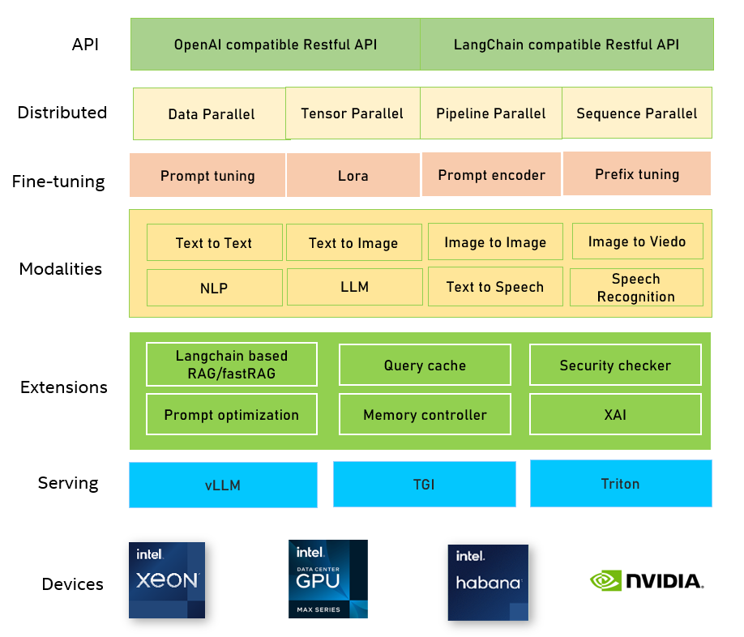

<div align="center">

NeuralChat
===========================
<h3> A customizable chatbot framework to create your own chatbot within minutes</h3>

---
<div align="left">

## Table of contents

- [Introduction](#introduction)
- [Installation](#installation)
- [Getting Started](#getting-started)
  - [Deploy Chatbot Non-Persistent](#deploy-chatbot-non-persistent)
  - [Deploy Chatbot Persistent Service](#deploy-chatbot-persistent-service)
  - [Chatbot with RAG](#chatbot-with-rag)
  - [Chatbot with Multimodal](#chatbot-with-multimodal)
  - [Neural Copliot](#neural-copliot)
  - [Inference and finetuning with Docker](#inference-and-finetuning-with-docker)
- [Advanced Topics](#advanced-topics)
  - [Optimization](#optimization)
  - [Fine-tuning](#fine-tuning)
  - [Safety Checker](#safety-checker)
  - [Caching](#caching)
- [Models](#models)
- [Notebooks](#notebooks)

# Introduction

NeuralChat is a customizable chat framework designed to easily create user own chatbot that can be efficiently deployed across multiple architectures (e.g., Intel® Xeon® Scalable processors, Habana® Gaudi® AI processors). NeuralChat is built on top of large language models (LLMs) and provides a set of strong capabilities including LLM fine-tuning, optimization, and inference, together with a rich set of plugins such as knowledge retrieval, query caching, etc. With NeuralChat, you can easily create a text-based or audio-based chatbot within minutes and deploy on user favorite platform rapidly. NeuralChat implements many features, such as:
- Simple launcher to serve most popular LLMs
- Token streaming using Server-Sent Events (SSE)
- Weight-only quantization with [LLM runtime](../llm/runtime/graph/README.md)
- Quantization technologies such as `MixedPrecision`, `SmoothQuant` and `WeightOnlyQuant` leverage `RTN/AWQ/TEQ` algorithms and `BitsandBytes` using [Intel® Neural Compressor](https://github.com/intel/neural-compressor) and [Intel® extension for pytorch](https://github.com/intel/intel-extension-for-pytorch)
- Fine-tuning Support: Utilize fine-tuned models for specific tasks to achieve higher accuracy and performance
- Distributed inference with [DeepSpeed](https://github.com/microsoft/DeepSpeed)
- Tensor parallelism strategy for distributed inference/training on multi-node and multi-socket
- OpenAI-compatible API
- Langchain-compatible API
- Support multi-frameworks serving, such as TGI, vLLM, Triton
- Support Intel CPUs, Intel XPUs, Habana HPU and NVIDIA GPUs.


<a target="_blank" href="./assets/pictures/neuralchat.png">
<p align="center">
  
</p>
</a>

<a target="_blank" href="./assets/pictures/neuralchat_architecture.png">
<p align="center">
  
</p>
</a>

> NeuralChat is under active development with some experimental features (APIs are subject to change).

# Installation

NeuralChat is seamlessly integrated into the Intel Extension for Transformers. Please refer to [Installation](../../docs/installation.md) page for step by step instructions.

Once you've installed the Intel Extension for Transformers, install NeuralChat's dependencies based on your device:
```shell
# For CPU device
pip install -r requirements_cpu.txt

# For HPU device
pip install -r requirements_hpu.txt

# For XPU device
pip install -r requirements_xpu.txt

# For CUDA
pip install -r requirements.txt
```

# Getting Started

NeuralChat could be deployed non-persistent or accessed through persistent service.

## Deploy Chatbot Non-Persistent

NeuralChat can be deployed non-persistent and users can run it through command line or python code.

```shell
# Command line
neuralchat predict --query "Tell me about Intel Xeon Scalable Processors."
```

```python
# Python code
from intel_extension_for_transformers.neural_chat import build_chatbot
chatbot = build_chatbot()
response = chatbot.predict("Tell me about Intel Xeon Scalable Processors.")
print(response)
```

## Deploy Chatbot Persistent Service

NeuralChat can be deployed as a persistent service and users can access it through curl with Restful API.

### Launch Service


```shell
neuralchat_server start --config_file ./server/config/neuralchat.yaml
```

### OpenAI-Compatible RESTful APIs

NeuralChat provides OpenAI-compatible APIs for LLM inference, so you can use NeuralChat as a local drop-in replacement for OpenAI APIs. The NeuralChat server is compatible with both [openai-python library](https://github.com/openai/openai-python) and cURL commands. See [neuralchat_api.md](./docs/neuralchat_api.md).

### Access Service

#### Using Curl
```shell
curl -X POST -H "Content-Type: application/json" -d '{"prompt": "Tell me about Intel Xeon Scalable Processors."}' http://127.0.0.1:80/v1/chat/completions
```

#### Using Python Requests Library

```python
# Python code
import requests
url = 'http://127.0.0.1:80/v1/chat/completions'
headers = {'Content-Type': 'application/json'}
data = '{"prompt": "Tell me about Intel Xeon Scalable Processors."}'
response = requests.post(url, headers=headers, data=data)
print(response.json())
```

#### Using OpenAI Client Library
```python
# Python code
from openai import Client
# Replace 'your_api_key' with your actual OpenAI API key
api_key = 'your_api_key'
backend_url = 'http://127.0.0.1:80/v1/chat/completions' 
client = Client(api_key=api_key, base_url=backend_url)
completion = client.ChatCompletion.create(prompt="Tell me about Intel Xeon Scalable Processors.")
print(completion)
```

## Chatbot with RAG
NeuralChat introduces 'plugins' that provide a comprehensive range of helpful LLM utilities and features to enhance the chatbot's capabilities. One such plugin is RAG(Retrieval-Augmented Generation), widely utilized in knowledge-based chatbot applications.

Taking inspiration from earlier chatbot frameworks like [langchain](https://github.com/langchain-ai/langchain), [Llama-Index](https://github.com/run-llama/llama_index) and [haystack](https://github.com/deepset-ai/haystack), the NeuralChat API simplifies the creation and utilization of chatbot models, seamlessly integrating the powerful capabilities of RAG. This API design serves as both an easy-to-use extension for langchain users and a user-friendly deployment solution for the general user.

To ensure a seamless user experience, the plugin has been designed to be compatible with common file formats such as txt, xlsx, csv, word, pdf, html and json/jsonl. It's essential to note that for optimal functionality, certain file formats must adhere to specific structural guidelines.

|  File Type   | Predefined Structure  |
|  :----:  | :----:  |
| txt  | NA |
| html  | NA |
| markdown  | NA |
| word  | NA |
| pdf  | NA |
| xlsx  | ['Questions', 'Answers']<br>['question', 'answer', 'link']<br>['context', 'link'] |
| csv  | ['question', 'correct_answer'] |
| json/jsonl  | {'content':xxx, 'link':xxx}|

Consider this straightforward example: by providing the URL of the CES main page, the chatbot can engage in a conversation based on the content from that webpage.

```python
# python code
from intel_extension_for_transformers.neural_chat import build_chatbot, PipelineConfig, plugins
plugins.retrieval.enable = True
plugins.retrieval.args["input_path"]=["https://www.ces.tech/"]
conf = PipelineConfig(plugins=plugins)
chatbot = build_chatbot(conf)
response = chatbot.predict("When is CES 2024?")
print(response)
```

RAG demo video:

https://github.com/intel/intel-extension-for-transformers/assets/104267837/d12c0123-3c89-461b-8456-3b3f03e3f12e

The detailed description about RAG plugin, please refer to [README](./pipeline/plugins/retrieval/README.md)

## Chatbot with Multimodal

NeuralChat integrates multiple plugins to enhance multimodal capabilities in chatbot applications. The Audio Processing and Text-to-Speech (TTS) Plugin is a software component specifically designed to improve audio-related functionalities, especially for TalkingBot. Additionally, NeuralChat supports image and video plugins to facilitate tasks involving image and video generation.

Test audio sample download:

```shell
wget -c https://github.com/intel/intel-extension-for-transformers/blob/main/intel_extension_for_transformers/neural_chat/assets/audio/sample.wav
```

Python Code for Audio Processing and TTS:

```python
# Python code
from intel_extension_for_transformers.neural_chat import build_chatbot, PipelineConfig, plugins
plugins.asr.enable = True
plugins.tts.enable = True
plugins.tts.args["output_audio_path"] = "./response.wav"
pipeline_config = PipelineConfig(plugins=plugins)
chatbot = build_chatbot(pipeline_config)
response = chatbot.predict(query="./sample.wav")
```

Multimodal demo video:

https://github.com/intel/intel-extension-for-transformers/assets/104267837/b5a3f2c4-f7e0-489b-9513-661b400b8983

Please check this [example](./examples/deployment/photo_ai/README.md) for details.

## Code Generation

Code generation represents another significant application of Large Language Model(LLM) technology. NeuralChat supports various popular code generation models across different devices and provides services similar to GitHub Copilot. NeuralChat copilot is a hybrid copilot which involves real-time code generation using client PC combines with deeper server-based insight. Users have the flexibility to deploy a robust Large Language Model (LLM) in the public cloud or on-premises servers, facilitating the generation of extensive code excerpts based on user commands or comments. Additionally, users can employ an optimized LLM on their local PC as an AI assistant capable of addressing queries related to user code, elucidating code segments, refactoring, identifying and rectifying code anomalies, generating unit tests, and more.

Neural Copilot demo video:

https://github.com/intel/intel-extension-for-transformers/assets/104267837/1328969a-e60e-48b9-a1ef-5252279507a7

Please check this [example](./examples/deployment/codegen/README.md) for details.

## Inference with Docker

The easiest way of getting started is using the official Docker file. To performance inference, please check [inference with Docker](./docker/inference/README.md). We're on track to release the official Docker containers.


# Advanced Topics

## Optimization

NeuralChat provides typical model optimization technologies, like `Automatic Mixed Precision (AMP)` and `Weight Only Quantization`, to allow user to run a high-througput chatbot.

### Automatic Mixed Precision (AMP)

NeuralChat utilizes Automatic Mixed Precision (AMP) optimization by default when no specific optimization method is specified by the user in the API.
Nevertheless, users also have the option to explicitly specify this parameter, as demonstrated in the following Python code snippet.

```python
# Python code
from intel_extension_for_transformers.neural_chat import build_chatbot, MixedPrecisionConfig
pipeline_cfg = PipelineConfig(optimization_config=MixedPrecisionConfig())
chatbot = build_chatbot(pipeline_cfg)
```

### Weight Only Quantization

Compared to normal quantization like W8A8, weight only quantization is probably a better trade-off to balance the performance and the accuracy. NeuralChat leverages [Intel® Neural Compressor](https://github.com/intel/neural-compressor) to provide efficient weight only quantization.

```python
# Python code
from intel_extension_for_transformers.neural_chat import build_chatbot, PipelineConfig
loading_config = LoadingModelConfig(use_llm_runtime=True)
config = PipelineConfig(
    optimization_config=WeightOnlyQuantConfig(compute_dtype="int8", weight_dtype="int4_fullrange")
)
chatbot = build_chatbot(config)
response = chatbot.predict("Tell me about Intel Xeon Scalable Processors.")
```

### Weight Only Quantization with LLM Runtime
[LLM Runtime](../llm/runtime/graph/README.md) is designed to provide the efficient inference of large language models (LLMs) on Intel platforms in pure C/C++ with optimized weight-only quantization kernels. Applying weight-only quantization with LLM Runtime can yield enhanced performance. However, please be mindful that it might impact accuracy. Presently, we're employing GPTQ for weight-only quantization with LLM Runtime to ensure the accuracy.

```python
# Python code
from intel_extension_for_transformers.neural_chat import build_chatbot, PipelineConfig
from intel_extension_for_transformers.neural_chat.config import LoadingModelConfig
loading_config = LoadingModelConfig(use_llm_runtime=True)
config = PipelineConfig(
    optimization_config=WeightOnlyQuantConfig(compute_dtype="int8", weight_dtype="int4"),
    loading_config=loading_config
)
chatbot = build_chatbot(config)
response = chatbot.predict("Tell me about Intel Xeon Scalable Processors.")
```

## Fine-tuning

NeuralChat supports fine-tuning the pretrained large language model (LLM) for text-generation, summarization, code generation tasks, and even TTS model, for user to create the customized chatbot.

```shell
# Command line
neuralchat finetune --base_model "Intel/neural-chat-7b-v3-1" --config pipeline/finetuning/config/finetuning.yaml
```

```python
# Python code
from intel_extension_for_transformers.neural_chat import finetune_model, TextGenerationFinetuningConfig
finetune_cfg = TextGenerationFinetuningConfig() # support other finetuning config
finetune_model(finetune_cfg)
```

For detailed fine-tuning instructions, please refer to the documentation below.

[NeuralChat Fine-tuning](./examples/finetuning/instruction/README.md)

[Direct Preference Optimization](./examples/finetuning/dpo_pipeline/README.md)

[Reinforcement Learning from Human Feedback](./examples/finetuning/ppo_pipeline/README.md)

[Multi-Modal](./examples/finetuning/multi_modal/README.md)

[How to train Intel/neural-chat-7b-v3-1 on Intel Gaudi2](./examples/finetuning/finetune_neuralchat_v3/README.md)

[Text-To-Speech (TTS) model finetuning](./examples/finetuning/tts/README.md)

And NeuralChat also provides Docker file tailored for easy fine-tuning. Explore details in [finetuning with Docker](./docker/finetuning/README.md).


## Safety Checker

We prioritize the safe and responsible use of NeuralChat for everyone. Nevertheless, owing to the inherent capabilities of large language models (LLMs), we cannot assure that the generated outcomes are consistently safe and beneficial for users. To address this, we've developed a safety checker that meticulously reviews and filters sensitive or harmful words that might surface in both input and output contexts.

```python
# python code
from intel_extension_for_transformers.neural_chat import build_chatbot, PipelineConfig
plugins.safety_checker.enable = True
conf = PipelineConfig(plugins=plugins)
chatbot = build_chatbot(conf)
response = chatbot.predict("Who is lihongzhi?")
print(response)
```

The detailed description about RAG plugin, please refer to [README](./pipeline/plugins/security/README.md)

## Caching

When LLM service encounters higher traffic levels, the expenses related to LLM API calls can become substantial. Additionally, LLM services might exhibit slow response times. Hence, we leverage GPTCache to build a semantic caching plugin for storing LLM responses. Query caching enables the fast path to get the response without LLM inference and therefore improves the chat response time.

```python
# python code
from intel_extension_for_transformers.neural_chat import build_chatbot, PipelineConfig
plugins.cache.enable = True
conf = PipelineConfig(plugins=plugins)
chatbot = build_chatbot(conf)
response = chatbot.predict("Tell me about Intel Xeon Scalable Processors.")
print(response)
```

The detailed description about Caching plugin, please refer to [README](./pipeline/plugins/caching/README.md)

# Models

## Supported  Models
The table below displays the validated model list in NeuralChat for both inference and fine-tuning.
|Pretrained model| Text Generation (Completions) | Text Generation (Chat Completions) | Summarization | Code Generation | 
|------------------------------------|:---:|:---:|:---:|:---:|
|Intel/neural-chat-7b-v1-1| ✅| ✅| ✅| ✅    |
|Intel/neural-chat-7b-v3-1| ✅| ✅| ✅| ✅    |
|LLaMA series| ✅| ✅|✅| ✅    |
|LLaMA2 series| ✅| ✅|✅| ✅    |
|GPT-J| ✅| ✅|✅| ✅    |
|MPT series| ✅| ✅|✅| ✅    |
|Mistral series| ✅| ✅|✅| ✅    |
|Mixtral series| ✅| ✅|✅| ✅    |
|SOLAR Series| ✅| ✅|✅| ✅    |
|ChatGLM series| ✅| ✅|✅| ✅    |
|Qwen series| ✅| ✅|✅| ✅    |
|StarCoder series|   |   |   | ✅ |
|CodeLLaMA series|   |   |   | ✅ |
|CodeGen series|   |   |   | ✅ |
|MagicCoder series|   |   |   | ✅ |


# Notebooks

Welcome to use Jupyter notebooks to explore how to create, deploy, and customize chatbots on multiple architectures, including Intel Xeon Scalable Processors, Intel Gaudi2, Intel Xeon CPU Max Series, Intel Data Center GPU Max Series, Intel Arc Series, and Intel Core Processors, and others. The selected notebooks are shown below:

| Notebook | Title                                       | Description                                                | Link                                           |
| ------- | --------------------------------------------- | ---------------------------------------------------------- | ------------------------------------------------------- |
| #1     | Getting Started on Intel CPU SPR          | Learn how to create chatbot on SPR                      | [Notebook](./docs/notebooks/build_chatbot_on_spr.ipynb) |
| #2     | Getting Started on Habana Gaudi1/Gaudi2   | Learn how to create chatbot on Habana Gaudi1/Gaudi2     | [Notebook](./docs/notebooks/build_chatbot_on_habana_gaudi.ipynb) |
| #3     | Deploying Chatbot on Intel CPU SPR        | Learn how to deploy chatbot on SPR                      | [Notebook](./docs/notebooks/deploy_chatbot_on_spr.ipynb) |
| #4     | Deploying Chatbot on Habana Gaudi1/Gaudi2 | Learn how to deploy chatbot on Habana Gaudi1/Gaudi2     | [Notebook](./docs/notebooks/deploy_chatbot_on_habana_gaudi.ipynb) |
| #5     | Deploying Chatbot with Load Balance       | Learn how to deploy chatbot with load balance on SPR    | [Notebook](./docs/notebooks/chatbot_with_load_balance.ipynb) |


🌟Please refer to [HERE](docs/full_notebooks.md) for the full notebooks.
