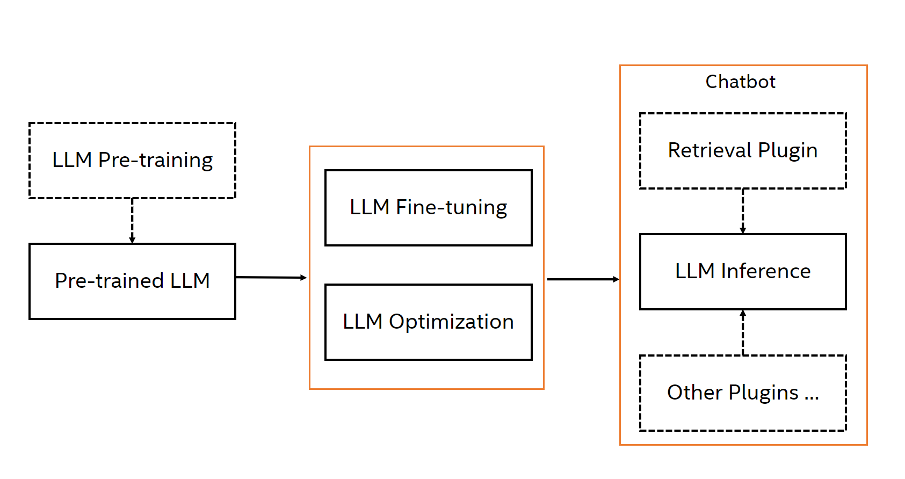

<div align="center">

NeuralChat
===========================
<h3> A customizable chatbot framework to create your own chatbot within minutes</h3>

---
<div align="left">

## Introduction

NeuralChat is a customizable chat framework designed to easily create user own chatbot that can be efficiently deployed across multiple architectures (e.g., Intel® Xeon® Scalable processors, Habana® Gaudi® AI processors). NeuralChat is built on top of large language models (LLMs) and provides a set of strong capabilities including LLM fine-tuning, optimization, and inference, together with a rich set of plugins such as knowledge retrieval, query caching, etc. With NeuralChat, you can easily create a text-based or audio-based chatbot within minutes and deploy on user favorite platform rapidly.

<a target="_blank" href="./assets/pictures/neuralchat.png">
<p align="center">
  
</p>
</a>

> NeuralChat is under active development with some experimental features (APIs are subject to change).

## Installation

NeuralChat is seamlessly integrated into the Intel Extension for Transformers. Please refer to [Installation](../../docs/installation.md) page for step by step instructions.

## Getting Started

NeuralChat could be deployed locally or accessed through service.

### Deploy Chatbot Locally

NeuralChat can be deployed locally and users can run it through command line or python code.

```shell
# Command line
neuralchat predict --query "Tell me about Intel Xeon Scalable Processors."
```

```python
# Python code
from intel_extension_for_transformers.neural_chat import build_chatbot
chatbot = build_chatbot()
response = chatbot.predict("Tell me about Intel Xeon Scalable Processors.")
print(response)
```

### Deploy Chatbot Service

NeuralChat can be deployed as a service and users can access it through curl with Restful API.

#### Launch Service


```shell
neuralchat_server start --config_file ./server/config/neuralchat.yaml
```

#### Access Service


```shell
curl -X POST -H "Content-Type: application/json" -d '{"prompt": "Tell me about Intel Xeon Scalable Processors."}' http://127.0.0.1:80/v1/chat/completions
```

## Advanced Topics

### Plugins

NeuralChat introduces the `plugins` which offer a rich set of useful LLM utils and features to augment the chatbot's capability. Such plugins are applied in the chatbot pipeline for inference.

Below shows the supported plugins:

- [Knowledge Retrieval](./pipeline/plugins/retrieval/)

    Knowledge retrieval consists of document indexing for efficient retrieval of relevant information, including Dense Indexing based on LangChain and Sparse Indexing based on fastRAG, document rankers to prioritize the most relevant responses.

- [Query Caching](./pipeline/plugins/caching/)

    Query caching enables the fast path to get the response without LLM inference and therefore improves the chat response time

- [Prompt Optimization](./pipeline/plugins/prompt/)

    Prompt optimization supports auto prompt engineering to improve user prompts.

- [Memory Controller](./pipeline/plugins/memory/)

    Memory controller enables the efficient memory utilization.

- [Safety Checker](./pipeline/plugins/security/)

    Safety checker enables the sensitive content check on inputs and outputs of the chatbot.

User could enable, disable, and even change the default behavior of all supported plugins like below

```python
from intel_extension_for_transformers.neural_chat import build_chatbot, PipelineConfig, plugins

plugins.retrieval.enable = True
plugins.retrieval.args["input_path"]="./assets/docs/"
conf = PipelineConf(plugins=plugins)
chatbot = build_chatbot(conf)

```

### Fine-tuning

NeuralChat supports fine-tuning the pretrained large language model (LLM) for text-generation, summarization, code generation tasks, and even TTS model, for user to create the customized chatbot.

```shell
# Command line
neuralchat finetune --base_model "meta-llama/Llama-2-7b-chat-hf" --config pipeline/finetuning/config/finetuning.yaml
```

```python
# Python code
from intel_extension_for_transformers.neural_chat import finetune_model, TextGenerationFinetuningConfig
finetune_cfg = TextGenerationFinetuningConfig() # support other finetuning config
finetune_model(finetune_cfg)
```

### Optimization

NeuralChat provides typical model optimization technologies, like `Automatic Mixed Precision (AMP)` and `Weight Only Quantization`, to allow user to define a customized chatbot.

```shell
# Command line
neuralchat optimize --base_model "meta-llama/Llama-2-7b-chat-hf" --config pipeline/optimization/config/optimization.yaml
```

```python
# Python code
from intel_extension_for_transformers.neural_chat import build_chatbot, MixedPrecisionConfig
pipeline_cfg = PipelineConfig(optimization_config=MixedPrecisionConfig())
chatbot = build_chatbot(pipeline_cfg)
```

## Validated Model List
The table below displays the validated model list in NeuralChat for both inference and fine-tuning.
|Pretrained model| Text Generation (Instruction) | Text Generation (ChatBot) | Summarization | Code Generation | 
|------------------------------------|---|---|--- | --- |
|Intel/neural-chat-7b-v1-1| ✅| ✅| ✅| ✅
|Intel/neural-chat-7b-v3-1| ✅| ✅| ✅| ✅
|LLaMA series| ✅| ✅|✅| ✅
|LLaMA2 series| ✅| ✅|✅| ✅
|MPT series| ✅| ✅|✅| ✅
|Mistral| ✅| ✅|✅| ✅
|ChatGLM series| ✅| ✅|✅| ✅
|Qwen series| ✅| ✅|✅| ✅
|StarCoder series|   |   |   | ✅
|CodeLLaMA series|   |   |   | ✅


## Restful API

### OpenAI-Compatible RESTful APIs & SDK
NeuralChat provides OpenAI-compatible APIs for its supported models, so you can use NeuralChat as a local drop-in replacement for OpenAI APIs. The NeuralChat server is compatible with both [openai-python library](https://github.com/openai/openai-python) and cURL commands.
The following OpenAI APIs are supported:

Chat Completions. (Reference: https://platform.openai.com/docs/api-reference/chat)
Completions. (Reference: https://platform.openai.com/docs/api-reference/completions)

### Hugging Face Generation APIs


## Selected Notebooks 

Welcome to use Jupyter notebooks to explore how to create, deploy, and customize chatbots on multiple architectures, including Intel Xeon Scalable Processors, Intel Gaudi2, Intel Xeon CPU Max Series, Intel Data Center GPU Max Series, Intel Arc Series, and Intel Core Processors, and others. The selected notebooks are shown below:

| Notebook | Title                                       | Description                                                | Link                                           |
| ------- | --------------------------------------------- | ---------------------------------------------------------- | ------------------------------------------------------- |
| #1     | Getting Started on Intel CPU SPR          | Learn how to create chatbot on SPR                      | [Notebook](./docs/notebooks/build_chatbot_on_spr.ipynb) |
| #2     | Getting Started on Habana Gaudi1/Gaudi2   | Learn how to create chatbot on Habana Gaudi1/Gaudi2     | [Notebook](./docs/notebooks/build_chatbot_on_habana_gaudi.ipynb) |
| #3     | Deploying Chatbot on Intel CPU SPR        | Learn how to deploy chatbot on SPR                      | [Notebook](./docs/notebooks/deploy_chatbot_on_spr.ipynb) |
| #4     | Deploying Chatbot on Habana Gaudi1/Gaudi2 | Learn how to deploy chatbot on Habana Gaudi1/Gaudi2     | [Notebook](./docs/notebooks/deploy_chatbot_on_habana_gaudi.ipynb) |
| #5     | Deploying Chatbot with Load Balance       | Learn how to deploy chatbot with load balance on SPR    | [Notebook](./docs/notebooks/chatbot_with_load_balance.ipynb) |


🌟Please refer to [HERE](docs/full_notebooks.md) for the full notebooks.
