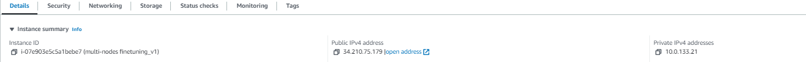

NeuralChat Fine-tuning
============

This example demonstrates how to finetune the pretrained large language model (LLM) with the instruction-following dataset for creating the NeuralChat, a chatbot that can conduct the textual conversation. Giving NeuralChat the textual instruction, it will respond with the textual response. This example have been validated on the 4th Gen Intel® Xeon® Processors, Sapphire Rapids.

## Validated Model List
|Pretrained model| Text Generation (Instruction) | Text Generation (ChatBot) | Summarization | Code Generation |
|------------------------------------|---|---|--- | --- |
|Mistral-7B | ✅| ✅|✅| ✅
|LLaMA series| ✅| ✅|✅| ✅
|LLaMA2 series| ✅| ✅|✅| ✅
|MPT series| ✅| ✅|✅| ✅
|FLAN-T5 series| ✅ | **WIP**| **WIP** | **WIP**|
|Mixtral-8x7B | **WIP** | **WIP**| **WIP** | **WIP**|

# Prerequisite​

## 1. Environment​
### Bare Metal
Recommend python 3.9 or higher version.
```shell
pip install -r requirements.txt
pip install transformers==4.34.1
# To use ccl as the distributed backend in distributed training on CPU requires to install below requirement.
python -m pip install oneccl_bind_pt==2.1.0 -f https://developer.intel.com/ipex-whl-stable-cpu
```
>**Note**: Suggest using transformers no higher than 4.34.1

### Docker 
Pick either one of below options to setup docker environment.
#### Option 1 : Build Docker image from scratch
Please refer to this section : [How to build docker images for NeuralChat FineTuning](../../../docker/finetuning/README.md#21-build-docker-image) to build docker image from scratch.  

#### Option 2: Pull existing Docker image
Please follow the session [itrex docker setup](../../../docker/finetuning/README.md#22-docker-pull-from-docker-hub) and use the docker pull command to pull itrex docker image.  


Once you have the docker image ready, please follow [run docker image](../../../docker/finetuning/README.md#3-create-docker-container) session to launch a docker instance from the image.   


## 2. Prepare the Model

#### meta-llama/Llama-2-7b-hf
To acquire the checkpoints and tokenizer, the user can get those files from [meta-llama/Llama-2-7b-hf](https://huggingface.co/meta-llama/Llama-2-7b-hf).
Users could follow below commands to get the checkpoints from github repository after the access request to the files is approved.
```bash
git lfs install
git clone https://huggingface.co/meta-llama/Llama-2-7b-hf
```
### MPT
To acquire the checkpoints and tokenizer, the user can get those files from [mosaicml/mpt-7b](https://huggingface.co/mosaicml/mpt-7b).
Users could follow below commands to get the checkpoints from github repository.
```bash
git lfs install
git clone https://huggingface.co/mosaicml/mpt-7b
```
For missing GPTNeoTokenizer issue, we advise the user to modify the local `tokenizer_config.json` file according to the following recommendation:
1. The `tokenizer_class` in `tokenizer_config.json` should be changed from `GPTNeoXTokenizer` to `GPTNeoXTokenizerFast`;

### Falcon
To acquire the checkpoints and tokenizer, the user can get those files from [tiiuae/falcon-7b](https://huggingface.co/tiiuae/falcon-7b).
Users could follow below commands to get the checkpoints from github repository.
```bash
git lfs install
git clone https://huggingface.co/tiiuae/falcon-7b
```

### Mistral
To acquire the checkpoints and tokenizer, the user can get those files from [mistralai/Mistral-7B-v0.1](https://huggingface.co/mistralai/Mistral-7B-v0.1).
Users could follow below commands to get the checkpoints from github repository.
```bash
git lfs install
git clone https://huggingface.co/mistralai/Mistral-7B-v0.1
```

### CodeLlama
To acquire the checkpoints and tokenizer, the user can get those files from [codellama/CodeLlama-7b-hf](https://huggingface.co/codellama/CodeLlama-7b-hf).
Users could follow below commands to get the checkpoints from github repository.
```bash
git lfs install
git clone https://huggingface.co/codellama/CodeLlama-7b-hf
```

### StarCoder
To acquire the checkpoints and tokenizer, the user can get those files from [bigcode/starcoder](https://huggingface.co/bigcode/starcoder).
Users could follow below commands to get the checkpoints from github repository.
```bash
git lfs install
git clone https://huggingface.co/bigcode/starcoder
```

### FLAN-T5
The user can obtain the [release model](https://huggingface.co/google/flan-t5-xl) from Huggingface.

## 3. Prepare Dataset
We select 4 kind of datasets to conduct the finetuning process for different tasks.

1. Text Generation (General domain instruction): We use the [Alpaca dataset](https://github.com/tatsu-lab/stanford_alpaca) from Stanford University as the general domain dataset to fine-tune the model. This dataset is provided in the form of a JSON file, [alpaca_data.json](https://github.com/tatsu-lab/stanford_alpaca/blob/main/alpaca_data.json). In Alpaca, researchers have manually crafted 175 seed tasks to guide `text-davinci-003` in generating 52K instruction data for diverse tasks.

2. Text Generation (Domain-specific instruction): Inspired by Alpaca, we constructed a domain-specific dataset focusing on Business and Intel-related issues. We made minor modifications to the [prompt template](https://github.com/tatsu-lab/stanford_alpaca/blob/main/prompt.txt) to proactively guide Alpaca in generating more Intel and Business related instruction data. The generated data could be find in `intel_domain.json`.

3. Text Generation (ChatBot): To finetune a chatbot, we use the chat-style dataset [HuggingFaceH4/ultrachat_200k](https://huggingface.co/datasets/HuggingFaceH4/ultrachat_200k).

4. Summarization: An English-language dataset [cnn_dailymail](https://huggingface.co/datasets/cnn_dailymail) containing just over 300k unique news articles as written by journalists at CNN and the Daily Mail, is used for this task.

5. Code Generation: To enhance code performance of LLMs (Large Language Models), we use the [theblackcat102/evol-codealpaca-v1](https://huggingface.co/datasets/theblackcat102/evol-codealpaca-v1).

### Dataset related arguments
- **dataset_name**: The name of the dataset to use (via the datasets library).
- **dataset_config_name**: The configuration name of the dataset to use (via the datasets library).
- **train_file**: The input training data file (a text file).
- **validation_file**: An optional input evaluation data file to evaluate the perplexity on (a text file).
- **max_seq_length**: The maximum total input sequence length after tokenization. Sequences longer than this will be truncated.
- **validation_split_percentage**: The percentage of the train set used as validation set in case there's no validation split.
- **dataset_concatenation**: Whether to concatenate the sentence for more efficient training.

# Finetune

We employ the [LoRA approach](https://arxiv.org/pdf/2106.09685.pdf) to finetune the LLM efficiently.

## 1. Single Node Fine-tuning in Xeon SPR

**For FLAN-T5**, use the below command line for finetuning on the Alpaca dataset.

```bash
python finetune_seq2seq.py \
        --model_name_or_path "google/flan-t5-xl" \
        --bf16 True \
        --train_file "stanford_alpaca/alpaca_data.json" \
        --per_device_train_batch_size 2 \
        --per_device_eval_batch_size 2 \
        --gradient_accumulation_steps 1 \
        --do_train \
        --learning_rate 1.0e-5 \
        --warmup_ratio 0.03 \
        --weight_decay 0.0 \
        --num_train_epochs 5 \
        --logging_steps 10 \
        --save_steps 2000 \
        --save_total_limit 2 \
        --overwrite_output_dir \
        --output_dir ./flan-t5-xl_peft_finetuned_model \
        --peft lora
```

#### For LLaMA2

- use the below command line for code tuning with `meta-llama/Llama-2-7b-hf` on [theblackcat102/evol-codealpaca-v1](https://huggingface.co/datasets/theblackcat102/evol-codealpaca-v1).

```bash
python finetune_clm.py \
        --model_name_or_path "meta-llama/Llama-2-7b-hf" \
        --bf16 True \
        --dataset_name "theblackcat102/evol-codealpaca-v1" \
        --per_device_train_batch_size 8 \
        --per_device_eval_batch_size 8 \
        --gradient_accumulation_steps 1 \
        --do_train \
        --learning_rate 1e-4 \
        --num_train_epochs 3 \
        --logging_steps 100 \
        --save_total_limit 2 \
        --overwrite_output_dir \
        --log_level info \
        --save_strategy epoch \
        --output_dir ./llama2_peft_finetuned_model \
        --peft lora \
        --use_fast_tokenizer false \
        --no_cuda

# the script also support other models, like mpt.
```

**For [CodeLlama](https://huggingface.co/codellama/CodeLlama-7b-hf)**, use the below command line for finetuning on the [sahil2801/CodeAlpaca-20k](https://huggingface.co/datasets/sahil2801/CodeAlpaca-20k) code instruction dataset.

```bash
python finetune_clm.py \
        --model_name_or_path "codellama/CodeLlama-7b-hf" \
        --bf16 True \
        --dataset_name "sahil2801/CodeAlpaca-20k" \
        --per_device_train_batch_size 8 \
        --per_device_eval_batch_size 8 \
        --gradient_accumulation_steps 1 \
        --do_train \
        --learning_rate 1e-4 \
        --num_train_epochs 3 \
        --logging_steps 100 \
        --save_total_limit 2 \
        --overwrite_output_dir \
        --log_level info \
        --save_strategy epoch \
        --output_dir ./codellama_peft_finetuned_model \
        --peft lora \
        --use_fast_tokenizer True \
        --no_cuda \
        --task code-generation
```

**For [MPT](https://huggingface.co/mosaicml/mpt-7b)**, use the below command line for finetuning on the Alpaca dataset. Only LORA supports MPT in PEFT perspective.it uses gpt-neox-20b tokenizer, so you need to define it in command line explicitly.This model also requires that trust_remote_code=True be passed to the from_pretrained method. This is because we use a custom MPT model architecture that is not yet part of the Hugging Face transformers package.

```bash
python finetune_clm.py \
        --model_name_or_path "mosaicml/mpt-7b" \
        --bf16 True \
        --train_file "/path/to/alpaca_data.json" \
        --dataset_concatenation \
        --per_device_train_batch_size 8 \
        --per_device_eval_batch_size 8 \
        --gradient_accumulation_steps 1 \
        --do_train \
        --learning_rate 1e-4 \
        --num_train_epochs 3 \
        --logging_steps 100 \
        --save_total_limit 2 \
        --overwrite_output_dir \
        --log_level info \
        --save_strategy epoch \
        --output_dir ./mpt_peft_finetuned_model \
        --peft lora \
        --trust_remote_code True \
        --use_fast_tokenizer True \
        --tokenizer_name "EleutherAI/gpt-neox-20b" \
        --no_cuda \
```

**For Falcon**, use the below command line for finetuning on the Alpaca dataset.

```bash
python finetune_clm.py \
        --model_name_or_path "tiiuae/falcon-7b" \
        --bf16 True \
        --train_file "/path/to/alpaca_data.json" \
        --dataset_concatenation \
        --per_device_train_batch_size 8 \
        --per_device_eval_batch_size 8 \
        --gradient_accumulation_steps 1 \
        --do_train \
        --learning_rate 1e-4 \
        --num_train_epochs 3 \
        --logging_steps 100 \
        --save_total_limit 2 \
        --overwrite_output_dir \
        --log_level info \
        --save_strategy epoch \
        --output_dir ./falcon_peft_finetuned_model \
        --peft lora \
        --use_fast_tokenizer True \
        --no_cuda \
```

**For Mistral**, use the below command line for finetuning on the Alpaca dataset.

```bash
python finetune_clm.py \
        --model_name_or_path "mistralai/Mistral-7B-v0.1" \
        --bf16 True \
        --train_file "/path/to/alpaca_data.json" \
        --dataset_concatenation \
        --per_device_train_batch_size 8 \
        --per_device_eval_batch_size 8 \
        --gradient_accumulation_steps 1 \
        --do_train \
        --learning_rate 1e-4 \
        --num_train_epochs 3 \
        --logging_steps 100 \
        --save_total_limit 2 \
        --overwrite_output_dir \
        --log_level info \
        --save_strategy epoch \
        --output_dir ./mistral_peft_finetuned_model \
        --peft lora \
        --use_fast_tokenizer True \
        --no_cuda \
```

**For StarCoder**, use the below command line for finetuning on the [sahil2801/CodeAlpaca-20k](https://huggingface.co/datasets/sahil2801/CodeAlpaca-20k) code instruction dataset.

```bash
python finetune_clm.py \
        --model_name_or_path "bigcode/starcoder" \
        --bf16 True \
        --dataset_name "sahil2801/CodeAlpaca-20k" \
        --per_device_train_batch_size 8 \
        --per_device_eval_batch_size 8 \
        --gradient_accumulation_steps 1 \
        --do_train \
        --learning_rate 1e-4 \
        --num_train_epochs 3 \
        --logging_steps 100 \
        --save_total_limit 2 \
        --overwrite_output_dir \
        --log_level info \
        --save_strategy epoch \
        --output_dir ./starcoder_peft_finetuned_model \
        --peft lora \
        --use_fast_tokenizer True \
        --no_cuda \
        --task code-generation
```

Where the `--dataset_concatenation` argument is a way to vastly accelerate the fine-tuning process through training samples concatenation. With several tokenized sentences concatenated into a longer and concentrated sentence as the training sample instead of having several training samples with different lengths, this way is more efficient due to the parallelism characteristic provided by the more concentrated training samples.

For finetuning on SPR, add `--bf16` argument will speedup the finetuning process without the loss of model's performance.
You could also indicate `--peft` to switch peft method in P-tuning, Prefix tuning, Prompt tuning, LLama Adapter, LoRA,
see https://github.com/huggingface/peft. Note for FLAN-T5/MPT, only LoRA is supported.


## 2. Multi-node Fine-tuning in Xeon SPR

We also supported Distributed Data Parallel finetuning on single node and multi-node settings. To use Distributed Data Parallel to speedup training, the bash command needs a small adjustment.
<br>
For example, to finetune FLAN-T5 through Distributed Data Parallel training, bash command will look like the following, where
<br>
*`<MASTER_ADDRESS>`* is the address of the master node, it won't be necessary for single node case,
<br>
*`<NUM_PROCESSES_PER_NODE>`* is the desired processes to use in current node, for node with GPU, usually set to number of GPUs in this node, for node without GPU and use CPU for training, it's recommended set to 1,
<br>
*`<NUM_NODES>`* is the number of nodes to use,
<br>
*`<NODE_RANK>`* is the rank of the current node, rank starts from 0 to *`<NUM_NODES>`*`-1`.
<br>
> Also please note that to use CPU for training in each node with multi-node settings, argument `--no_cuda` is mandatory, and `--ddp_backend ccl` is required if to use ccl as the distributed backend. In multi-node setting, following command needs to be launched in each node, and all the commands should be the same except for *`<NODE_RANK>`*, which should be integer from 0 to *`<NUM_NODES>`*`-1` assigned to each node.

``` bash
mpirun -f nodefile -n 16 -ppn 4 -genv OMP_NUM_THREADS=56 python3 finetune_seq2seq.py \
    --model_name_or_path "google/flan-t5-xl" \
    --bf16 True \
    --train_file "stanford_alpaca/alpaca_data.json" \
    --per_device_train_batch_size 2 \
    --per_device_eval_batch_size 2 \
    --gradient_accumulation_steps 1 \
    --do_train \
    --learning_rate 1.0e-5 \
    --warmup_ratio 0.03 \
    --weight_decay 0.0 \
    --num_train_epochs 5 \
    --logging_steps 10 \
    --save_steps 2000 \
    --save_total_limit 2 \
    --overwrite_output_dir \
    --output_dir ./flan-t5-xl_peft_finetuned_model \
    --peft lora \
    --no_cuda \
    --ddp_backend ccl \
```
If you have enabled passwordless SSH in cpu clusters, you could also use mpirun in master node to start the DDP finetune. Take llama alpaca finetune for example. follow the [hugginface guide](https://huggingface.co/docs/transformers/perf_train_cpu_many) to install Intel® oneCCL Bindings for PyTorch, IPEX

oneccl_bindings_for_pytorch is installed along with the MPI tool set. Need to source the environment before using it.

for Intel® oneCCL >= 1.12.0
``` bash
oneccl_bindings_for_pytorch_path=$(python -c "from oneccl_bindings_for_pytorch import cwd; print(cwd)")
source $oneccl_bindings_for_pytorch_path/env/setvars.sh
```

for Intel® oneCCL whose version < 1.12.0
``` bash
torch_ccl_path=$(python -c "import torch; import torch_ccl; import os;  print(os.path.abspath(os.path.dirname(torch_ccl.__file__)))")
source $torch_ccl_path/env/setvars.sh
```

The following command enables training with a total of 16 processes on 4 Xeons (node0/1/2/3, 2 sockets each node. taking node0 as the master node), ppn (processes per node) is set to 4, with two processes running per one socket. The variables OMP_NUM_THREADS/CCL_WORKER_COUNT can be tuned for optimal performance.

In node0, you need to create a configuration file which contains the IP addresses of each node (for example nodefile) and pass that configuration file path as an argument.
``` bash
 cat nodefile
 xxx.xxx.xxx.xxx #node0 ip
 xxx.xxx.xxx.xxx #node1 ip
 xxx.xxx.xxx.xxx #node2 ip
 xxx.xxx.xxx.xxx #node3 ip
```
Now, run the following command in node0 and **4DDP** will be enabled in node0 and node1 with BF16 auto mixed precision:
``` bash
export CCL_WORKER_COUNT=1
export MASTER_ADDR=xxx.xxx.xxx.xxx #node0 ip
## for DDP ptun for LLama2
mpirun -f nodefile -n 16 -ppn 4 -genv OMP_NUM_THREADS=56 python3 finetune_clm.py \
    --model_name_or_path meta-llama/Llama-2-7b-chat-hf \
    --train_file ./alpaca_data.json \
    --bf16 True \
    --output_dir ./llama2_peft_finetuned_model \
    --num_train_epochs 3 \
    --per_device_train_batch_size 4 \
    --per_device_eval_batch_size 4 \
    --gradient_accumulation_steps 1 \
    --evaluation_strategy "no" \
    --save_strategy "steps" \
    --save_steps 2000 \
    --save_total_limit 1 \
    --learning_rate 1e-4 \
    --logging_steps 1 \
    --peft ptun \
    --group_by_length True \
    --dataset_concatenation \
    --use_fast_tokenizer false \
    --do_train \
    --no_cuda \
    --ddp_backend ccl \

## for DDP LORA for MPT
mpirun -f nodefile -n 16 -ppn 4 -genv OMP_NUM_THREADS=56 python3 finetune_clm.py \
    --model_name_or_path mosaicml/mpt-7b \
    --train_file ./alpaca_data.json \
    --bf16 True \
    --output_dir ./mpt_peft_finetuned_model \
    --num_train_epochs 3 \
    --per_device_train_batch_size 4 \
    --per_device_eval_batch_size 4 \
    --gradient_accumulation_steps 1 \
    --evaluation_strategy "no" \
    --save_strategy "steps" \
    --save_steps 2000 \
    --save_total_limit 1 \
    --learning_rate 1e-4  \
    --logging_steps 1 \
    --peft lora \
    --group_by_length True \
    --dataset_concatenation \
    --do_train \
    --trust_remote_code True \
    --use_fast_tokenizer True \
    --tokenizer_name "EleutherAI/gpt-neox-20b" \
    --no_cuda \
    --ddp_backend ccl \
```
you could also indicate `--peft` to switch peft method in P-tuning, Prefix tuning, Prompt tuning, LLama Adapter, LORA,
see https://github.com/huggingface/peft

## 3. Multi-node Fine-tuning in AWS m7i SPR instances

### Build Docker image with customized SSH server port from scratch
AWS instances have a SSH server on by default, so we need to start SSH Server with different port inside the docker instance.  
Users could pick their CUSTOM_PORT but we should not use 22 as the SSH Server port inside the docker instance.  
Please refer to this section : [How to build docker images for NeuralChat FineTuning](../../../docker/finetuning/README.md#21-build-docker-image) and add `--build-arg SSHD_PORT=<CUSTOM_PORT>` to build docker image from scratch.   

ex : using 2345 as the CUSTOM_PORT  
```bash
docker build --build-arg UBUNTU_VER=22.04 --build-arg SSHD_PORT=2345 -f intel-extension-for-transformers/intel_extension_for_transformers/neural_chat/docker/Dockerfile -t ${IMAGE_NAME}:${IMAGE_TAG} . --target cpu
```  

### Add one AWS inbound rule for distributed training
Allow all network traffic inside the cluster, so that distributed training runs unencumbered.   
AWS provides a safe and convenient way to do this with security groups. We just need to create a security group that allows all traffic from instances configured with that same security group and make sure to attach it to all instances in the cluster.  
Here's how my setup looks.  
  
Users could also refer to [a huggingface blog](https://huggingface.co/blog/intel-sapphire-rapids) for more details.

### Same Instructions as Multi-node Fine-tuning in Xeon SPR session
Please follow previous Multi-node Fine-tuning in Xeon SPR session with the docker image and AWS inbound rule changes.  
For the IPs in nodefile, please **use private IP instead of public IP**.  
  


## 1. Single Card Fine-tuning in Habana DL1

Follow install guidance in [optimum-habana](https://github.com/huggingface/optimum-habana)

For LLaMA2, use the below command line for finetuning on the Alpaca dataset.

```bash
python finetune_clm.py \
        --model_name_or_path "meta-llama/Llama-2-7b-chat-hf" \
        --bf16 True \
        --train_file "/path/to/alpaca_data.json" \
        --dataset_concatenation \
        --per_device_train_batch_size 2 \
        --per_device_eval_batch_size 2 \
        --gradient_accumulation_steps 4 \
        --evaluation_strategy "no" \
        --save_strategy "steps" \
        --save_steps 2000 \
        --save_total_limit 1 \
        --learning_rate 1e-4  \
        --logging_steps 1 \
        --do_train \
        --num_train_epochs 3 \
        --overwrite_output_dir \
        --log_level info \
        --output_dir ./llama2_peft_finetuned_model \
        --peft lora \
        --use_fast_tokenizer false \
        --device "hpu" \
        --use_habana \
        --use_lazy_mode \
```

For [MPT](https://huggingface.co/mosaicml/mpt-7b), use the below command line for finetuning on the Alpaca dataset. Only LORA supports MPT in PEFT perspective.it uses gpt-neox-20b tokenizer, so you need to define it in command line explicitly.This model also requires that trust_remote_code=True be passed to the from_pretrained method. This is because we use a custom MPT model architecture that is not yet part of the Hugging Face transformers package.

```bash
python finetune_clm.py \
        --model_name_or_path "mosaicml/mpt-7b" \
        --bf16 True \
        --train_file "/path/to/alpaca_data.json" \
        --dataset_concatenation \
        --per_device_train_batch_size 2 \
        --per_device_eval_batch_size 2 \
        --gradient_accumulation_steps 4 \
        --evaluation_strategy "no" \
        --save_strategy "steps" \
        --save_steps 2000 \
        --save_total_limit 1 \
        --learning_rate 1e-4  \
        --logging_steps 1 \
        --do_train \
        --num_train_epochs 3 \
        --overwrite_output_dir \
        --log_level info \
        --output_dir ./mpt_peft_finetuned_model \
        --peft lora \
        --trust_remote_code True \
        --tokenizer_name "EleutherAI/gpt-neox-20b" \
        --device "hpu" \
        --use_habana \
        --use_lazy_mode \
```
Where the `--dataset_concatenation` argument is a way to vastly accelerate the fine-tuning process through training samples concatenation. With several tokenized sentences concatenated into a longer and concentrated sentence as the training sample instead of having several training samples with different lengths, this way is more efficient due to the parallelism characteristic provided by the more concentrated training samples.

For finetuning on SPR, add `--bf16` argument will speedup the finetuning process without the loss of model's performance.
You could also indicate `--peft` to switch peft method in P-tuning, Prefix tuning, Prompt tuning, LLama Adapter, LoRA,
see https://github.com/huggingface/peft. Note for MPT, only LoRA is supported.


## 2. Multi Card Fine-tuning in Habana DL1

Follow install guidance in [optimum-habana](https://github.com/huggingface/optimum-habana)

For LLaMA2, use the below command line for finetuning on the Alpaca dataset.

```bash
python gaudi_spawn.py \
        --world_size 8 --use_mpi finetune_clm.py \
        --model_name_or_path "meta-llama/Llama-2-7b-chat-hf" \
        --bf16 True \
        --train_file "/path/to/alpaca_data.json" \
        --dataset_concatenation \
        --per_device_train_batch_size 2 \
        --per_device_eval_batch_size 2 \
        --gradient_accumulation_steps 4 \
        --evaluation_strategy "no" \
        --save_strategy "steps" \
        --save_steps 2000 \
        --save_total_limit 1 \
        --learning_rate 1e-4  \
        --logging_steps 1 \
        --do_train \
        --num_train_epochs 3 \
        --overwrite_output_dir \
        --log_level info \
        --output_dir ./llama2_peft_finetuned_model \
        --peft lora \
        --use_fast_tokenizer false \
        --device "hpu" \
        --use_habana \
        --use_lazy_mode \
```

For [MPT](https://huggingface.co/mosaicml/mpt-7b), use the below command line for finetuning on the Alpaca dataset. Only LORA supports MPT in PEFT perspective.it uses gpt-neox-20b tokenizer, so you need to define it in command line explicitly.This model also requires that trust_remote_code=True be passed to the from_pretrained method. This is because we use a custom MPT model architecture that is not yet part of the Hugging Face transformers package.

```bash
python gaudi_spawn.py \
        --world_size 8 --use_mpi finetune_clm.py \
        --model_name_or_path "mosaicml/mpt-7b" \
        --bf16 True \
        --train_file "/path/to/alpaca_data.json" \
        --dataset_concatenation \
        --per_device_train_batch_size 2 \
        --per_device_eval_batch_size 2 \
        --gradient_accumulation_steps 4 \
        --evaluation_strategy "no" \
        --save_strategy "steps" \
        --save_steps 2000 \
        --save_total_limit 1 \
        --learning_rate 1e-4  \
        --logging_steps 1 \
        --do_train \
        --num_train_epochs 3 \
        --overwrite_output_dir \
        --log_level info \
        --output_dir ./mpt_peft_finetuned_model \
        --peft lora \
        --trust_remote_code True \
        --tokenizer_name "EleutherAI/gpt-neox-20b" \
        --device "hpu" \
        --use_habana \
        --use_lazy_mode \
```

Multi-card finetuning of Llama2-70B with DeepSpeed ZeRO-3 optimization and LoRA in 8 Gaudi2 card
The following command requires Habana DeepSpeed 1.13.0 or later.

```bash
PT_HPU_MAX_COMPOUND_OP_SIZE=10 DEEPSPEED_HPU_ZERO3_SYNC_MARK_STEP_REQUIRED=1 python gaudi_spawn.py \
        --world_size 8 --use_deepspeed finetune_clm.py \
        --model_name_or_path "meta-llama/Llama-2-70b-chat-hf" \
        --bf16 True \
        --dataset_name tatsu-lab/alpaca \
        --dataset_concatenation \
        --per_device_train_batch_size 2 \
        --per_device_eval_batch_size 2 \
        --gradient_accumulation_steps 4 \
        --evaluation_strategy "no" \
        --save_strategy "steps" \
        --save_steps 2000 \
        --save_total_limit 1 \
        --learning_rate 1e-4  \
        --logging_steps 1 \
        --do_train \
        --num_train_epochs 3 \
        --overwrite_output_dir \
        --log_level info \
        --output_dir ./llama2_peft_finetuned_model \
        --peft lora \
        --use_fast_tokenizer false \
        --device "hpu" \
        --use_habana \
        --use_lazy_mode \
        --deepspeed llama2_ds_zero3_config.json \

```

Where the `--dataset_concatenation` argument is a way to vastly accelerate the fine-tuning process through training samples concatenation. With several tokenized sentences concatenated into a longer and concentrated sentence as the training sample instead of having several training samples with different lengths, this way is more efficient due to the parallelism characteristic provided by the more concentrated training samples.

For finetuning on SPR, add `--bf16` argument will speedup the finetuning process without the loss of model's performance.
You could also indicate `--peft` to switch peft method in P-tuning, Prefix tuning, Prompt tuning, LLama Adapter, LoRA,
see https://github.com/huggingface/peft. Note for MPT, only LoRA is supported.


# Evaluation Metrics

- **train loss:** `--do_train` is set for training, `train loss` will be logged during training.

- **eval loss:** set `--do_eval`. If dataset path doesn't have the `validation` split, the validation dataset will be split from train dataset with the `validation_split_percentage` argument (default is 0). For example, you can set `--validation_split_percentage 5` to split %5 of train dataset.

- **lm-eval (for finetuning `--task chat` or `--task completion`):** set `--do_lm_eval true` and `--lm_eval_tasks truthfulqa_mc`

- **rouge related metrics:** the metrics will be calculated when the finetuning task is summarization `--task summarization`

- **human eval (code generation metric):** the metric will be calculated when the finetuning task is code-generation `--task code-generation`
