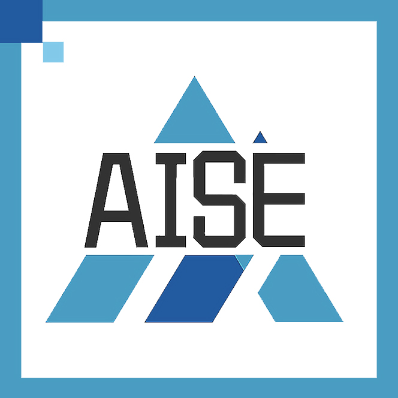

<h1 align="center" id="title">
Side By Side</h1>

### 📸 Project Screenshots


<h2>🧐 Features</h2>

Here're some of the project's features:

- Start a Talking Chat：Compare the performance in output quality and response time between Gaudi2 and A100 using textual conversations.
- Compare Concurrency Across Machines：One machine concurrently processes multiple requests and compares the time taken for each chat processing.
- Upload File: The choice between uploading locally or copying a remote link. Chat according to uploaded knowledge base.

<h2>🛠️ Get it Running:</h2>

1. Clone the repo.

2. cd command to the current folder.

3. Modify the required .env variables.
    ```
    CHAT_A100_URL = ''
    CHAT_GAUDI2_URL = ''
    KNOWLEDGE_A100_URL = ''
    KNOWLEDGE_GAUDI2_URL = ''
    ```
4. Execute `npm install` to install the corresponding dependencies.

5. Execute `npm run dev` in both enviroments
