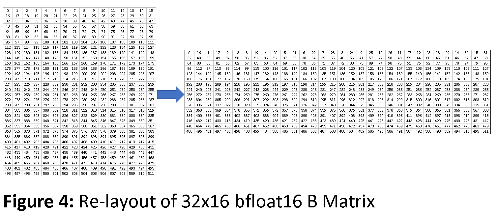
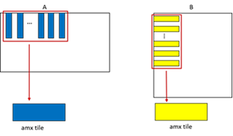

# Sparse GEMM AMX

## Brief introduction for ISAs
As we all know, AMX ISA introduces the `tdpbf16ps`, which does **16x32** matrix times **32x16** matrix as the following:
```
FOR m := 0 TO dst.rows - 1
	tmp := dst.row[m]
	FOR k := 0 TO (a.colsb / 4) - 1                                                 // colsb => bytes per col, in BF16 case k = [0, 16)
		FOR n := 0 TO (dst.colsb / 4) - 1                                           // colsb => bytes per col, in BF16 case n = [0, 16)
			tmp.fp32[n] += FP32(a.row[m].bf16[2*k+0]) * FP32(b.row[k].bf16[2*n+0])
			tmp.fp32[n] += FP32(a.row[m].bf16[2*k+1]) * FP32(b.row[k].bf16[2*n+1])
		ENDFOR
	ENDFOR
	write_row_and_zero(dst, m, tmp, dst.colsb)
ENDFOR
zero_upper_rows(dst, dst.rows)
zero_tileconfig_start()
```
Like the **VNNI**, **AMX-BF16** needs re-layout the right matrix as following:





As a successor to **AVX512** series sparse pattern, **AMX** pattern split the matrix into many **1x16** blocks and then concatenate them to meet AMX 32x16 requirements.
You can refer to [intrinsics guide](https://www.intel.com/content/www/us/en/docs/intrinsics-guide/index.html#ig_expand=159,653,1854,5965,5461,1742,2774,4964,4916,4925,4944,1745,1589,4089,4120,5390,5389,5388,2782,4541,6243,6255,4541,1510,2244,6836,7263,2250,5360,5388,5389,5390,5352,5353,5324,5381,4626,7264,6172,649,6159,6897,7264,7267,2795,2782,2913,1431,1385,5381,574,572,5381,5380,5379,5378,5377,5376,5375,5374,5373,5390,5389,5388,5360,5359,6897,6905,6830,6897,6903,6857,7265,6501,6519,6582,488,4506,5240,5459,5478,5489,5488,5487,5480,5463,640,6206,640,2808,4469,4470,4471,4463,4472,4469,2801,2759,2782,2787,640,2949,2949,2890,2913,2912,2585,2585,2585,7041,7043,572,640,4369,6903,6903,2756,1827,6529,572,7264,2749,5645,2808,2795,2782,7260,4469,7267,7266,2139,1998,2756,2750,2753,7439,7259,7259,7439,4376,6172,6255,6252,7498,7400,7343,6410,6951,5289,4087,4111,4107,2250,6951,6947,6944,4374,4107,707,4107,4108,1753,6955,4107,4108,4114,4111,607,4123,4114,4111,6955,6923,6937,4111,607,581,572,4111,2244,1595,2579,2585,2585,1998,2008,5446,7263,7263,2769,2782,2808,2782,2769,2782,2769,2782&techs=AMX) for ISA details.

## Pattern



Let the left matrix in the above image be A and the right be B. In our case, A is transposed weight(sparse), B is transposed activation. A can be compressed offline or before the inference, so we could directly use `tileloadd` instruction for 32 nonzero blocks in A (they’re stored consecutively in memory). For B, We need 32 rows of 16 consecutive values for one `tdpbf16ps`. This may be good because 16 values in one row are consecutive and can be loaded via `vmovdqu32` (through we are handling BF16). However, there are two tradeoff. The first is that the 32x16 tiles of B need to be reordered to AMX layout as the images shows. The second is that the activation matrix needs to be transposed, which may be more time-consuming

Alternatively, considering A as activation and B as weight can save a lot of time because weight is fixed and can be compressed, concatenated and reordered offline. However, the loading of activation is a disaster because all 32 **16x1** blocks are not consecutive can will greatly impact performance, related experiments WIP.


## Reorder

The key to the question is how to re-layout activation on the fly. We use [a similar method with the VNNI kernel](./kernel_vnni.md#on-the-fly-activation-reordering) but saving two load instructions. The related code is as follows:

```cpp
const static __m512i mask = _mm512_set_epi16(31,15,30,14,29,13,28,12,27,11,26,10,25,9,24,8,23,7,22,6,21,5,20,4,19,3,18,2,17,1,16,0);
__m256i lo = _mm256_loadu_epi(...);
__m256i li = _mm256_loadu_epi(...);
__m512i vec = _mm512_inserti32x8(_mm512_castsi256_si512(lo), li, 1);
__m512i permuted = _mm512_permutexvar_epi16(mask, vec);
_mm512_storeu_epi32(..., permuted);
```
