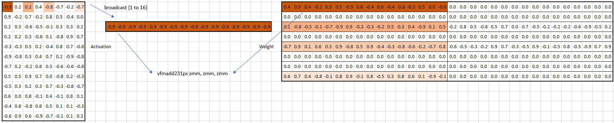
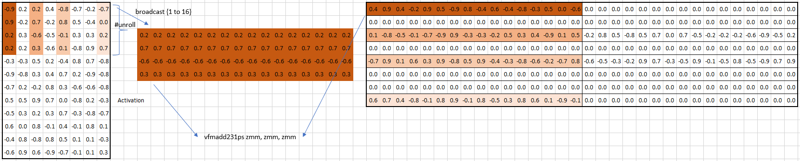

# Sparse GEMM AVX512F

## Key Instruction

In this kernel, we use the `vfmadd` instruction from AVX512F for matrix multiplication. Specifically, `vfmadd231ps` does the following:

```
FOR j := 0 to 15
    i := j*32
    dst[i+31:i] := (a[i+31:i] * b[i+31:i]) + dst[i+31:i]
ENDFOR
dst[MAX:512] := 0
```

## Sparse Pattern & Data Format

Based on `vfmadd231ps`, the sparse pattern is set to 1 x 16, where 1 is the degree of reduction and 16 is the degree of the parallelization. In terms of neural network, 1 for input channel and 16 is for output channel. Therefore, for each `vfmadd231ps`, 1 element of activation is broadcasted 16 times for its second operand and 16 contingent elements of weight are loaded for its third operands (its first operand act as destination register).



Given the sparse pattern, Block Sparse Column format (BSC, a column variant of [BSR](https://docs.scipy.org/doc/scipy/reference/generated/scipy.sparse.bsr_matrix.html)) is adopted to optimize memory access so that non-zero elements of weight are accessed sequentially along K-dimension.

## Loops

The first 2 levels of loop are C++ loops and their iterations can be paralleled with OpenMP.

- We first iterate blocks over the m-dimension, which is the dimension of batch size in terms of linear layer in NN.

- (Not implemented) Similar to the top-level loop, n-dimension is divided into blocks and iterated through. This blocking may bring enhancement as it reduces the size of assembly code for each iteration thus relief frontend bottleneck.

The next 2 levels of loop are assembly loop in JIT generated code.

- The m-blocks created in the first loop are further divided into the m-blocks of microkernels. We unroll `vfmadd231ps` and its peripheral a few times (within the limit of available vector registers) to improve the performance. Currently it is unrolled 4 times to form a 4 *K* 16 micro kernel (see the graph below). It is promising to make it configurable to find or dynamically decide the optimal size of microkernel.

- The n-blocks in the second loop (or the whole output channel) are iterated by blocks of 16, which matches the width of ZMM registers when handling fp32.

The last 3 levels of loop are inside the microkernel.

- The k-dimension of microkernel are implemented as C++ JIT loop that generates a sequence of operations with the information of the sparse structure.

- The m-loop of microkernel is described in the third loop and is implemented as unrolled assembly code (as shown below).

- The n-loop of microkernel is implicit as the parallelism of SIMD instructions.


