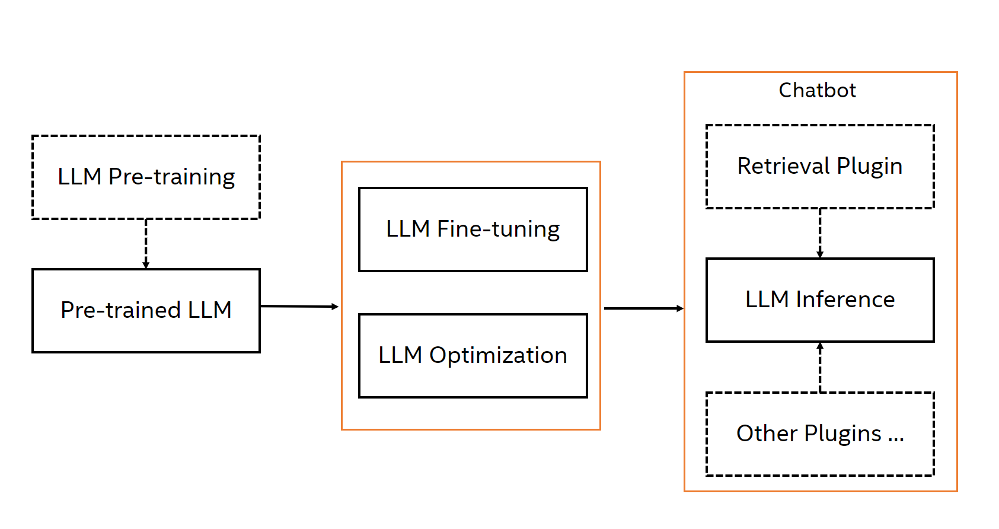

<div align="center">

Intel® Neural Chat
===========================
<h3> An open-source Python library that empowers you to customize your chatbot with a diverse range of plugins.</h3>

---
<div align="left">

NeuralChat is a general chat framework designed to create your own chatbot that can be efficiently deployed on Intel CPU/GPU, Habana HPU and Nvidia GPU. NeuralChat is built on top of large language models (LLMs) and provides a set of strong capabilities including LLM fine-tuning and LLM inference with a rich set of plugins such as knowledge retrieval, query caching, etc. With NeuralChat, you can easily create a text-based or audio-based chatbot and deploy on Intel platforms rapidly. Here is the flow of NeuralChat:

<a target="_blank" href="./assets/pictures/neuralchat.png">
<p align="center">
  
</p>
</a>

# Installation

NeuralChat is seamlessly integrated into the Intel Extension for Transformers. Getting started is quick and simple, just simply install 'intel-extension-for-transformers'.

## Install from Pypi
```bash
pip install intel-extension-for-transformers
```
> For more installation method, please refer to [Installation Page](../docs/installation.md)

<a name="quickstart"></a>
# Quick Start

Users can have a try of NeuralChat with [NeuralChat Command Line](./cli/README.md) or Python API.

## Install from source

```
export PYTHONPATH=<PATH TO intel-extension-for-transformers>
conda create -n neural_chat python==3.10
pip install -r requirements.txt
pip install librosa==0.10.0
```


## Inference

### Text Chat

Giving NeuralChat the textual instruction, it will respond with the textual response.

**command line experience**

```shell
neuralchat textchat --query "Tell me about Intel Xeon Scalable Processors."
```

**Python API experience**

```python
>>> from neural_chat.config import PipelineConfig
>>> from neural_chat.chatbot import build_chatbot
>>> config = PipelineConfig()
>>> chatbot = build_chatbot(config)
>>> response = chatbot.predict("Tell me about Intel Xeon Scalable Processors.")
```

### Text Chat With Retreival

Giving NeuralChat the textual instruction, it will respond with the textual response.

**command line experience**

```shell
neuralchat textchat --retrieval_type sparse --retrieval_document_path ./assets/docs/ --query "Tell me about Intel Xeon Scalable Processors."
```

**Python API experience**

```python
>>> from neural_chat.config import PipelineConfig
>>> from neural_chat.chatbot import build_chatbot
>>> config = PipelineConfig(retrieval_type="sparse", retrieval_document_path="./assets/docs/")
>>> chatbot = build_chatbot(config)
>>> response = chatbot.predict("How many cores does the Intel® Xeon® Platinum 8480+ Processor have in total?")
```

### Voice Chat

In the context of voice chat, users have the option to engage in various modes: utilizing input audio and receiving output audio, employing input audio and receiving textual output, or providing input in textual form and receiving audio output.

**command line experience**

- audio in and audio output
```shell
neuralchat voicechat --audio_input_path ./assets/audio/say_hello.wav --audio_output_path ./response.wav
```

- audio in and text output
```shell
neuralchat voicechat --audio_input_path ./assets/audio/say_hello.wav
```

- text in and audio output
```shell
neuralchat voicechat --query "Tell me about Intel Xeon Scalable Processors." --audio_output_path ./response.wav
```


**Python API experience**

For the Python API code, users have the option to enable different voice chat modes by setting audio_input to True for input or audio_output to True for output.

```python
>>> from neural_chat.config import PipelineConfig
>>> from neural_chat.chatbot import build_chatbot
>>> config = PipelineConfig(audio_input_path="./assets/audio/pat.wav", audio_output_path="./response.wav")
>>> chatbot = build_chatbot(config)
>>> result = chatbot.predict()
```

We provide multiple plugins to augment the chatbot on top of LLM inference. Our plugins support [knowledge retrieval](./pipeline/plugins/retrievers/), [query caching](./pipeline/plugins/caching/), [prompt optimization](./pipeline/plugins/prompts/), [safety checker](./pipeline/plugins/security/), etc. Knowledge retrieval consists of document indexing for efficient retrieval of relevant information, including Dense Indexing based on LangChain and Sparse Indexing based on fastRAG, document rankers to prioritize the most relevant responses. Query caching enables the fast path to get the response without LLM inference and therefore improves the chat response time. Prompt optimization suppots auto prompt engineering to improve user prompts, instruction optimization to enhance the model's performance, and memory controller for efficient memory utilization.


## Finetuning

Finetune the pretrained large language model (LLM) with the instruction-following dataset for creating the customized chatbot is very easy for NeuralChat.

**command line experience**

```shell
neuralchat finetune --base_model "meta-llama/Llama-2-7b-chat-hf" --config pipeline/finetuning/config/finetuning.config
```


**Python API experience**

```python
>>> from neural_chat.config import FinetuningConfig
>>> from neural_chat.chatbot import finetune_model
>>> finetune_cfg = FinetuningConfig()
>>> finetuned_model = finetune_model(finetune_cfg)
```

## Quantization

NeuralChat provides three quantization approaches respectively (PostTrainingDynamic, PostTrainingStatic, QuantAwareTraining) based on [Intel® Neural Compressor](https://github.com/intel/neural-compressor).

**command line experience**

```shell
neuralchat optimize --base_model "meta-llama/Llama-2-7b-chat-hf" --config pipeline/optimization/config/optimization.config
```


**Python API experience**

```python
>>> from neural_chat.config import OptimizationConfig
>>> from neural_chat.chatbot import optimize_model
>>> opt_cfg = OptimizationConfig()
>>> optimized_model = optimize_model(opt_cfg)
```


<a name="quickstartserver"></a>
# Quick Start Server

Users can have a try of NeuralChat server with [NeuralChat Server Command Line](./server/README.md).


**Start Server**
- Command Line (Recommended)
    ```shell
    neuralchat_server start --config_file ./conf/neuralchat.yaml
    ```

- Python API
    ```python
    from neuralchat.server.neuralchat_server import NeuralChatServerExecutor
    server_executor = NeuralChatServerExecutor()
    server_executor(
        config_file="./conf/neuralchat.yaml",
        log_file="./log/neuralchat.log")
    ```

**Access Text Chat Service**

- Command Line
    ```shell
    neuralchat_client textchat --server_ip 127.0.0.1 --port 8000 --prompt "Tell me about Intel Xeon Scalable Processors."
    ```

- Python API
    ```python
    from neuralchat.server.neuralchat_client import TextChatClientExecutor

    executor = TextChatClientExecutor()
    executor(
        prompt="Tell me about Intel Xeon Scalable Processors.",
        server_ip="127.0.0.1",
        port=8000)
    ```

- Curl with Restful API
    ```
    curl -X POST -H "Content-Type: application/json" -d '{"prompt": "Tell me about Intel Xeon Scalable Processors."}' http://127.0.0.1:80/v1/chat/completions
    ```

**Access Voice Chat Service**

```shell
neuralchat_client voicechat --server_ip 127.0.0.1 --port 8000 --input say_hello.wav --output response.wav
```

**Access Retrieval Service**
```shell
neuralchat_client retrieval --server_ip 127.0.0.1 --port 8000 --input ./docs/
```

