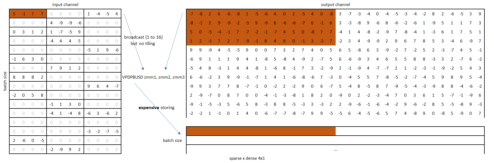

# Design of VNNI Kernel

As we all know, sparse patterns must align with target ISA, especially GEMM instruction.
VNNI introduces the following GEMM calculation:

> Description
> 
> Multiply groups of 4 adjacent pairs of unsigned 8-bit integers in a with corresponding signed 8-bit integers in b, producing 4 intermediate signed 16-bit results. Sum these 4 results with the corresponding 32-bit integer in src, and store the packed 32-bit results in dst.
> 
> Operation
> 
> ```
> FOR j := 0 to 15
> 	tmp1.word := Signed(ZeroExtend16(a.byte[4*j]) * SignExtend16(b.byte[4*j]))
> 	tmp2.word := Signed(ZeroExtend16(a.byte[4*j+1]) * SignExtend16(b.byte[4*j+1]))
> 	tmp3.word := Signed(ZeroExtend16(a.byte[4*j+2]) * SignExtend16(b.byte[4*j+2]))
> 	tmp4.word := Signed(ZeroExtend16(a.byte[4*j+3]) * SignExtend16(b.byte[4*j+3]))
> 	dst.dword[j] := src.dword[j] + tmp1 + tmp2 + tmp3 + tmp4
> ENDFOR
> dst[MAX:512] := 0
> ```

According to our kernel experiments, we defined the so-called **"4x1"** sparse pattern to fully utilize VNNI capability.

As shown in the figure below, the sparse pattern in the weight (the left matrix) is 4x1, where 4 is in output channels dimensions, 1 is in input channel dimensions. In terms of a typical GEMM, we say that **4** is in **M** dimensions and **1** is in **K** dimension. For the rest part of this doc, we will use GEMM concept which usually uses **M**, **K**, **N** for the first, second and third dimension.

After compression, we concatenate each **4x1** block in the same row into some **4x4** blocks (there will be some paddings in rows that the number of non-zero blocks is not a multiple of 4, as we can see the second and third row of blocks in the image). Then for each row (maybe including paddings) in a **4x4** blocks, we broadcast them to 4x16 elements, which meet the accumulation and parallelization dimension of VNNI. For the activation (the right) matrix we pick 4 (or less if we added padding when preparing weight data) 1x16 blocks according to sparse indices and concatenate them into 4x16 blocks in column major. That is the second matrix we prepared for VNNI.

For a typical GEMM (M x K x N) problem, a high performance GEMM micro-kernel need to tile in (m x k x n) which means taking m rows of matrix A and n cols of matrix B to improve density of ```fma``` instructions, therefore reducing bubbles in the assembly line. In the **4x4** block, the **"4"** is corresponding to the **m** in micro-kernels, and the **"4"** by the concatenate along rows is just for VNNI accumulation dimensions. 


## Candidate patterns
Transposition is not a default option for matrix multiplication but a workaround we found after investigation. Without transposition, activation multiplies weight and the major dimension of left matrix (that is K) must be uses for accumulation. Therefore, we need to use the N dim for parallelization which is sparse. Unfortunately, it is hard to store the result to inconsecutively to destination memory. 


Adopting 1x16 pattern and using concatenation to get the accumulation dimension is also a bad idea as it means reading 4 skipping elements in a row on the dense matrix. Therefore, we must apply transposition so that the 2nd dimension of the dense matrix is used for accumulation leaving the leading dimension for parallelization.


Given that transposition is necessary, an alternative pattern is **"1x4"**, where the concatenation cost is saved but missing tiling means lower density of micro-kernels, which will bring more harm for performance.



> Comparison between **"1x4"** and **"4x1"**
> 1. **"4x1"** does tiling along M dimensions, **"1x4"** does no tiling along this dimension.
> 2. **"4x1"** needs concatenation along K dimensions, **"1x4"** doesn't need concatenation. However, the concatenation happens during the compression, which is offline.

We performed a simulation by changing the **"4x1"** to **"2x1"**, which means tiling along the M dimensions becomes 2. As a result, the following table demonstrates about 1/3 perf drop, and we expect more performance drop with totally no tiling.


In conclusion, **"4x1"** brings higher performance which is about ~2(+) times against **"1x4"** (estimated from differences between tiling and no tiling.) 
