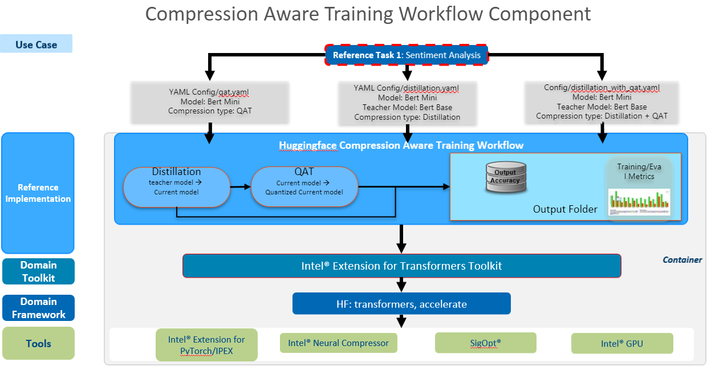
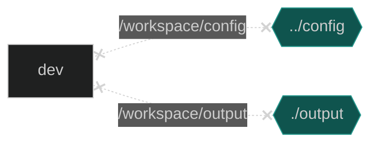

# Compression Aware Training

## Introduction
Learn to use Intel's XPU hardware and Intel optimized software for Model Compression Aware Training on Hugging Face models for tasks related to Natural Language Processing (NLP) with easy to run steps that seemlessly leverage intel Optimizations for Xeon CPU processors using Intel Extension for Tranfomrer Domain toolkit, PyTorch* and Intel® Neural Compressor.

## Solution Techical Overview

The workflow provides a generic way to do model Compression Aware Training supporting the following Compression types specified below.

### Compression Aware Training Types Supported
1. Distillation : Distill the Finetuned teacher model for your task to a smaller student model
2. Quantization Aware Training (QAT)
3. Distillation followed by Quantization Aware Training (QAT)
4. Sparsity Aware Training (SAT) : Training while preserving the sparsity of a pruned sparse model  

## Validated Hardware Details 
| Supported Hardware           | Precision  |
| ---------------------------- | ---------- |
| CPU and GPU|FP32, INT8 |

## How it Works
### Architecture


## Get Started

### Clone this Repository

Start by defining an environment variable that will store the workspace path, this can be an existing directory or one to be created in further steps. This ENVVAR will be used for all the commands executed using absolute paths.

```
export WORKSPACE=</workdir/path>

git clone https://github.com/intel/intel-extension-for-transformers.git $WORKSPACE/intel-nlp-toolkit
cd $WORKSPACE/intel-nlp-toolkit/workflows/compression_aware_training

```

### Download Miniconda and install it.
Note: If you have already installed conda on your system, just skip this step.
```bash
wget https://repo.anaconda.com/miniconda/Miniconda3-latest-Linux-x86_64.sh
sh Miniconda3-latest-Linux-x86_64.sh
```

### Prepare the Conda Environment for this Workflow
```bash
conda create -n compawaretraining python=3.9.13 --yes
conda activate compawaretraining
```
or
```bash
python -m venv compawaretraining
source compawaretraining/bin/activate
```

### Install Packages for Running compression-aware-training
```bash
sh install.sh
```
or
```bash
pip install -r requirements.txt
```

### Prepare Your Config File per your Requirements
edit config/config.yaml
and set
1. model or the student_model
2. teacher_model
3. dataset
4. task
5. Distillation / Quantization
amongst others specified in the example config.yaml file.

### Run Using Bare Metal
Run the Workflow  using the Configurations specified in the YAML file.
#### 1. Running in vscode
Use the .vscode/launch.json to launch

#### 2. Running in Bash or Terminal
```
Student (Current) Model: bert Mini
teacher Model: Bert base uncased pre fine tuned sentiment task using HF sst2 dataset
Task: sentiment analysis
output: Distilled Bert Mini, or Distilled and Quantized bert mini
```

See [config/README.md](./config/README.md) for options.

Run both traditional Distillation followed by Quantization Aware Training
```bash
python src/run.py config/distillation_with_qat.yaml
```
Run traditional Distillation only
```bash
python src/run.py config/distillation.yaml
```
Run Quantization Aware Training only
```bash
python src/run.py config/qat.yaml
```
Run Sparsity Aware Training only
```bash
python src/run.py config/sat.yaml
```

#### 3. Running Distributed Data Parallel (MultiNode) in Bash or Terminal
```
<MASTER_ADDRESS>         is the address of the master node, it won't be necessary for single node case,
<NUM_PROCESSES_PER_NODE> is the desired processes to use in current node. 
                         for node with GPU, usually set to number of GPUs in this node. 
                         for node without GPU and use CPU for training, it's recommended set to 1.
<NUM_NODES>              is the number of nodes to use.
<NODE_RANK>              is the rank of the current node, rank starts from 0 to *`<NUM_NODES>`*`-1`.

Also please note that to use CPU for training in each node with multi nodes settings, argument `--no_cuda` is mandatory. 
In multi nodes setting, following command needs to be launched in each node.
All the commands should be the same except for *NODE_RANK*, 
which should be integer from 0 to *`<NUM_NODES>`*`-1` assigned to each node.
```
Example template for running on 2 Nodes CPU with 1 process per node
```bash
python -m torch.distributed.launch --master_addr=10.10.10.1 --nproc_per_node=1 --nnodes=2 --node_rank=0  src/run.py config/distillation.yaml
```
```bash
python -m torch.distributed.launch --master_addr=10.19.17.1 --nproc_per_node=1 --nnodes=2 --node_rank=1  src/run.py config/distillation.yaml
```

## Run Using Docker

### 1. Set Up Docker Engine and Docker Compose
You'll need to install Docker Engine on your development system. Note that while **Docker Engine** is free to use, **Docker Desktop** may require you to purchase a license. See the [Docker Engine Server installation instructions](https://docs.docker.com/engine/install/#server) for details.


To build and run this workload inside a Docker Container, ensure you have Docker Compose installed on your machine. If you don't have this tool installed, consult the official [Docker Compose installation documentation](https://docs.docker.com/compose/install/linux/#install-the-plugin-manually).


```bash
DOCKER_CONFIG=${DOCKER_CONFIG:-$HOME/.docker}
mkdir -p $DOCKER_CONFIG/cli-plugins
curl -SL https://github.com/docker/compose/releases/download/v2.7.0/docker-compose-linux-x86_64 -o $DOCKER_CONFIG/cli-plugins/docker-compose
chmod +x $DOCKER_CONFIG/cli-plugins/docker-compose
docker compose version
```

### 2. Set Up Docker Image
Build or Pull the provided docker image.

```bash
cd $WORKSPACE/intel-nlp-toolkit 
git submodule update --init --recursive
cd ${WORKSPACE}/docker
docker compose build
```
OR
```bash
docker pull intel/ai-workflows:pa-compression-aware
```

### 3. Run with Docker Compose



```bash
cd docker
export CONFIG=<config_file_name_without_.yaml>
docker compose run dev
```

| Environment Variable Name | Default Value | Description |
| --- | --- | --- |
| CONFIG | n/a | Config file name |

### 4. Clean Up Docker Container
Stop container created by docker compose and remove it.

```bash
docker compose down
```

## Run Using Argo Workflows on K8s Using Helm
### 1. Install Helm
- Install [Helm](https://helm.sh/docs/intro/install/)
```bash
curl -fsSL -o get_helm.sh https://raw.githubusercontent.com/helm/helm/main/scripts/get-helm-3 && \
chmod 700 get_helm.sh && \
./get_helm.sh
```
### 2. Setting up K8s
- Install [Argo Workflows](https://argoproj.github.io/argo-workflows/quick-start/) and [Argo CLI](https://github.com/argoproj/argo-workflows/releases)
- Configure your [Artifact Repository](https://argoproj.github.io/argo-workflows/configure-artifact-repository/)
- Ensure that your dataset and config files are present in your chosen artifact repository.
### 3. Install Workflow Template
```bash
export NAMESPACE=argo
helm install --namespace ${NAMESPACE} --set proxy=${http_proxy} compression-aware ./chart
argo submit --from wftmpl/workspace --namespace=${NAMESPACE}
```
### 4. View 
To view your workflow progress
```bash
argo logs @latest -f
```

## Expected Output

### Distillation

Evaluation and Training performance parameters are presented as Output in Distillation
```
{'eval_loss': 0.4425612986087799, 'eval_accuracy': 0.8176605504587156, 'eval_runtime': 1.2764, 'eval_samples_per_second': 683.18, 'eval_steps_per_second': 85.398, 'epoch': 3.0} 

{'train_runtime': 969.0107, 'train_samples_per_second': 49.535, 'train_steps_per_second': 6.192, 'train_loss': 0.23751972579956054, 'epoch': 3.0}

Batch size =  8
Final Eval eval_accuracy Accuracy: 0.8176605504587156
Latency: 1.43633 ms
Throughput: 696.22000 samples/sec
```

### Quantization

Evaluation and Training performance parameters are presented as Output in Quantization
```
***** train metrics *****
  epoch                    =        3.0
  train_loss               =     0.3413
  train_runtime            = 0:14:12.25
  train_samples_per_second =     56.321
  train_steps_per_second   =       7.04
 |*********Mixed Precision Statistics********|
 +---------------------+-------+------+------+
 |       Op Type       | Total | INT8 | FP32 |
 +---------------------+-------+------+------+
 |      Embedding      |   3   |  3   |  0   |
 |      LayerNorm      |   9   |  0   |  9   |
 | quantize_per_tensor |   26  |  26  |  0   |
 |        Linear       |   26  |  26  |  0   |
 |      dequantize     |   26  |  26  |  0   |
 |     input_tensor    |   8   |  8   |  0   |
 |       Dropout       |   8   |  0   |  8   |
 +---------------------+-------+------+------+
 Pass quantize model elapsed time: 853199.87 ms

***** eval metrics *****
 {
     'eval_loss': 0.6824533939361572,
     'eval_accuracy': 0.8107798165137615,
     'eval_runtime': 1.2214,
     'eval_samples_per_second': 713.955,
     'eval_steps_per_second': 89.244,
     'epoch': 3.0
 }
 metric: 0.8107798165137615
 Throughput: 713.955 samples/sec
 Tune 1 result is: [Accuracy (int8|fp32): 0.8108|0.4828, Duration (seconds) (int8|fp32): 1.2238|1.2393], Best tune result is: [Accuracy: 0.8108, Duration (seconds): 1.2238]
 |**********************Tune Result Statistics**********************|
 +--------------------+----------+---------------+------------------+
 |     Info Type      | Baseline | Tune 1 result | Best tune result |
 +--------------------+----------+---------------+------------------+
 |      Accuracy      | 0.4828   |    0.8108     |     0.8108       |
 | Duration (seconds) | 1.2393   |    1.2238     |     1.2238       |
 +--------------------+----------+---------------+------------------+
```
  
## Summary and Next Steps

* You can try other tasks, models and datasets from huggingface repository per your liking by changing the config file.
* If you want to enable distributed training on k8s for your use case, please follow steps to apply that configuration mentioned here [Intel® Extension for Tranfomrer Domain toolkit](../../docker/README.md#kubernetes) which provides insights into k8s operators and yml file creation.

## Learn More

You can see more examples of the workflow [here](../../examples/huggingface/) or a use case [here](https://www.ncbi.nlm.nih.gov/pmc/articles/PMC7193019/)

## Troubleshooting

1. If a unsuitable Task Name is provided then the below exception is thrown. Either pass the loacal_dataset parameters or provide any other huggingface dataset.
```
Traceback (most recent call last):
  File "/DataDisk_4/frameworks.ai.nlp-toolkit.intel-nlp-toolkit/workflows/compression_aware_training/src/run.py", line 27, in <module>
    main()
  File "/DataDisk_4/frameworks.ai.nlp-toolkit.intel-nlp-toolkit/workflows/compression_aware_training/src/run.py", line 22, in main
    itrex_opt = ItrexOpt(args)
  File "/DataDisk_4/frameworks.ai.nlp-toolkit.intel-nlp-toolkit/workflows/compression_aware_training/src/itrex_opt.py", line 92, in __init__
    model_args, data_args, training_args, optim_args = parser.parse_yaml_file(
  File "/DataDisk_4/cat/lib/python3.9/site-packages/transformers/hf_argparser.py", line 412, in parse_yaml_file
    outputs = self.parse_dict(yaml.safe_load(Path(yaml_file).read_text()), allow_extra_keys=allow_extra_keys)
  File "/DataDisk_4/cat/lib/python3.9/site-packages/transformers/hf_argparser.py", line 367, in parse_dict
    obj = dtype(**inputs)
  File "<string>", line 14, in __init__
  File "/DataDisk_4/frameworks.ai.nlp-toolkit.intel-nlp-toolkit/workflows/compression_aware_training/src/utils.py", line 111, in __post_init__
    raise ValueError(
ValueError: Unknown task, you should pick one in emotion,cola,mnli,mrpc,qnli,qqp,rte,sst2,stsb,wnli
```

2. If you see the following libGL.so.1 error while running the workflow
```
Exception:  "ImportError: libGL.so.1: cannot open shared object file: No such file or directory"

Fix: Install the following packages for the error to go away.
1. pip install opencv-python-headless
2. conda install -c anaconda mesa-libgl-cos6-x86_64 (if it is a conda environment)
```

## Support

The Workflow team tracks both bugs and enhancement requests using GitHub issues.

Before submitting a suggestion or bug report, search the GitHub issues to see if your issue has already been reported.
