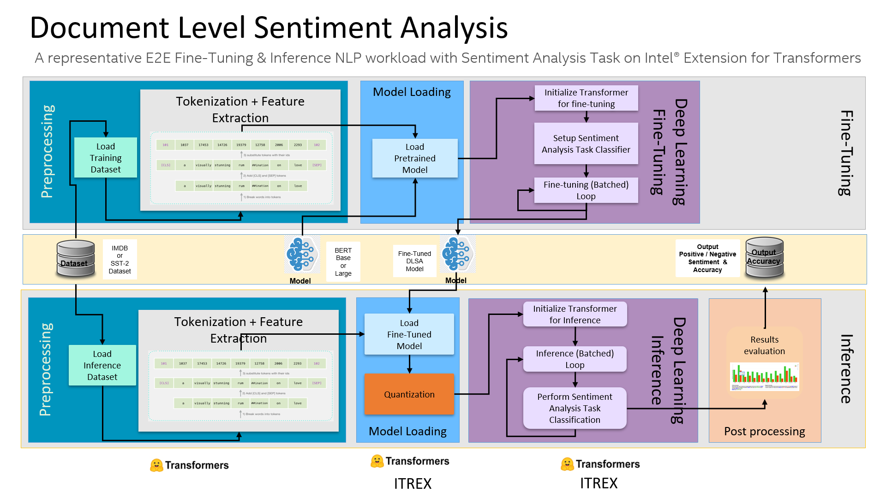

E2E DLSA Pipeline
============
1. [Introduction](#introduction)
2. [Get Started](#get-started)


# Introduction
DLSA is a representative E2E Fine-Tuning & Inference NLP workload with Sentiment Analysis Task on Intel® Extension for Transformers.
<br>


<br>

The DLSA workload code uses [Intel® Extension for Transformers](https://github.com/intel-innersource/frameworks.ai.models.intel-models/tree/develop/quickstart/language_modeling/pytorch/bert_large/inference/cpu) toolkit to run an end-to-end deep learning workload, which will analyze the sentiment of any input English sentence or paragraph.

It consists of load data, tokenization + feature extraction, load model, fine tuning, model quantization and inference.

## Validated model list

| Dataset | Model                   | Fine-tuning | Quantization | Inference |
| ------- | ----------------------- | :---------: | :----------: | :-------: |
| SST-2   | distilbert-base-uncased |  &#10004;   |   &#10004;   | &#10004;  |
| SST-2   | bert-large-uncased      |    TODO     |     TODO     |   TODO    |
| IMDb    | distilbert-base-uncased |  &#10004;   |   &#10004;   | &#10004;  |
| IMDb    | bert-large-uncased      |    TODO     |     TODO     |   TODO    |


# Get Started
## Deploy the test environment

### Create a new python environment
```shell
conda create -n <env name> python=3.8
conda activate <env name>
```
### Install the ITREX
```shell
pip install intel-extension-for-transformers
```

### Install package for examples
```shell
cd <intel_extension_for_transformers_folder>/workflows/dlsa
pip install -r requirements.txt
```


## Running the E2E DLSA pipeline
The shell script `run_dlsa.sh` provides running E2E DLSA pipeline with one-click.

```shell
bash ./run_dlsa.sh
```
By default, it will launch one instance to run E2E DLSA pipeline which includes load data, tokenization + feature extraction, load model, fine-tuning, model quantization and inference, then print the elapsed time of each phase. It use SST-2 dataset and conduct inference for both default FP32 model and ITREX quantized INT8 model. You can also pass the parameters when running the script.

Below is the help message by using the command `bash ./run_dlsa.sh -h`:

```shell
Usage: run_dlsa.sh [OPTIONS]
OPTION includes:
   -l | --log_name - the log name of this round
   -d | --dataset - [imdb|sst2] whether to use imdb or sst2 DATASET
   -s | --sequence_len - max sequence length
   -o | --output_dir - output dir
   -m | --model - the input model name or path
   --train_batch_size - batch size for fine-tuning
   --eval_batch_size - batch size for inference
   -h | --help - displays this message
```
